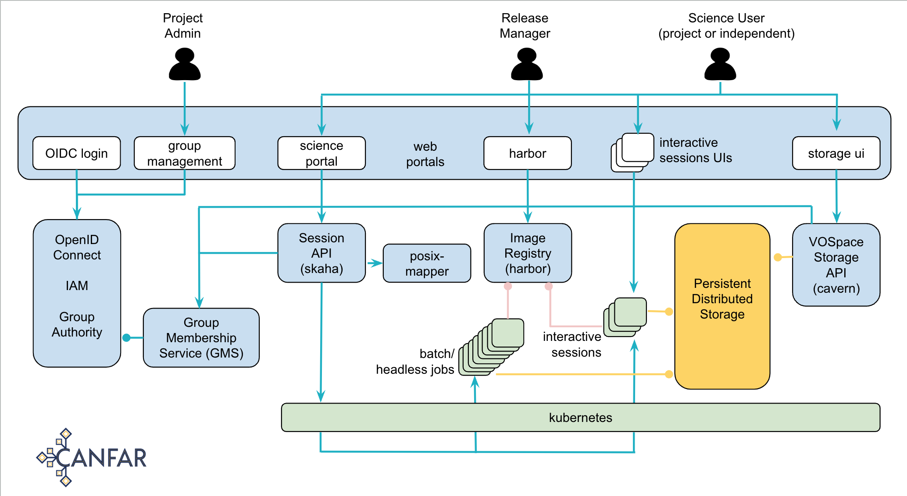
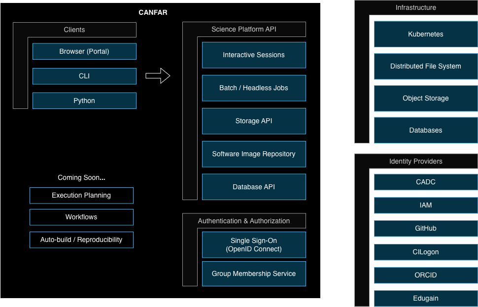

# Skaha (1.0.0)

*A container based science platform in CANFAR.*

## Table of Contents
- [Skaha](#skaha)
  - [Table of Contents](#table-of-contents)
  - [CANFAR Science Portal Documentation](#canfar-science-portal-documentation)
  - [Acknowledgements](#acknowledgements)
  - [Overview](#overview)
  - [Deployment](#deployment)
  - [System Components](#system-components)
    - [skaha](#skaha-1)
  - [Session Containers](#session-containers)
  - [Software Containers](#software-containers)
  - [Dependencies](#dependencies)

## CANFAR Science Portal Documentation

User documentation for the CANFAR Science Portal and Platform can be found here:  [Official CANFAR Science Platform Documentation](https://www.opencadc.org/science-containers/)

## Acknowledgements
This project has been funded in part by:
- The ALMA Cycle 7 development study with support from the National Radio Astronomy Observatory and the North American ALMA Science Centre
- The CANARIE Research Software Program Competitive Funding Call 3: Research Software Platform Re-Use
- The National Research Council Canada

## Overview

Skaha is a general purpose online platform for running science containers interactively.  It is part of the [CANFAR Science Platform](https://canfar.net).  In the architecture diagram below, skaha is the main API to the Science Platform.

The CANFAR Science Platform Architecture.

Skaha is the API to the Science Platform box.

## Deployment

Skaha runs on Kubernetes and and is deployed using Helm. See the [Deployment Guide](./deployment/helm/README.md) for more information.

## System Components

Components of skaha are containers that can be scaled out on a cluster of nodes to meet the storage and processing demands of the scientific software containers.

### skaha
The skaha module provides the API for:
- Listing published container images that the calling user is allowed to run
- Creating skaha sessions from published container images
- Launching container images to be displayed in desktop sessions

The complete API of skaha can be viewed here: https://ws-uv.canfar.net/skaha

The CANFAR Science Platform, a web interface to skaha, is here: https://www.canfar.net

## Session Containers

Session containers are HTML5/websocket applications that can run in shaka.  Currently this consists of Jupyter Labs, CARTA Visualization, and NoVNC desktops.  More information on session containers and how they can be used in skaha can be found in the [science-containers](https://github.com/opencadc/science-containers/blob/main/containers) github repository.

## Software Containers

These are some of the astronomy science containers that have been built for skaha.  They run as applications within skaha.  The graphical aspects of the containers are displayed in skaha-desktop by sending the DISPLAY to skaha-desktop.

More information on software containers can be found in the [science-containers](https://github.com/opencadc/science-containers/blob/main/containers) github repository.

## Dependencies

skaha relies on a number of other opencadc modules to operate.
* registry (reg) web service (https://github.com/opencadc/reg) -- A registry service will be used to read the capabilities and locations of other web services used by skaha.
* access control (ac) web service (https://github.com/opencadc/ac) -- If the IdentityManager implementation is configured to use cadc-access-control-server for authentication an operational ac web service is required to be running.
* credential delegation (cdp) web service (https://github.com/opencadc/cdp) -- The cdp service is used to obtain users' delegated proxy certificates.
* cavern -- skaha is complimented by having the cavern VOSpace implementation mounted as a shared POSIX file system.  (https://github.com/opencadc/vos/tree/master/cavern).  cavern is a vospace implementation where both the data and metadata are based on the contents of a file system.  If the software-containers have access to the cavern file system the contents of that file system can be accessed and shared through the cavern web service.
* posix/sssd -- Containers in skaha are always run _as the user_ and with the users' group memberships.  If skaha-desktop and software-containers are run with a SSSD configuration that points to the same LDAP instance as used by ac, the names of those uids and gids can be resolved.
