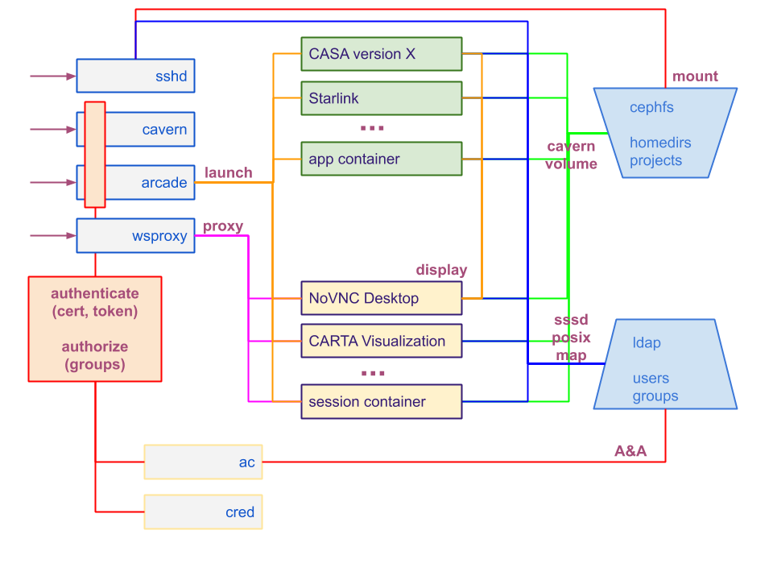

# ARCADE: ALMA Reduction in the CANFAR Data Environment
Principal Investigator: Toby Brown, Helen Kirk

#### Table of contents
  * [Overview](#overview)
  * [Getting started](#getting-started)
  * [Tutorials](#tutorials)
  * [Technical Overview](#technical-overview)
  * [System Components](#system-components)
    + [arcade](#arcade)
    + [arcade-wsproxy](#arcade-wsproxy)
    + [arcade-desktop](#arcade-desktop)
    + [arcade-carta](#arcade-carta)
    + [software-containers](#software-containers)
  * [Dependencies](#dependencies)
  * [Deployment](#deployment)
  * [Publication acknowledgement](#publication-acknowledgement)

## Overview
ARCADE is a general purpose online platform built to support ALMA data processing requirements. The system is currently in beta deployment with a limited number of simultaneous users.

The ARCADE system is also fully integrated with [CARTA: The Cube Analysis and Rendering Tool for Astronomy](https://cartavis.github.io/).

## Getting started
Obtaining an ARCADE user allocation requires a [CADC account](http://www.cadc-ccda.hia-iha.nrc-cnrc.gc.ca/en/auth/request.html). Allocations are provided on a case-by-case basis while the system is in beta.

Sessions are started (or resumed) using the `ARCADE` and `CARTA` buttons on the [demo CANFAR homepage](https://demo.canfar.net/en/). Ensure you are logged in to your CADC account at the top right of the page to enable these options.

## Tutorials

There are also a series of [how to guides](https://github.com/opencadc/arcade/tree/master/arcade-tutorial) for ARCADE.

## Technical Overview

## System Components

Components of arcade are containers that can be scaled out on a cluster of nodes to meet the storage and processing demands of the scientific software containers.

### arcade
The arcade module provides the API for creating arcade sessions and launching applications within that session.  It is a Java war file running in tomcat 8 in a container.

### arcade-wsproxy
arcade-wsproxy is an apache httpd container whose job is to proxy NoVNC traffic to the containers running NoVNC sessions.

### arcade-desktop
arcade-desktop is a container representing an arcade session.  It is a NoVNC implementation, forked and modified from the ConSol project:  https://github.com/ConSol/docker-headless-vnc-container.
The current implementation of arcade-desktop as a NoVNC container may be replaced with another technology at some point.

### arcade-carta
arcade-carta is container installation of Carta 1.3 Remote.  It is another type of session supported in arcade.  Other session types can be added to arcade.

### software-containers
These are some of the astronomy science containers that have been built for arcade.  They run as applications within arcade.  The graphical aspects of the containers are displayed in arcade-desktop by sending the DISPLAY to arcade-desktop.

## Dependencies

arcade relies on a number of other opencadc modules to operate.
* registry (reg) web service (https://github.com/opencadc/reg) -- A registry service will be used to read the capabilities and locations of other web services used by arcade.
* access control (ac) web service (https://github.com/opencadc/ac) -- If the IdentityManager implementation is configured to use cadc-access-control-server for authentication an operational ac web service is required to be running.
* credential delegation (cdp) web service (https://github.com/opencadc/cdp) -- The cdp service is used to obtain users' delegated proxy certificates.
* cavern -- arcade is greatly complimented by running cavern along side it.  (https://github.com/opencadc/vos/tree/master/cavern).  cavern is a vospace implementation where both the data and metadata are based on the contents of a file system.  If the software-containers have access to the cavern file system the contents of that file system can be accessed and shared through the cavern web service.
* posix/sssd -- arcade-desktop and software-containers are run with a SSSD configuration that must point to the same LDAP instance as is used by ac.  When users interact with cavern on the file system the permissions are enforced according to the group membership contained in the LDAP instace.

## Deployment
The current implementation targets a Kubernetes deployment.  In the arcade/src/obsolete directory is a version which targets a Docker deployment.  This is no longer supported.

On session and application launch, arcade will interact with kubernetes to manifest these entities.  Two kubernetes configuration files are required for these operations.  Examples of these files can be found in arcade/src/examples.  The variables in these files are replaced by arcade at runtime.

## Publication acknowledgement
Publications that made use of ARCADE platform must include the following statement in the acknowledgement:
*“We acknowledge the use of the ARCADE (ALMA Reduction in the CANFAR Data Environment) science platform. ARCADE is a ALMA Cycle 7 development study with support from the National Radio Astronomy Observatory, the North American ALMA Science Centre, and the National Research Centre of Canada."*

