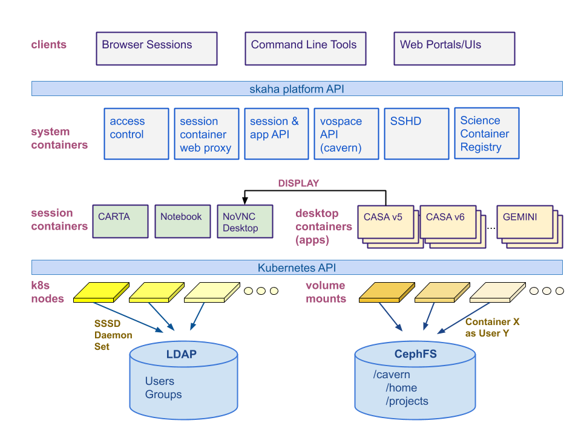

# skaha - A container based science platform in CANFAR

#### Table of contents
  * [Overview](#overview)
  * [System Components](#system-components)
    + [skaha](#skaha)
    + [skaha-wsproxy](#skaha-wsproxy)
    + [skaha-desktop](#skaha-desktop)
    + [skaha-carta](#skaha-carta)
    + [skaha-notebook](#skaha-notebook)
    + [software-containers](#software-containers)
  * [Dependencies](#dependencies)
  * [Deployment](#deployment)
  * [Publication acknowledgement](#publication-acknowledgement)

## Overview
skaha is a general purpose online platform. The system is currently in beta deployment with a limited number of simultaneous users.

## System Components

Components of skaha are containers that can be scaled out on a cluster of nodes to meet the storage and processing demands of the scientific software containers.

### skaha
The skaha module provides the API for creating skaha sessions and launching applications within that session.  It is a Java war file running in tomcat 8 in a container.

### skaha-wsproxy
skaha-wsproxy is an apache httpd container whose job is to proxy NoVNC traffic to the containers running NoVNC sessions.

### skaha-desktop
skaha-desktop is a container representing a skaha session.  It is a NoVNC implementation, forked and modified from the ConSol project:  https://github.com/ConSol/docker-headless-vnc-container.
The current implementation of skaha-desktop as a NoVNC container may be replaced with another technology at some point.

### skaha-carta
skaha-carta is container installation of Carta 1.3 Remote.  It is another type of session supported in skaha.  Other session types can be added to skaha.

### skaha-notebook
skaha-notebook is a Jupyter notebook session with which we are currently experimenting and prototyping.

### software-containers
These are some of the astronomy science containers that have been built for skaha.  They run as applications within skaha.  The graphical aspects of the containers are displayed in skaha-desktop by sending the DISPLAY to skaha-desktop.

## Dependencies

skaha relies on a number of other opencadc modules to operate.
* registry (reg) web service (https://github.com/opencadc/reg) -- A registry service will be used to read the capabilities and locations of other web services used by skaha.
* access control (ac) web service (https://github.com/opencadc/ac) -- If the IdentityManager implementation is configured to use cadc-access-control-server for authentication an operational ac web service is required to be running.
* credential delegation (cdp) web service (https://github.com/opencadc/cdp) -- The cdp service is used to obtain users' delegated proxy certificates.
* cavern -- skaha is greatly complimented by running cavern along side it.  (https://github.com/opencadc/vos/tree/master/cavern).  cavern is a vospace implementation where both the data and metadata are based on the contents of a file system.  If the software-containers have access to the cavern file system the contents of that file system can be accessed and shared through the cavern web service.
* posix/sssd -- skaha-desktop and software-containers are run with a SSSD configuration that must point to the same LDAP instance as is used by ac.  When users interact with cavern on the file system the permissions are enforced according to the group membership contained in the LDAP instace.

## Deployment
The current implementation targets a Kubernetes deployment.

On session and application launch, skaha will interact with kubernetes to manifest these entities.  Two kubernetes configuration files are required for these operations.  Examples of these files can be found in skaha/src/examples.  The variables in these files are replaced by skaha at runtime.

