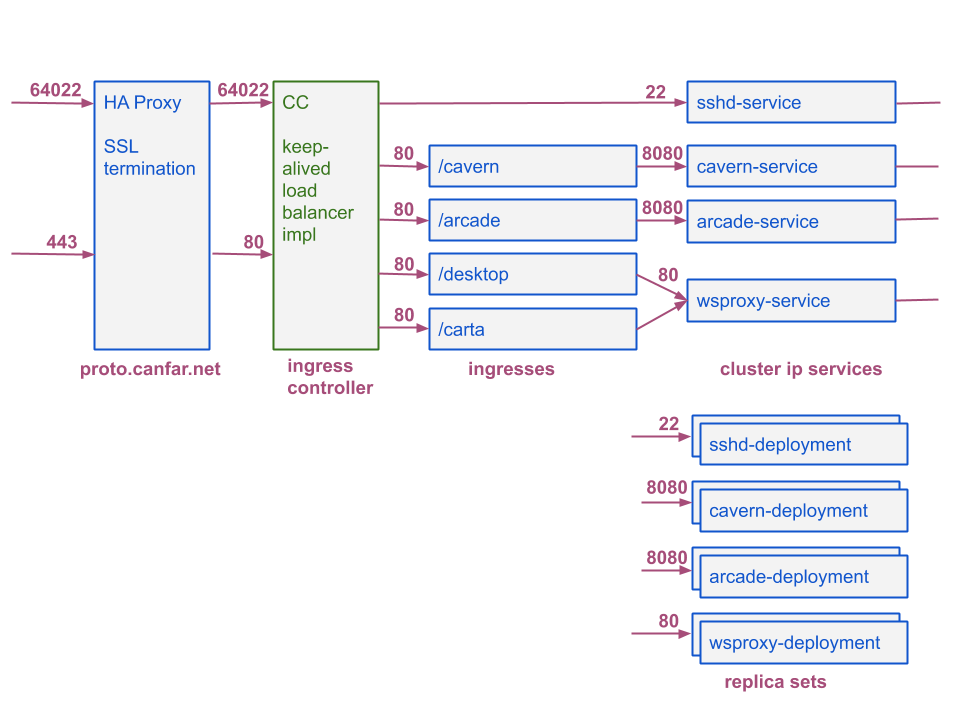
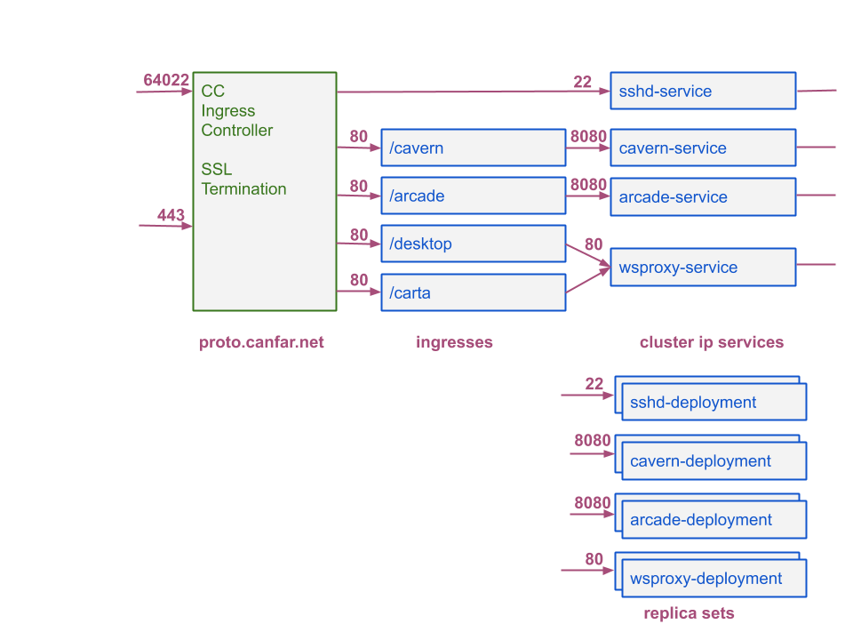

# arcade-k8s-config
Kubernetes deployment of arcade and cavern

## Overview
This module contains the prototype deployment of arcade and cavern in kubernetes.  

## Network

### Current network

The HA Proxy VM is there to support client proxy certificates.  The 'future' diagram below is what we'd like the network architecture to look like.  nginx in the ingress controller uses a newer version of openssl which requires apps (nginx in this case) to expose the configuration required to enable proxy certificates.  nginx does not allow that at this time.

This setup is not ideal because of the single point of failure in HA Proxy.

### Future network

In this setup SSL termination is done right in the ingress.  Because the ingress is load balanced it does not have a single point of failure.
