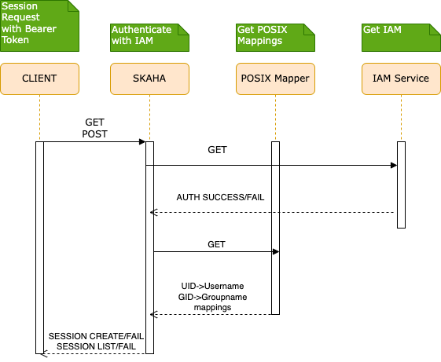
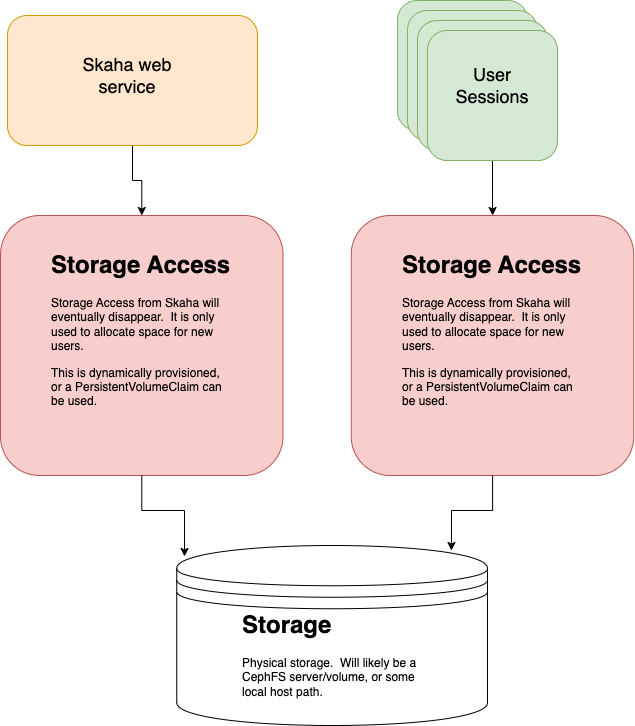

# Deployment Guide

- [Dependencies](#dependencies)
- [Helm](#helm-repository)
- [Quick Start](#quick-start)
  - [Base install](#base-install)
  - [Persistent Volumes](#persistent-volumes-and-persistent-volume-claims)
  - [POSIX Mapper install](#posix-mapper-install)
  - [Skaha install](#skaha-install)
  - [Science Portal install](#science-portal-user-interface-install)
  - [Cavern install](#cavern-user-storage-api-install)
  - [Storae User Interface install](#user-storage-ui-installation)
- [Obtaining a bearer token](#obtaining-a-bearer-token)
- [Flow](#flow)
- [Structure](#structure)

## Dependencies

- An existing Kubernetes cluster.
- An IVOA Registry (See the [Current SKAO Registry](https://spsrc27.iaa.csic.es/reg))

## Quick Start

```bash
helm repo add science-platform https://images.opencadc.org/chartrepo/platform
helm repo update

helm install --values my-base-local-values-file.yaml base science-platform/base
helm install -n skaha-system --values my-posix-mapper-local-values-file.yaml posixmapper science-platform/posixmapper
helm install -n skaha-system --values my-skaha-local-values-file.yaml skaha science-platform/skaha
helm install -n skaha-system --dependency-update --values my-scienceportal-local-values-file.yaml scienceportal science-platform/scienceportal
helm install -n skaha-system --values my-cavern-local-values-file.yaml cavern science-platform/cavern
helm install -n skaha-system --dependency-update --values my-storage-ui-local-values-file.yaml storage-ui science-platform/storageui
```

More details below.

### Helm repository

Add the Helm repository:
```bash
helm repo add science-platform https://images.opencadc.org/chartrepo/platform
helm repo update
```

### Base install

The [Base](base) install will create ServiceAccount, Role, Namespace, and RBAC objects needed to place the Skaha service.

Create a `my-base-local-values-file.yaml` file to override Values from the main [template `values.yaml` file](base/values.yaml).  Mainly the
Traefik Default Server certificate (optional if needed):

`my-base-local-values-file.yaml`
```yaml
secrets:
    default-certificate:
        tls.crt: <base64 encoded server certificate>
        tls.key: <base64 encoded server key>
```

```bash
helm install --values my-base-local-values-file.yaml base science-platform/base

NAME: base
LAST DEPLOYED: Thu Sep 28 07:28:45 2023
NAMESPACE: default
STATUS: deployed
REVISION: 1
```

### Persistent Volumes and Persistent Volume Claims

**Note** 
The `base` MUST be installed first as it creates the necessary Namespaces for the Persistent Volume Claims!

**Important**
There are two (2) Persistent Volume Claims that are used in the system, due to the fact that there are two (2) Namespaces (`skaha-system` and `skaha-workload`).  These PVCs, while
having potentially different configurations, **SHOULD** point to the same storage.  For example, if two `hostPath` PVCs are created, the `hostPath.path` **MUST** point to the same
folder in order to have shared content between the Services (`skaha`, `cavern`) and the User Sessions (Notebooks, CARTA, etc.).

It is expected that the deployer, or an Administrator, will create the necessary Persistent Volumes (if needed), and the required Persistent Volume Claims at
this point.  There are sample [Local Storage](https://kubernetes.io/docs/concepts/storage/volumes/#local) Persistent Volume examples in the `base/volumes` folder.


#### Required Persistent Volume Claim

It is expected that there is a Persistent Volume Claim with the name of the Skaha Workload namespace hyphenated with `cavern-pvc`.  This will provide the
backing storage to the User Sessions.  Using the default values, this means:

`skaha-workload-cavern-pvc`

will exist as a Persistent Volume Claim in the `skaha-workload` namespace.


### POSIX Mapper install

The [POSIX Mapper Service](posix-mapper) is required to provide a UID to Username mapping, and a GID to Group Name mapping so that any Terminal access properly showed System Users in User Sessions.  It will generate UIDs when a user is requested, or a GID when a Group is requested, and then keep track of them.

This service is required to be installed _before_ the Skaha service.

Create a `my-posix-mapper-local-values-file.yaml` file to override Values from the main [template `values.yaml` file](posix-mapper/values.yaml).

`my-posix-mapper-local-values-file.yaml`
```yaml
# POSIX Mapper web service deployment
deployment:
  hostname: example.host.com    # Change this!
  posixMapper:
    # Optionally set the DEBUG port.
    # extraEnv:
    # - name: CATALINA_OPTS
    #   value: "-agentlib:jdwp=transport=dt_socket,server=y,suspend=n,address=0.0.0.0:5555"
    # - name: JAVA_OPTS
    #   value: "-agentlib:jdwp=transport=dt_socket,server=y,suspend=n,address=0.0.0.0:5555"

    # Uncomment to debug.  Requires options above as well as service port exposure below.
    # extraPorts:
    # - containerPort: 5555
    #   protocol: TCP

    # Resources provided to the Skaha service.
    resources:
      requests:
        memory: "1Gi"
        cpu: "500m"
      limits:
        memory: "1Gi"
        cpu: "500m"

    # Used to set the minimum UID.  Useful to avoid conflicts.
    minUID: 10000

    # Used to set the minimum GID.  Keep this much higher than the minUID so that default Groups can be set for new users.
    minGID: 900000

    # The URL of the IVOA Registry
    registryURL: https://spsrc27.iaa.csic.es/reg

    # Optionally mount a custom CA certificate
    # extraVolumeMounts:
    # - mountPath: "/config/cacerts"
    #   name: cacert-volume

    # Create the CA certificate volume to be mounted in extraVolumeMounts
    # extraVolumes:
    # - name: cacert-volume
    #   secret:
    #     defaultMode: 420
    #     secretName: posix-manager-cacert-secret

# Declare the storage for the skaha service to use.
storage:
  service:
    spec:
      persistentVolumeClaim:
        claimName: skaha-pvc # Match this label up with whatever was installed in the base install, or the desired PVC, or create dynamically provisioned storage.

secrets:
  # Uncomment to enable local or self-signed CA certificates for your domain to be trusted.
#   posix-manager-cacert-secret:
#     ca.crt: <base64 encoded ca crt>

# These values are preset in the catalina.properties, and this default database only exists beside this service.
# It's usually safe to leave these as-is.
# postgresql:
#   auth:
#     username: posixmapper
#     password: posixmapperpwd
#     database: mapping
#     schema: mapping
#   storage:
#     spec:
#       hostPath:
#         path: "/posixmapper/data"

# An omission equals true, so set this explicitly to false as we already installed it.
base:
  install: false
```

It is recommended to install into the `skaha-system` namespace, but not required.
```bash
helm install -n skaha-system  --values my-posix-mapper-local-values-file.yaml posixmapper science-platform/posixmapper

NAME: posixmapper
LAST DEPLOYED: Thu Sep 28 07:28:45 2023
NAMESPACE: skaha-system
STATUS: deployed
REVISION: 1
```

Test it.
```bash
# See below for tokens
export SKA_TOKEN=...
curl -SsL --header "authorization: Bearer ${SKA_TOKEN}" https://example.host.com/posix-mapper/uid

[]%

curl -SsL --header "authorization: Bearer ${SKA_TOKEN}" "https://example.host.com/posix-mapper/uid?user=mynewuser"

mynewuser:x:1000:1000:::
```

### Skaha install

The Skaha service will manage User Sessions.  It relies on the POSIX Mapper being deployed, and available to be found
via the IVOA Registry:

`/reg/resource-caps`
```
...
# Ensure the hostname matches the deployment hostname.
ivo://example.org/posix-mapper = https://example.host.com/posix-mapper/capabilities
...
```

```yaml
# POSIX Mapper web service deployment
deployment:
  hostname: example.host.com    # Change this!
  skaha:
    # Optionally set the DEBUG port.
    # extraEnv:
    # - name: CATALINA_OPTS
    #   value: "-agentlib:jdwp=transport=dt_socket,server=y,suspend=n,address=0.0.0.0:5555"
    # - name: JAVA_OPTS
    #   value: "-agentlib:jdwp=transport=dt_socket,server=y,suspend=n,address=0.0.0.0:5555"

    # Uncomment to debug.  Requires options above as well as service port exposure below.
    # extraPorts:
    # - containerPort: 5555
    #   protocol: TCP

    # Optional.  Rename the main root folder to something else.  For existing installs, this can be
    # omitted.
    # skahaTld: "/arc"

    # Resources provided to the Skaha service.
    resources:
      requests:
        memory: "1Gi"
        cpu: "500m"
      limits:
        memory: "1Gi"
        cpu: "500m"

    maxUserSessions: "3"
    sessionExpiry: "345600"
    defaultQuotaGB: "10"

    # Space delimited list of allowed Image Registry hosts.  These hosts should match the hosts in the User Session images.
    registryHosts: "images.canfar.net"

    # The group name to verify users against for permission to use the Science Platform.  Group must exist in the group provider.
    usersGroup: "ivo://skao.int/gms?prototyping-groups/mini-src/platform-users"

    # Set to an administrative group.  Used to determine if the current user can bypass Harbor image validation.
    adminsGroup: "ivo://skao.int/gms?prototyping-groups/mini-src/platform-users"

    # Group for users to preempt headless jobs.  Group must exist in the group provider. (Optional)
    headlessGroup: "ivo://skao.int/gms?prototyping-groups/mini-src/platform-users"

    # Array of groups allowed to set the logging level.  Group must exist in the group provider. (Optional)
    loggingGroups:
      - "ivo://skao.int/gms?prototyping-groups/mini-src/platform-users"

    # The Resource ID of the Service that contains the Posix Mapping information
    posixMapperResourceID: "ivo://opencadc.org/posix-mapper"

    # URI or URL of the OIDC (IAM) server
    # oidcURI: https://ska-iam.stfc.ac.uk/

    # ID (URI) of the GMS Service.
    # gmsID: ivo://skao.int/gms

    registryURL: https://spsrc27.iaa.csic.es/reg

    # Optionally mount a custom CA certificate
    # extraVolumeMounts:
    # - mountPath: "/config/cacerts"
    #   name: cacert-volume

    # Create the CA certificate volume to be mounted in extraVolumeMounts
    # extraVolumes:
    # - name: cacert-volume
    #   secret:
    #     defaultMode: 420
    #     secretName: posix-manager-cacert-secret

# Set these labels appropriately to match your Persistent Volume labels.
# The storage.service.spec can be anything that supports ACLs, such as CephFS or Local.
# The CephFS Volume can be dynamically allocated here for the storage.service.spec:
# Example:
# storage:
#   service:
#     spec:
#       cephfs:
#         mons:
#           ...
# Default is a PersistentVolumeClaim to the Local Storage.
storage:
  service:
    spec:
      persistentVolumeClaim:
        claimName: skaha-pvc # Match this label up with whatever was installed in the base install, or the desired PVC, or create dynamically provisioned storage.

secrets:
  # Uncomment to enable local or self-signed CA certificates for your domain to be trusted.
#   posix-manager-cacert-secret:
#     ca.crt: <base64 encoded ca crt>

# An omission equals true, so set this explicitly to false as we already installed it.
posixmapper:
    install: false
    # Supports all of the posix-mapper/values.yaml options here.
```

It is recommended to install into the `skaha-system` namespace, but not required.
```bash
helm install -n skaha-system --values my-skaha-local-values-file.yaml skaha science-platform/skaha

NAME: skaha
LAST DEPLOYED: Thu Sep 28 07:31:10 2023
NAMESPACE: skaha-system
STATUS: deployed
REVISION: 1
```

Test it.
```bash
# See below for tokens
export SKA_TOKEN=...
curl -SsL --header "authorization: Bearer ${SKA_TOKEN}" https://example.host.com/skaha/v0/session

[]%

# xxxxxx is the returned session ID.
curl -SsL --header "authorization: Bearer ${SKA_TOKEN}" -d "ram=1" -d "cores=1" -d "image=images.canfar.net/canucs/canucs:1.2.5" -d "name=myjupyternotebook" "https://example.host.com/skaha/v0/session"

xxxxxx
```

### Science Portal User Interface install

The Skaha service will manage User Sessions.  It relies on the Skaha service being deployed, and available to be found
via the IVOA Registry:

`/reg/resource-caps`
```
...
# Ensure the hostname matches the deployment hostname.
ivo://example.org/skaha = https://example.host.com/skaha/capabilities
...
```

Please read the [minimum configuration](./science-portal/README.md).  A quick look is:

```yaml
deployment:
  hostname: example.com # Change this!
  sciencePortal:
    # OIDC (IAM) server configuration.  These are required
    oidc:
      # Location of the OpenID Provider (OIdP), and where users will login
      uri: https://ska-iam.stfc.ac.uk/

      # The Client ID as listed on the OIdP.  Create one at the uri above.
      clientID: my-client-id

      # The Client Secret, which should be generated by the OIdP.
      clientSecret:  my-client-secret

      # Where the OIdP should send the User after successful authentication.  This is also known as the redirect_uri in OpenID.
      redirectURI: https://example.com/science-portal/oidc-callback

      # Where to redirect to after the redirectURI callback has completed.  This will almost always be the URL to the /science-portal main page (https://example.com/science-portal).
      callbackURI: https://example.com/science-portal/

      # The standard OpenID scopes for token requests.  This is required, and if using the SKAO IAM, can be left as-is.
      scope: "openid profile offline_access"

    # Optionally mount a custom CA certificate
    # extraVolumeMounts:
    # - mountPath: "/config/cacerts"
    #   name: cacert-volume

    # Create the CA certificate volume to be mounted in extraVolumeMounts
    # extraVolumes:
    # - name: cacert-volume
    #   secret:
    #     defaultMode: 420
    #     secretName: science-portal-cacert-secret

    # The Resource ID of the Service that contains the URL of the Skaha service in the IVOA Registry
    skahaResourceID: ivo://example.org/skaha

    # The logo in the top left.  No link associated, just the image.  This can be relative, or absolute.
    # Default is the SRCNet Logo.
    # logoURL: /science-portal/images/SRCNetLogo.png

# secrets:
  # Uncomment to enable local or self-signed CA certificates for your domain to be trusted.
  # science-portal-cacert-secret:
    # ca.crt: <base64 encoded ca.crt blob>
```

### Cavern (User Storage API) install

The Cavern API provides access to the User Storage which is shared between Skaha and all of the User Sessions.  A [Bearer token](#obtaining-a-bearer-token) is required when trying to read
private access, or any writing.

Please see the [minimum configuration](./cavern/README.md).  A quick look is:

```yaml
# Skaha web service deployment
deployment:
  hostname: example.org  # Change this!
  cavern:
    # How cavern identifies itself.
    resourceID: "ivo://example.org/cavern"

    # Set the Registry URL pointing to the desired registry
    registryURL: "https://registry.example.org/reg"

    # How to find the POSIX Mapper API.  URI (ivo://) or URL (https://).
    posixMapperResourceID: "ivo://example.org/posix-mapper"

    filesystem:
      # persistent data directory in container
      dataDir: "/data"

      # RELATIVE path to the node/file content that could be mounted in other containers
      subPath: "cavern"

      # See https://github.com/opencadc/vos/tree/master/cavern for documentation.  For deployments using OpenID Connect,
      # the rootOwner MUST be an object with the following properties set.
      rootOwner:
        # The adminUsername is required to be set whomever has admin access over the filesystem.dataDir above.
        adminUsername: 

        # The username of the root owner.
        username: 

        # The UID of the root owner.
        uid: 

        # The GID of the root owner.
        gid: 

    # Further UWS settings for the Tomcat Pool setup.
    uws:
      schema: uws
      maxActive: 2

    # Optional rename of the application from the default "cavern"
    # applicationName: "cavern"

    # The endpoint to serve this from.  Defaults to /cavern.  If the applicationName is changed, then this should match.
    # Don't forget to update your registry entries!
    # endpoint: "/cavern"

    # Optionally set the DEBUG port.
    # extraEnv:
    # - name: CATALINA_OPTS
    #   value: "-agentlib:jdwp=transport=dt_socket,server=y,suspend=n,address=0.0.0.0:5555"
    # - name: JAVA_OPTS
    #   value: "-agentlib:jdwp=transport=dt_socket,server=y,suspend=n,address=0.0.0.0:5555"

    # Optionally mount a custom CA certificate
    # extraVolumeMounts:
    # - mountPath: "/config/cacerts"
    #   name: cacert-volume

    # Create the CA certificate volume to be mounted in extraVolumeMounts
    # extraVolumes:
    # - name: cacert-volume
    #   secret:
    #     defaultMode: 420
    #     secretName: skaha-cacert-secret

    # Resources provided to the Skaha service.
    resources:
      requests:
        memory: "1Gi"
        cpu: "500m"
      limits:
        memory: "1Gi"
        cpu: "500m"

# secrets:
  # Uncomment to enable local or self-signed CA certificates for your domain to be trusted.
  # cavern-cacert-secret:
  #   ca.crt: <base64 encoded CA crt>

# Set these appropriately to match your Persistent Volume Claim labels.
storage:
  service:
    spec:
      # YAML for service mounted storage.
      # Example is the persistentVolumeClaim below.  This should match whatever Skaha used.
      # persistentVolumeClaim:
      #   claimName: skaha-pvc

# UWS Database
postgresql:
  install: true  # To run your own database, set this to false and override auth settings.
```

### User Storage UI installation

Please read the [minimum configuration](./storage-ui/README.md).  A quick look is:

```yaml
deployment:
  hostname: example.com # Change this!
  storageUI:
    # OIDC (IAM) server configuration.  These are required
    oidc:
      # Location of the OpenID Provider (OIdP), and where users will login
      uri: https://ska-iam.stfc.ac.uk/

      # The Client ID as listed on the OIdP.  Create one at the uri above.
      clientID: my-client-id

      # The Client Secret, which should be generated by the OIdP.
      clientSecret:  my-client-secret

      # Where the OIdP should send the User after successful authentication.  This is also known as the redirect_uri in OpenID.
      redirectURI: https://example.com/science-portal/oidc-callback

      # Where to redirect to after the redirectURI callback has completed.  This will almost always be the URL to the /science-portal main page (https://example.com/science-portal).
      callbackURI: https://example.com/science-portal/

      # The standard OpenID scopes for token requests.  This is required, and if using the SKAO IAM, can be left as-is.
      scope: "openid profile offline_access"

    # ID (URI) of the GMS Service.
    gmsID: ivo://skao.int/gms

    # Dictionary of all VOSpace APIs (Services) available that will be visible on the UI.
    # Format is:
    backend:
      defaultService: cavern
      services:
        cavern:
          resourceID: "ivo://ska.int/cavern"
          nodeURIPrefix: "vos://int.ska~cavern"
          userHomeDir: "/home"
          # Some VOSpace services support these features.  Cavern does not, but it needs to be explicitly declared here.
          features:
            batchDownload: false
            batchUpload: false
            externalLinks: false
            paging: false

    # Optionally mount a custom CA certificate
    # extraVolumeMounts:
    # - mountPath: "/config/cacerts"
    #   name: cacert-volume

    # Create the CA certificate volume to be mounted in extraVolumeMounts
    # extraVolumes:
    # - name: cacert-volume
    #   secret:
    #     defaultMode: 420
    #     secretName: science-portal-cacert-secret

# secrets:
  # Uncomment to enable local or self-signed CA certificates for your domain to be trusted.
  # science-portal-cacert-secret:
    # ca.crt: <base64 encoded ca.crt blob>
```

## Obtaining a Bearer Token

See the [JIRA Confluence page](https://confluence.skatelescope.org/display/SRCSC/RED-10+Using+oidc-agent+to+authenticate+to+OpenCADC+services) on obtaining a Bearer Token.

## Flow



The Skaha service depends on several installations being in place.

## Structure


