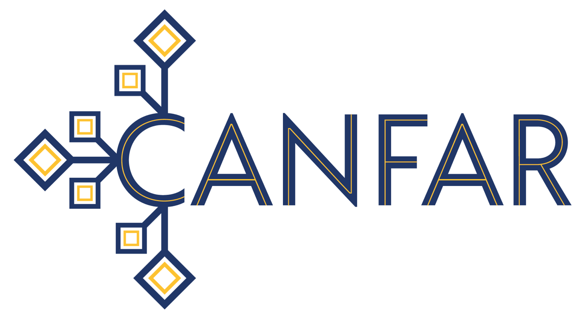

# CANFAR Science Platform Documentation

# Table of Contents
1. [Introduction and Access](#introduction-and-access)
2. [Interactive Sessions](#interactive-sessions)
3. [Storage](#storage)
4. [Groups and Permissions](#groups-and-permissions)
5. [Programmatic Access](#programmatic-access)
6. [Community and Support](#community-and-support)
7. [FAQ](#faq)

## Introduction and Access

Documentation for new users can be found here: [Documentation For New Users](https://canfar-scienceportal.readthedocs.io/en/latest/) 

The CANFAR Portal can be found here:  [CANFAR Science Portal](https://www.canfar.net)
On the portal are the [Science Portal](https://www.canfar.net/science-portal) and the [Storage UI](https://www.canfar.net/storage/arc/list/).

A Canadian Astronomy Data Centre (CADC) Account and authorization to use the portal are required first.

To request a CADC Account:  https://www.cadc-ccda.hia-iha.nrc-cnrc.gc.ca/en/auth/request.html

To request authorization to use the science portal, send an email to [support@canfar.net](mailto:support@canfar.net)

## Interactive Sessions

The CANFAR Science Portal allows users to run both pre-built, shared containers or private, custom containers.  Users publish container images to the CANFAR Image Registry at https://images.canfar.net

Logins to the Image Registry are done through the OpenID Connect Login button using your CADC/CANFAR crendentials.  Contact the project image coordinator to obtain authorization to publish images to that project.

Details of image publishing for use in the CANFAR science portal can be found here:  [Publishing](../containers)

### Jupyter Notebooks

The CANFAR Science Portal allows for the creation of Jupyter Notebooks.  [Jupyter](https://jupyter.org/)

### CARTA 

The CANFAR Science Portal allows for the creation of CARTA (Cube Analysis and Rendering Tool for Astronomy) sessions.  [CARTA](https://cartavis.org/) 

### ARCADE Desktop

For running CASA and other non-browser applications in the Science Platform.

- ARCADE documentation and tutorials: [ARCADE](https://github.com/canfar/arcade)
- Launching a CASA window in ARCADE YouTube tutorial:  [YouTube Tutorial](https://youtu.be/GDDQ3jKbldU)

## Storage

All sessions and applications that run in the Science Portal have filesystem access to the same storage, mounted at `/arc`.  Within are `/arc/home` (contains all home directories) and `/arc/projects` (for project use).  We encourage the use of `/arc/projects` for most data, and `/arc/home` for personalized configuration.

`arc` is accesible through an API based on the IVOA VOSpace specification.  The following list the ways it can be accessed:
- Through the `/arc` filesystem mount on all portal sessions and ARCADE windows.
- Using the storage management UI in CANFAR: https://www.canfar.net/storage/arc/list
- Using the [CADC Python libraries](https://github.com/opencadc/vostools/tree/master/vos)
- Using sshfs [documentation](https://github.com/canfar/arcade/tree/master/arcade-tutorial)
- Using the `/arc/files` endpoint [documentation](https://ws-uv.canfar.net/arc)

Please take care to protect sensitive information by ensuring it is not publicly accessible.

## Groups and Permissions

Projects are encouraged to use groups to manage access to resources, including files and directories in arc project storage, mounted at `/arc/projects` in every skaha session.

Groups and their memberships can be managed through the CANFAR groups web portal, here: https://www.cadc-ccda.hia-iha.nrc-cnrc.gc.ca/en/groups/

Once created, groups can be assinged to files and directories in arc storage.  This can be done the CANFAR storage web portal, here:  https://www.canfar.net/storage/arc/list

Groups can be assigned as either `read-only` or `read-write`.

More sophisticated mangement of groups, including setting default groups for a given project directory, can be done on the command line in the science portal, and is explained in the section below.

### Command Line Group Management

Each file or directory can have any of read (r), write (w), or execute (x) permission.  For example, a file with read-write permission is describe with rw-.

```
r = read - can see the file or directory
w = write - can modify the file or directory
x = execute - for directories, means list children.  for files, means execute file
- = does not have the given permission (r, w, or x, depending on the position of the -)
```

The following lists permission combinations for arc as seen on the command line:

```
read-only file permissions: r--
read-write file permissions: rw-
read-only directory permissions: r-x
read-write directory permissions: rwx
```

Group permissions are stored in POSIX Access Control Lists (ACLs).  To view the group permissions on a given file or directory, run the following command:

```
getfacl file-or-directory
```

There are two relevant entries in the output:

The named-group permissions, in the format `group:{group-name}:{permissions}`.  For example: `group:skaha-users:rw-`

Secondly, if a `mask` entry exists, it will change the actual (or effictive) permissions the group receives.  For example, if the following mask entry `mask::r-x` were applied to `group:skaha-users:rw-`, the effective permissions become `group:skaha-users:r--`  Effective permissions are calculated by doing an AND operation on each of the three correspsonding permissions (rwx).  The permission must exist in both the original group permissions and the mask for them to become effective.  If a mask entry does not exist, the group permissions are used directly.

To make files and directories (and their children) inherit group permissions, run *one* of the following commands:

Set the default read group:
```
setfacl -d -m group:{group-name}:r-x {read-only-dir}
```

Set the default read-write group:
```
setfacl -d -m group:{group-name}:rwx {read-write-dir}
```

The group permissions are not set on target directories themselves, only on newly created children.
To set group permissions on a single file or directory, run *one* of the following commands:

Set the read group:
```
setfacl -m group:{group-name}:r-x {read-only-dir}
```

Set the read-write group:
```
setfacl -m group:{group-name}:rwx {read-write-dir}
```

To set group permissions on an existing directory tree recursively, run *one* of the following commands:

Set the read group:
```
setfacl -R -m group:{group-name}:r-x {read-only-dir}
```

Set the read-write group:
```
setfacl -R -m group:{group-name}:rwx {read-write-dir}
```

To set group permissions on an existing directory tree recursively, and to have new children in directories of that tree inherit the group permissions, run *one* of the following commands:

Set the read group:
```
setfacl -R -d -m group:{group-name}:r-x {read-only-dir}
```

Set the read-write group:
```
setfacl -R -d -m group:{group-name}:rwx {read-write-dir}
```

## Programmatic Access

The skaha API definition and science platform service are here:  https://ws-uv.canfar.net/skaha

### Authentication

All requests to the skaha API must be made with CADC/CANFAR credentials.  In the science portal the credentials are handled with cookies, but for programatic access, either x.509 client certificates or authorization tokens must be used.

#### Authorization Tokens

Tokens can be obtained from the CANFAR Access Control service by providing your CADC username and password over a secure SSL connection:

```curl https://ws-cadc.canfar.net/ac/login -d "username=<username>" -d "password=<password>"```

The token returned can then be used for making authenticated requests to skaha.  For example:

```curl -H "Authorization: Bearer <token>" https://ws-uv.canfar.net/skaha/session```

Tokens are valid for 48 hours.

#### Proxy Certificates

Another way to authenticate to the skaha API is by using proxy certificates.  Using the [CADC Python libraries](https://github.com/opencadc/vostools/tree/master/vos), the `cadc-get-cert` tool will download a proxy certificate to the default location: `$HOME/.ssl/cadcproxy.pem`.

```cadc-get-cert -u <username>```

By default the proxy certificate is valid for 10 days.  This can be modified (to a maximum of 30 days) with the `--days-valid` parameter.

Instead of prompting for your password, cadc-get-cert can read it from your `$HOME/.netrc` file using the `--netrc-file` parameter.

### Headless Jobs

Please contact us before making use of the 'headless job' support--we are incrementally adding support for batch processing in the science platform.

#### Create an image

Create an image as per the regular process of making containers available in the platform:  [Publishing](../containers)

However, label it as `headless` in https://images.canfar.net to make it available for headless job launching.

#### Launch a headless job

For the full details of the job launching API, see this section of the akaha API documentation:  https://ws-uv.canfar.net/skaha#!/Session_Management/post_session

All jobs will be run as the calling user.  All jobs have the `/arc` filesystem mounted.

Example: launch a headless job, overriding the command and providing two arguments:

```curl -E ~/.ssl/cadcproxy.pem https://ws-uv.canfar.net/skaha/session -d "name=headless-test" -d "image=images.canfar.net/skaha/terminal:0.1" --data-urlencode "cmd=touch" --data-urlencode "args=/arc/home/majorb/headless-test-1a /arc/home/majorb/headless-test-1b"```

skaha will return the `sessionID` on a successful post (job launch).  The job will remain in the system for 1 hour after completion (success or failure).

Job phases:
- Pending
- Running
- Succeeded
- Failed
- Terminating
- Unknown

To view all sessions and jobs:
```curl -E ~/.ssl/cadcproxy.pem https://ws-uv.canfar.net/skaha/session```

To view a single session or job:
```curl -E ~/.ssl/cadcproxy.pem https://ws-uv.canfar.net/skaha/session/<sessionID>```

To view logs for session:
```curl -E ~/.ssl/cadcproxy.pem https://ws-uv.canfar.net/skaha/session/<sessionID>?view=logs```

This shows the complete output (stdout and stderr) for the image for the job.

To view scheduling events for session:
```curl -E ~/.ssl/cadcproxy.pem https://ws-uv.canfar.net/skaha/session/<sessionID>?view=events```

Scheduling events will only be seen when there are issues scheduling the job on a node.

## Community and Support

Dicussions of issues and platform features take place in the Science Platform Slack Channel:  [Science Platform Slack Channel](https://cadc.slack.com/archives/C01K60U5Q87)

Reporting of bugs and new feature requests can also be made as github issues:  https://github.com/opencadc/skaha/issues

Contributions to the platform (including updates or corrections to the documentation) can be submitted as pull requests to this github project.

General inquiries can be made to [support@canfar.net](mailto:support@canfar.net)

## FAQ

* ***My session is stuck in the `Pending` state*** - This can imply that the platform is unable to launch your image.  There are a number of potential causes:
   * Often skaha fails to authorize you to https:images.canfar.net due to an expired `CLI Secret`.  Try resetting this value by logging into https://images.canfar.net (using the OIDC Login button), going to your User Profile, and updating your CLI Secret.  Once done you should delete the Pending session and try launching it again.
    * If the image is proprietary and the CLI Secret update did not work, check with your project administrator to ensure you have been granted access to the project in https://images.canfar.net
    * The session could be in a Pending state waiting for resources so that it can be scheduled.
    * More information about the reason for the Pending state can be found using the logging mechanisms explained in [Programmatic Access](#programmatic-access).

* ***How do I test a graphical container on my Mac?***
   * See the instructions to have container display shown on your Mac here:  [Display ENV on OSX](DISPLAY_ENV_ON_OSX.md)


