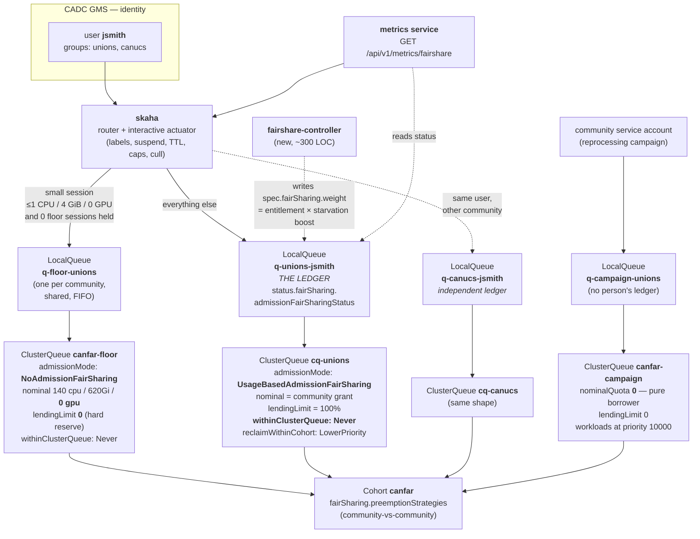

# CANFAR fair share — technical reference

**Status:** Implementation reference · **Updated:** 2026-08-09
**Companions:** [`kueue-afs-design.md`](kueue-afs-design.md) (the design, normative for all policy and
parameters) · [`kueue-afs-userguide.md`](kueue-afs-userguide.md) (science users)
**Assumed parameters** (normative copies live in the design doc §1): `usageHalfLifeTime H = 120h`,
`usageSamplingInterval Δt = 5m`, `α = 1 − 0.5^(Δt/H) ≈ 4.81×10⁻⁴`, session TTL 7 d, five percentile
standing bands.
**Target platform:** Kubernetes ≥ 1.33, Kueue ≥ v0.19.1 (carries the sub-milli AFS precision fix,
backported as PR #13761), `waitForPodsReady` disabled.

This document holds the implementation-level material: exact API semantics, source-verified
mechanics, the statistic's computation and serving contract, and the adversarial review record.

---

## 2. Usage semantics — what is charged, and what escapes

### 2.1 The minimum billing quantum is one sampling interval

The entry penalty is `α × requests` — precisely what one full tick of holding would add. So a
3-second session and a session held for one full interval cost about the same, and a session held
for *n* intervals costs about `n` times that, converging on the true EWMA.

**Charging is quantised upward to one interval.** Sub-interval work is over-charged relative to its
true hold time. This is deliberate anti-burst design from Kueue, and it is what makes a long
sampling interval safe: **a 1-hour interval does not let short jobs slip between ticks, because every
admission pays a penalty regardless of how briefly it runs.** Long intervals alias *concurrency
sampling*, never *admissions*.

### 2.2 What escapes the ledger

| Situation | Charged? | Note |
|---|---|---|
| Held for hours/days | ✅ | EWMA converges to held usage |
| Lives for seconds | ✅ one interval's worth | Entry penalty — `α × requests`, charged at admission regardless of how briefly the pod runs |
| Admitted but pod never schedulable | ✅ **in full** | `GetAdmittedUsage()` counts *admitted*, not *running*. A GPU workload admitted against cluster-wide quota with no GPU node free burns fair share while the user sees "Pending". Audit F9. |
| Rejected before admission | ❌ | Correct — nothing held |
| **Job without `kueue.x-k8s.io/queue-name`** | ❌ **runs free** | `manageJobsWithoutQueueName: false` ⇒ no Workload, no quota, no charge |
| **Non-`batch/Job` kinds** (JobSet, Ray, MPI, PyTorch) | ❌ **runs free** | No matching `integrations.frameworks` entry |

**The last two rows are the "jobs left out" answer, and they are structural, not version defects.**
Any user who can create a Job directly can opt out of fair share entirely. Close with a
ValidatingAdmissionPolicy / Kyverno rule rejecting label-less Jobs and non-`batch/Job` kinds in
`canfar-workloads` and `canfar-src-workloads`. Until that exists, this is the cheapest exploit on
the platform after B1.

---


## 3. The metrics contract

Metric families below were **scraped from a live controller**; the Visibility API was queried
directly.

### 3.1 What is emitted

**12 `kueue_local_queue_*` families**, all labelled `{name, namespace, replica_role}`:

| Metric | Extra labels | Serves |
|---|---|---|
| `kueue_local_queue_resource_usage` | `flavor`, `resource` | what the user holds now |
| `kueue_local_queue_resource_reservation` | `flavor`, `resource` | reserved vs used |
| `kueue_local_queue_pending_workloads` | `status` | how many of their jobs wait |
| `kueue_local_queue_admitted_active_workloads` | — | how many run |
| `kueue_local_queue_reserving_active_workloads` | — | holding quota |
| `kueue_local_queue_quota_reserved_wait_time_seconds` | histogram | **wait distribution — the honest alternative to an ETA** |
| `kueue_local_queue_admission_wait_time_seconds` | histogram | end-to-end wait |
| `kueue_local_queue_{admitted,quota_reserved,finished}_workloads_total` | counters | throughput |
| `kueue_local_queue_status` | `active` | queue health |

`kueue_cluster_queue_*` (usage, nominal quota, weighted share) require
`metrics.enableClusterQueueResources: true` — CANFAR prod sets this.

`kueue_local_queue_admission_fair_sharing_usage` — the scalar the scheduler sorts on — is **Prometheus
only**, and even then Prometheus-only rather than an API object.

### 3.2 The Visibility API — real output, and how to poll it at scale

Queried live. All requests use **`v1beta2`** (the preferred version; this document assumes it throughout). Scenario: one
ClusterQueue with `cpu: 2` nominal, three per-user LocalQueues, four 1-CPU jobs each — 2 admitted,
10 pending.

```
GET /apis/visibility.kueue.x-k8s.io/v1beta2/clusterqueues/cq-vis/pendingworkloads
```
```json
{
  "kind": "PendingWorkloadsSummary",
  "apiVersion": "visibility.kueue.x-k8s.io/v1beta2",
  "metadata": {},
  "items": [
    { "metadata": { "name": "job-bob-2-60299", "namespace": "afs-test",
                    "creationTimestamp": "2026-08-06T19:58:50Z",
                    "ownerReferences": [ { "apiVersion": "batch/v1", "kind": "Job",
                                           "name": "bob-2", "uid": "6515260c-…" } ] },
      "priority": 0,
      "localQueueName": "user-bob",
      "positionInClusterQueue": 0,
      "positionInLocalQueue": 0 },
    { "metadata": { "name": "job-carol-1-c6d0c", … },
      "priority": 0, "localQueueName": "user-carol",
      "positionInClusterQueue": 2, "positionInLocalQueue": 0 },
    { "metadata": { "name": "job-alice-2-bb493", … },
      "priority": 0, "localQueueName": "user-alice",
      "positionInClusterQueue": 8, "positionInLocalQueue": 0 }
  ]
}
```

**Read the ordering — this is AFS working.** `alice` has the two admitted workloads, so her ledger is
non-zero; `bob` and `carol` are at zero. Every one of bob's and carol's jobs is ordered ahead of
alice's, and alice's first pending job sits at global position **8**. All twelve jobs are identical
and were submitted within one second of each other, so submission order explains none of it. The
ledger does.

**This *is* a direct Kubernetes API-server query.** `visibility.kueue.x-k8s.io` is an aggregated
API: the request goes to the ordinary kube-apiserver with ordinary kubeconfig auth and RBAC, and the
apiserver proxies it to the Kueue controller, which computes the answer from its in-memory queue.
Nothing besides standard Kubernetes plumbing is involved. The *other* direct route — `LIST`ing
`Workload` objects straight from etcd via the apiserver — returns workload *state* cheaply and
watchably, but not positions: deriving order client-side means re-implementing the scheduler's
comparator, which breaks the guarantee that the displayed order is the real one. Use the visibility
API for positions and a `Workload` watch for states.

Three fields matter:

| field | meaning | use |
|---|---|---|
| `positionInClusterQueue` | rank in the **whole** ClusterQueue ordering | **the only number worth showing a user** |
| `positionInLocalQueue` | rank within that user's own queue | useless under per-user queues — always `0,1,2,…` |
| `localQueueName` | which ledger the workload belongs to | the fan-out key |

#### Is ClusterQueue-scoped polling safe at 100k–200k pending?

Measured payload: **332 bytes per pending workload.**

| pending | CQ-scoped payload |
|---|---|
| 1 000 | 0.3 MB |
| 10 000 | 3.3 MB |
| 100 000 | 33 MB |
| **200 000** | **66 MB** |

So an unbounded CQ-scoped poll is not viable at the target backlog. But **scoping to the LocalQueue
does not fix it**, and this is the finding that decides the design.

`pendingWorkloadsInLqREST.Get` builds the **full ClusterQueue snapshot** before filtering
(`pkg/visibility/storage/pending_workloads_lq.go`):

```go
pendingWorkloadsInfo := m.queueMgr.PendingWorkloadsInfo(cqName)   // ← FULL snapshot + sort of the CQ
for index, wlInfo := range pendingWorkloadsInfo {                 // ← then a linear filter
    if len(wls) >= int(limit) { break }
    if wlInfo.Obj.Namespace == namespace && wlInfo.Obj.Spec.QueueName == lqName { … }
}
```

and `PendingWorkloadsInfo` → `cq.Snapshot()` → `totalElements()` + `snapshotSort(elements)` — a full
copy and full `O(N log N)` re-sort of every pending workload in the ClusterQueue, **on every call,
at any scope, at any `limit`**. The `limit` truncates the *response*; the snapshot is already built.

> **Therefore: LocalQueue-scoped polling is strictly worse.** Same leader cost per call, and you now
> make one call *per user* instead of one call per ClusterQueue. At 1 000 users that is 1 000 full
> snapshots per polling interval instead of one.

The intuition that scoping reduces cost is correct for most Kubernetes APIs and wrong for this one.

#### The design that follows

- **One CQ-scoped poll per ClusterQueue per interval**, on a timer, into the metrics-service cache.
  **Never per user. Never on page load.**
- **Bound the payload with `limit`.** Both `limit` and `offset` work — verified: `?limit=2&offset=4`
  returns exactly `positionInClusterQueue` 4 and 5. Defaults: `limit=1000`, hard max `100000`
  (`pkg/constants/constants.go`).
- **Cache TTL = `usageSamplingInterval` (5m).** The ordering only changes when the ledger changes or
  when workloads are admitted, and the ledger is resampled on exactly that clock. Polling faster
  buys nothing.
- **Fan out client-side** on `localQueueName` (and `canfar.net/username` from the Workload label).
- **Beyond the limit, show no position at all.** A user told they are `48 217th` learns nothing
  useful and feels worse. Show the standing band instead, and only surface a position when it is
  inside the polled window.

At `limit=5000` the payload is ~1.7 MB per ClusterQueue per 5 minutes — about 5.7 kB/s — and every
user in the first 5 000 gets a real position. That is the whole cost.

**Residual risk to monitor:** the snapshot is `O(N log N)` in the leader on every call regardless of
`limit`. At 200 000 pending that is ~3.5 M comparisons per poll. One poll per ClusterQueue per 5
minutes is negligible; the failure mode is a poller that ignores the cache. Rate-limit the route and
alert if the call rate exceeds one per ClusterQueue per interval. Kueue takes no lock across the
sort (`buildSnapshotSort` deep-copies AFS state first), so the cost is CPU, not contention.

#### Eviction and the ledger

Two independent fair-share systems exist, and only one has memory:

| | Admission Fair Sharing (AFS) | Cohort Fair Sharing (CFS) |
|---|---|---|
| Object | **LocalQueue** | **ClusterQueue / Cohort** |
| Quantity | decayed usage ledger (`consumedResources`) | instantaneous usage **above nominal quota**, ÷ weight (`weightedShare`) |
| Has memory? | **yes** — half-life `H` | **no** — a live gauge |
| What it drives | **admission ordering** | **cross-queue preemption** |
| Config | `admissionFairSharing`, `admissionScope.admissionMode` | `fairSharing` block, `preemption.*` |

Plainly: **cross-ClusterQueue eviction ignores the ledger entirely.** When one community reclaims
capacity another borrowed, victims are selected by current borrowing (`weightedShare`), then
priority, then recency — a user who has been 10× over share for a fortnight is no likelier a victim
across queues than one who started an hour ago.

**Within a ClusterQueue, victim selection on the target platform IS ledger-aware.** Verified at
`main` (`pkg/scheduler/preemption/common/ordering.go`, `CandidatesOrdering`): among
strictly-lower-priority candidates, workloads are ordered by (0) already-being-evicted first,
(1) other-ClusterQueues-in-cohort first, (2) **the LocalQueue's fair-share usage — heavier-ledger
queues' workloads preferred as victims**, (3) lower priority, (4) most recent admission. So when a
guaranteed session preempts to make room, it takes the heaviest user's batch job first — the tier
design in the design doc §3 leans on exactly this.

Worked example: `cq-a` and `cq-b` share a cohort, 100 CPU nominal each. `cq-a` borrows to 180 while
`cq-b` is idle; when `cq-b` submits, CFS preempts `cq-a`'s borrowed workloads (no ledger involved).
Inside `cq-a`, a guaranteed session preempting batch picks the batch job belonging to the
heaviest-ledger user (ledger involved, step 2 above).

### 3.3 Where the authoritative number comes from

**The authoritative number is
`LocalQueue.status.fairSharing.admissionFairSharingStatus.consumedResources`.** It is accurate to
nano-units, a first-class API object written every sampling tick, and exactly the quantity the
scheduler sorts on. With one LocalQueue per `(user, community)`, Kueue's ledger *is* the per-user
ledger — we read it; we do not recompute it. Three reasons beyond economy:

- **Order-isomorphism is the entire value of the number.** The point of showing a standing is that it
  explains admission order. A reimplementation is only faithful if it is exact — and it cannot be,
  because the scheduler's in-memory sort key includes **pending entry penalties that are never
  persisted to status**, and because our sampling clock is not Kueue's reconciler clock. Two EWMAs
  with the same `H` and different sample times converge but differ transiently. Any divergence is a
  number that contradicts observed behaviour, which is worse than no number.
- **It avoids a new stateful component.** Our own ledger needs durable storage, restart semantics,
  and backfill. Kueue's is persisted for us on the object.
- **It cannot drift out of sync with a Kueue upgrade** that changes the accounting.

**What we still compute ourselves** — and this is the legitimate residue of the old §3.3:

1. **The re-expression `f`** — a bounded, legible monotone transform of Kueue's scalar. Monotone, so
   it never disagrees with the ordering.
2. **The entitlement denominator `S`** — the active-peer set is our policy, not Kueue's.
3. **Per-user attribution *inside* a shared queue**, for the admin view only, by summing admitted
   Workload requests grouped on `canfar.net/username`. Explicitly **informational, not the ledger** —
   it is not order-isomorphic with admission and must never be presented as standing.

**Two caveats to encode regardless:**

- The persisted value **omits the in-memory entry penalty**, so it lags the scheduler's own number by
  up to one sampling interval during a submission burst. Surface this via `Last-Modified`.
- Kueue explicitly declares precise accounting and billing out of scope for this field. This is a
  scheduling signal, never an invoice — it must not be used for cost recovery or grant reporting.

**Never surface `LocalQueue.status.fairSharing.weightedShare`.** No controller writes it for a
LocalQueue; it serialises as a permanent `0`. It is the field whose name most sounds like the answer.

### 3.4 What the user sees

| Rule | Reason |
|---|---|
| **No numeric ETA** | Slurm's own estimator is minute-accurate for 5.13 % of jobs (ARCHER2) / 0.42 % (Cirrus); Kueue has no predictor at all. Antonides et al. 2002: an ETA *increases* dissatisfaction once exceeded. |
| **Band, not a raw float** | A published number invites argument about the number instead of acceptance of the rule. |
| **Position only for long waits, monotonically clamped** | Hui & Tse 1996: position helps only for long waits. Munichor & Rafaeli 2007: the benefit is *perceived progress* — a position that moves backwards is worse than none, and AFS genuinely re-sorts each interval. |
| **Publish the half-life; never the weight table** | The half-life makes decay legible. The weights are a closed-form gaming optimiser (§4, #13). |
| **Pre-explain every slip** | Larson 1987: perceived unfairness tracks *observed slips* — later arrivals served first. Fair share is a slip generator by construction. |

**`standing.band` — what it is.** The band is a four-level *label* for how the user's decayed usage
compares to their entitlement — `ratio = U/S`, their usage divided by an equal share of the active
pool. It exists because the raw scalar is unreadable ("412.7 CPU-core-equivalents") and because
publishing a precise float invites argument about the number rather than acceptance of the rule.
Thresholds are in §2 of Part B. Four levels, not more: enough to distinguish "you are fine" from
"this is why you are waiting", few enough that a user never has to reason about a boundary.
**The band is a rank among the peers currently active** — and when there is no line at all the display says so instead of ranking,
which is correct, because with no contention there is nothing to arbitrate.

**Per-user payload**, refreshed at `usageSamplingInterval`, cached in the existing metrics service
(Redis; TTL = `lastUpdate + interval − now`):

```jsonc
{
  "user": "jdoe", "community": "cadc",
  "standing": { "band": "middle",     // next | front | middle | behind | lagging
                "ratio": 0.78,          // your usage ÷ community median  <- the headline
                "halfLifeHours": 120, "lastUpdate": "2026-08-03T16:40:00Z" },
  "holding":  { "cpu": 12, "memory_gib": 48, "gpu": 1, "credits": 95 },
  "sessions": [
    {"id":"abc","kind":"notebook","state":"running","credits_per_hour":40,"held_for":"3d4h"},
    {"id":"def","kind":"headless","state":"pending","reason":"waiting_behind_fairshare",
     "position":7,"of":412,"trend":"improving"}
  ],
  "summary": {"running":4, "pending":3, "pending_explained":"3 waiting behind other users"}
}
```

That directly answers the "seven jobs, four here, three behind" requirement: per-session state,
reason, and position, plus one aggregate line.

### 3.5 Pending-reason vocabulary

| Kueue signal | User-facing |
|---|---|
| `QuotaReserved=False`, lower-usage queues admitted ahead | *"Waiting behind other users who have used less recently."* |
| `reason=WaitingForQuota` | *"Waiting for resources to free up."* |
| `reason=NoMatchingFlavor` / `ExceedsMaxQuota` | **Should be unreachable.** skaha already validates request size against the namespace `LimitRange` at submit time and rejects synchronously with a specific message, so the user never reaches a queued state for this cause. If one of these ever appears on a queued workload it is a **platform bug** — skaha and the ClusterQueue have drifted apart — and should raise an operator alert, not user-facing copy. |
| higher-priority work of the same user ahead | *"Waiting behind your own higher-priority work."* |
| `Evicted`, `reason=Preempted` | *"Interrupted so higher-priority work could run."* |
| no condition present | *"Waiting to be evaluated."* — **never blank** |

No pending reason should ask the user to act: size validation happens synchronously at submit. Everything here says "no action needed",
which is the single most support-load-reducing sentence available. The blank case is real: under
`StrictFIFO` a Workload never evaluated carries no condition at all, so the fallback must be
synthesised.

---


## Resize capture — why the admitted Workload is sealed, and what to do instead

Design doc §4 states the conclusion; this section carries the evidence and the reconciler contract.

### The three locks on the admitted Workload (source-verified, `main` 2026-08)

**Lock 1 — `spec.podSets` is immutable under quota.** `pkg/webhooks/workload_webhook.go`:

```go
if workload.HasQuotaReservation(oldObj) {
    allErrs = append(allErrs, validateImmutablePodSets(newObj.Spec.PodSets, oldObj.Spec.PodSets, ...)...)
}
```

**Lock 2 — `status.admission` contents are immutable.** Same file, comment verbatim:

```go
// validateAdmissionUpdate validates that admission can be set or unset, but the
// fields within can't change.
```

`status.admission.podSetAssignments[].resourceUsage` — the exact field `GetAdmittedUsage()` and the
ledger derive from — cannot be edited on a live admission.

**Lock 3 — divergence is terminal.** `pkg/controller/jobframework/reconciler.go`,
`ensurePrebuiltWorkloadInSync`: a Workload that no longer matches its Job is not corrected —

```go
msg := "The prebuilt workload is out of sync with its user job"
return false, workloadfinish.Finish(ctx, r.client, wl, kueue.WorkloadFinishedReasonOutOfSync, msg, r.clock)
```

— it is **finished**, ending the admission. Any "patch both the pod and the Workload" scheme
therefore fails even if it slips past the webhook.

**Lock 4 — the ledger itself is write-only from outside.**
`LocalQueue.status.fairSharing.admissionFairSharingStatus.consumedResources` is written every tick
from Kueue's in-memory accumulator and read back **exactly once** — in `initializeAfsIfNeeded` on
controller restart, the only read in `pkg/controller/core/localqueue_controller.go`. An external
edit is overwritten at the next tick; if it survived to a restart it would seed a corrupted history.
The ledger is an output, never an input.

And the principled fourth objection: a direct patch injects usage without passing admission — no
quota check, no entry penalty, no arbitration against other users. The seal is a feature.

### The resize reconciler

One controller, one rule: **the truth about a session's size lives on the pod; the *charge* for any
excess over the admitted size lives in a companion delta Workload that passed admission.**

```
observe:   session pods (Kueue-managed, canfar.net/* labels)
compare:   actual container requests  vs  admitted Workload podSet requests
reconcile: positive delta  -> ensure delta Workload `resize-<session>` of exactly that size
           zero delta      -> ensure no delta Workload
           session gone    -> garbage-collected via ownerReference
```

Ordering differs by initiator, deliberately:

| initiator | ordering | failure mode |
|---|---|---|
| **UI/API RAM arrow** (skaha) | **delta Workload first**; pod patched only after it admits | fail-closed: un-admittable growth is refused with a queue-aware message |
| **VPA CPU auto-grow** | pod resizes first; reconciler mirrors after | fail-open by policy — CPU growth is the declared uncharged subsidy; the mirror records drift rather than charging it |

Notes that matter in implementation:

- The delta Workload is podless. `GetAdmittedUsage()` counts *admitted* workloads regardless of
  pods, so it charges and reserves correctly; `waitForPodsReady` must remain off (target-platform
  requirement) or podless workloads would be evicted on timeout.
- **Eviction of a delta Workload** (a guaranteed session displaced it): the grown RAM is still
  physically held. The reconciler treats this as a platform-initiated shrink request — best-effort
  in-place memory decrease; if the kernel cannot reclaim, flag the session, alert, and re-create
  the delta when capacity frees. Drift is bounded by the reconcile interval and surfaced as a
  metric (`resize_uncharged_bytes`).
- **Optional hardening:** Kubernetes ≥ 1.33 exposes resizes through the `pods/resize` subresource;
  a validating webhook on that subresource can gate *all* resize sources — including VPA — on the
  existence of an admitted delta Workload, turning fail-open mirroring into fail-closed
  authorisation. Costs a webhook on the resize path; adopt only if uncharged drift proves material.
- RBAC: skaha and the reconciler need create/delete on `workloads.kueue.x-k8s.io` and (for the
  hardening) `pods/resize`.

---

### Delta Workload — live verification

Prototyped on a kind cluster running a Kueue build with the sub-milli precision fix, AFS at
`H = 300s / Δt = 30s` (short, so the ledger moves visibly within minutes), `waitForPodsReady`
absent. Two per-user LocalQueues, each with one admitted 1-CPU session; a podless delta Workload
requesting `cpu: 1, memory: 1Gi` created against `u-jdoe`.

| property | evidence |
|---|---|
| **Admits with zero pods** | `QuotaReserved=True`, `Admitted=True` within seconds; pod count in namespace unchanged (2). |
| **Reserves quota** | ClusterQueue `flavorsUsage.cpu` `2 → 3`, `memory 1Gi → 2Gi` — exactly the delta. |
| **Charged identically to a running pod** | jdoe (2 CPU held) vs peer (1 CPU held), five consecutive ticks: `0.3765/0.1878 = 2.005`, `0.4853/0.2422 = 2.004`, `0.5867/0.2930 = 2.003` … **ratio 2.00 to three digits.** |
| **Fails closed on quota** | A 2-CPU delta against 1 free CPU: `QuotaReserved=False`, `reason=Pending`, *"insufficient unused quota for cpu in flavor default-flavor, 1 more needed"*; CQ usage unchanged. |
| **Releases on delete** | Deleting the delta: CQ usage `3 → 2` within seconds; jdoe's ledger stops accruing and the ratio to peer falls `2.00 → 1.87 → 1.71` on successive ticks — decay on the half-life, as designed. |
| **Update = delete + recreate** | In-place `PATCH` of the delta's requests is rejected by the webhook — `spec.podSets.0: field is immutable`. Delete → recreate at the new size → admitted measured at **0.1 s**; quota re-reserved atomically. Shrink (1Gi → 512Mi) released the difference within one tick. |
| **Garbage-collected with the session** | Delta owner-referenced to a session Job; deleting the Job removed the delta within 12 s with no other action. |

The oversized-delta rejection message is the exact string skaha surfaces to a user whose RAM
up-arrow cannot be honoured. Nothing here required a Kueue change, a CRD, or a controller: the
prototype was six `kubectl apply/delete` operations.

## Appendix A — Per-user LocalQueue mechanics

### 1.1 Diagram



### 1.2 The ledger lives on the LocalQueue, and its granularity is `(user, community)`

Verified fact that forces this: Kueue's Admission Fair Sharing ledger is keyed by `utilqueue.LocalQueueReference = namespace/name` (`pkg/util/queue/local_queue.go:KeyFromWorkload`). There is no per-user dimension anywhere in the AFS code path. If you want Kueue's own scheduler to order admission by per-user history, the LocalQueue **must** be the user.

Naming and placement:

| Object | Name | Namespace | Count |
|---|---|---|---|
| User ledger | `q-{community}-{user}` | `canfar-workloads` | users × communities-they-use |
| Floor queue | `q-floor-{community}` | `canfar-workloads` | # communities |
| Campaign queue | `q-campaign-{community}` | `canfar-workloads` | # communities |
| SRC mirror | `q-src-{community}-{user}` | `canfar-src-workloads` | as above |

`{user}` and `{community}` are DNS-1123-sanitised (lowercase, `[^a-z0-9-] → -`), truncated to 40 chars each, with an 8-hex-char FNV-1a suffix of the raw pair appended whenever sanitisation or truncation is lossy. skaha stores the canonical pair in labels `canfar.net/username` / `canfar.net/community` so the name is never parsed to recover identity.

**LocalQueues are created lazily on first submission and are NEVER deleted.** This is not a preference. Verified: `LocalQueueReconciler.Delete()` purges both `AfsConsumedResources` and `AfsEntryPenalties`, and the only durable copy of the ledger is the object's own `.status` subresource — so delete-then-recreate is an unrecoverable fair-share reset, identical at every Kueue version. A cron job that reaps idle LocalQueues would be a self-service amnesty button. Add `localqueues.kueue.x-k8s.io` to etcd backup scope and to any admission-webhook deny list for `DELETE` by non-admins.

### 1.3 Why this is affordable

The AFS status write rate is exactly `N_localqueues / usageSamplingInterval` — the LocalQueue
reconciler self-requeues at that interval and writes `.status` on each tick.

| `usageSamplingInterval` | 850 ledgers | 3 000 ledgers | 10 000 ledgers |
|---|---|---|---|
| **5m** | **2.8 w/s** | 10.0 w/s | 33.3 w/s |
| 15m | 0.94 w/s | 3.3 w/s | 11.1 w/s |
| 60m | 0.24 w/s | 0.83 w/s | 2.8 w/s |

At the platform's expected ceiling — **no more than ~1 000 users**, each with a ledger per community
they belong to, so order 1 000–1 500 LocalQueues — 5-minute sampling costs **3–5 status writes per
second** on a small object's status subresource, spread evenly rather than bursty. At that population
the object count is unremarkable for etcd and the ledger set is comfortably manageable.

This is a **capacity-planning input, not a ceiling.** `clientConnection.qps` and `burst` on the Kueue
controller are tunable and should be raised to suit the ledger population rather than lengthening the
sampling interval to fit a default. The interval is better spent on freshness. Two guard rails:

- Alert on `rest_client_rate_limiter_duration_seconds` for the Kueue client. If the limiter is
  actually delaying requests, raise `qps`/`burst` before touching the interval.
- Alert on API-server write latency and etcd fsync. Status writes are cheap individually; the failure
  mode on a loaded control plane is latency, not QPS exhaustion.

If the ledger population grows by an order of magnitude, lengthening `usageSamplingInterval` is the
cheapest lever and costs nothing in fairness semantics — the tick cancels out of the decay (§1).

```yaml
admissionFairSharing:
  usageHalfLifeTime: 120h        # 5 days
  usageSamplingInterval: 5m
  resourceWeights:               # set from a target share of the weighted pool
    cpu: 1.0
    memory: <derived>
    ephemeral-storage: <derived>
    nvidia.com/gpu: <derived>
```

---


---

# Part B — The user-facing fair-share statistic

> Parameter values in this part predate §1. **§1 is normative.**

# The CANFAR Fair-Share Statistic

**Answers:** *"We have to report a statistic to a user, e.g. their fairshare value. How do we do that?"*

**Status:** design, ready to implement. Targets `metrics/` (compute + contract) and `skaha/` (identity + proxy).

---

## 0. Decision summary

| Question | Decision |
| --- | --- |
| **The number** | `standing.score` = **f = 2⁻⁽ᵁ/ˢ⁾** — bounded in (0, 1], 1.0 = unused, 0.5 = exactly your share. |
| **Why f** | It is **order-isomorphic to Kueue's own admission sort key**. Ranking users by f descending is byte-for-byte the same order the scheduler admits in. No other candidate has this property. |
| **Headline shown to user** | Not f. A **4-band badge** derived from f, plus one sentence. f is drill-down only. |
| **Read from** | `LocalQueue.status.fairSharing.admissionFairSharingStatus.consumedResources` — authoritative, already written every sampling tick. **Not Prometheus.** |
| **Computed in** | `metrics/` — new `fairshare` scope, one shared cluster snapshot, O(1) API reads regardless of user count. |
| **Cache** | Shared snapshot TTL = `usageSamplingInterval`; per-user response `Cache-Control: private, max-age=15`. |
| **Scope honesty** | Standing is per `(user, community)` — one `FairShareStanding` object per ledger. |
| **ETA** | Never shown. |
| **Queue position** | Shown only after 10 min pending, **monotonically clamped** so it can never move backwards. |

## 1. The number

### 1.1 The candidates, and why f wins

Kueue admits pending work in ascending order of

```
U_q = ( Σ_r  resourceWeights[r] · consumedResources_q[r] ) / fairSharing.weight_q
```

(`pkg/util/admissionfairsharing/admission_fair_sharing.go:CalculateUsage`). That is the *only* number the scheduler acts on. Any statistic we display must be a **strictly monotone function of U**, or the UI will contradict the queue.

| Candidate | Bounded? | Monotone in U? | Verdict |
| --- | --- | --- | --- |
| Raw `consumedResources` weighted scalar (`U`) | No | Trivially | **Reject as headline.** "412.7 CPU-core-equivalents" is unreadable, unit-confusing (1 GPU = 35 cores = 35 GiB RAM = 1225 GiB disk), and has no reference point. Keep as drill-down. |
| `U / median(U over active peers)` | No (→∞) | Yes, but **only at fixed peers** | **Reject.** The denominator moves when *other people* act, so a user's badge changes while they do nothing — the exact opposite of Munichor & Rafaeli's progress requirement. Also degenerate when peers are idle. |
| Slurm `LevelFS = NormShares / EffectvUsage` | No (→∞ as usage→0) | Yes (inverted) | **Reject.** Unbounded means no stable bucket boundaries and no renderable bar. Slurm shows it to sysadmins, not scientists. |
| **FASRC `f = 2^(−U/S)`** | **Yes, (0,1]** | **Yes, strictly decreasing** | **Adopt.** |

### 1.2 Definition

```
f_q  =  2 ^ ( − U_q / S_q )
```

where `S_q` is queue *q*'s **entitlement** expressed in the same weighted CPU-core-equivalent units:

```
S_q  =  ( weight_q / Σ_p weight_p )  ·  Σ_r  resourceWeights[r] · nominalQuota_CQ[r]
```

Σ over `p` runs over the **active** LocalQueues attached to the same ClusterQueue (see §3.4 for "active").

### 1.3 Why this shape is right for astronomers

- **Bounded and anchored.** `f = 1.0` you have used nothing. `f = 0.5` you have been holding *exactly* your entitled share, continuously. `f → 0` you are far above it. There is a natural, explainable midpoint — LevelFS and the raw scalar have none.
- **Band boundaries are powers of two of your share.** `f = 0.75 → U/S = 0.415`, `f = 0.50 → U/S = 1`, `f = 0.25 → U/S = 2`, `f = 0.125 → U/S = 3`. Each band drop is "one more multiple of your share". That is a story you can tell in one sentence.
- **Unitless.** It never forces us to explain that 1 GPU costs 35 cores.
- **Order-preserving.** `f_a > f_b ⟺ U_a < U_b ⟺ a's next job is admitted before b's`. So the badge *predicts the slip* — which is precisely what Larson (1987) says you must do, because a fair-share system is by construction a slip generator.

> **Kueue does not compute f.** f is our monotone re-expression of Kueue's `CalculateUsage`. That is a feature: we present a legible number without ever disagreeing with the scheduler. It also means we can compute it entirely client-side from published API fields.

---

## 2. Bands and thresholds

Bands are **percentile ranks among active peers in the community**, cut on the normal curve, best
standing first (rank by `f` descending — equivalently `U/S` ascending):

| band key | percentile of active peers | badge | one-sentence explanation |
| --- | --- | --- | --- |
| `next` | top 2.5 % | **Next in line** | "You're next — your jobs start as soon as anything frees up." |
| `front` | 2.5 – 16 % | **Near the front of the line** | "You've used less than most active members recently, so your jobs start before theirs." |
| `middle` | 16 – 50 % | **In the middle of the line** | "You're around the middle — jobs start in the usual order." |
| `behind` | 50 – 84 % | **Toward the back of the line** | "You've used about {ratio}× your share recently, so jobs from lighter users start first. This eases as your recent usage fades — it halves every 5 days." |
| `lagging` | bottom 16 % | **At the back of the line** | "You've used more than almost all active members recently. Jobs from lighter users start first until your recent usage fades; it halves every 5 days." |

Two rules that keep the labels honest:

- **The no-line override.** If the user has nothing pending *and* the community's pending queue is
  empty, no band is shown at all — the display reads **"no line — jobs start immediately"**. A band
  describes your place in a line that exists; ranking five nearly-idle users and telling one of them
  they are "at the back" generates tickets and is not information.
- **"Active peers"** = members with running or pending work, or a ledger above a noise floor
  (1 credit). Dormant members are excluded from the denominator.

`{ratio}` = `round(U/S, 1)` — the only number in the copy, a multiple of the user's own share, never
a scheduler internal. `f` remains the underlying score (§1); bands are cut on its *rank*, not on
fixed thresholds, so the bands automatically track whatever the community's current usage
distribution looks like.

## 3. How it is computed

### 3.1 The decay

Kueue's ledger is an EWMA over **currently held** admitted resources, resampled every `usageSamplingInterval` and folded in with

```
α        = 1 − 2^(−Δt / H)                     Δt = actual elapsed since last sample
consumed = consumed_prev·(1−α) + held_now·α
```

`α` is computed from **actual elapsed wall time**, not the nominal interval. Two consequences that matter for us:

- The decay's **time constant is `H` and only `H`**. Changing `usageSamplingInterval` changes sampling resolution — it does **not** change how fast usage is forgotten. The tick cancels exactly out of the decay.
- The ledger accrues for the **whole time** a workload holds resources, not once at admission. A 3-day GPU notebook is counted in every sample for 3 days. This is the mechanical reason the platform owners' constraint — *interactive must be charged to the same ledger as batch* — is already satisfied by AFS accounting, with no skaha-side workaround needed.

### 3.2 What H = 120h (5 days) actually means

| how much of a burst is forgotten | elapsed |
| --- | --- |
| 50% | **5.0 days** |
| 75% | 10.0 days |
| 90% | 16.6 days |
| 95% | 21.6 days |
| 99% | 33.2 days |

Five days is chosen against two opposing pressures.

- **Long enough to be un-gameable.** The half-life must exceed the longest legitimate unit of work,
  or a user can alternate campaigns faster than the ledger can see them and stay permanently in good
  standing. Multi-day campaigns are spanned; a weekend pause buys almost nothing.
- **Short enough to be explicable.** A user who runs one large campaign is materially affected for
  about a week and effectively clear inside three. That is a timescale a person can hold in their
  head, and it is short enough that the recovery is visible week to week rather than being an
  invisible month-long tail.

**The obligation this creates:** because the tail is measured in weeks, the UI is *required* to state
the half-life. "It halves every 5 days" is not decoration — it is what converts an otherwise
inexplicable multi-week penalty into a rule. This is why the half-life appears in the band copy and
in `standing.basis.halfLifeHours`.

### 3.4 Choosing the entitlement denominator

`S_q` needs `Σ_p weight_p` over **active** peers. Definition:

> A LocalQueue is **active** if `consumedResources` is non-empty **or** it has ≥ 1 admitted or pending workload.

Rationale: dividing by *all configured* queues understates everyone's share whenever a project is dormant, and the whole point of the number is contention. With CANFAR's four static LocalQueues all carrying `fairSharing.weight: "1"`, `Σ weight` is just the active count.

**Clamp:** `S_q ≥ ε` (use `ε = 1.0`) so a misconfigured zero-weight queue cannot produce `f = 0` or a division by zero. Kueue itself returns `MaxInt64` for zero-weight borrowing queues; we return band `lagging` with `score: 0.0` and a `degraded` entry rather than propagating a sentinel.

### 3.5 The complete algorithm

```python
GIB = 2 ** 30

def weighted(resources: dict[str, float], weights: dict[str, float]) -> float:
    """Σ_r weight_r · amount_r, in base units. Unlisted resources weigh 1.0 (Kueue's rule)."""
    return sum(weights.get(name, 1.0) * amount for name, amount in resources.items())

def standing(lq_consumed, lq_weight, cq_nominal_quota, sum_active_weights, weights):
    U = weighted(lq_consumed, weights) / max(lq_weight, 1e-9)
    C = weighted(cq_nominal_quota, weights)
    S = max(C * lq_weight / max(sum_active_weights, 1e-9), 1.0)
    ratio = U / S
    return {"usage": U, "entitlement": S, "ratio": ratio, "score": 2.0 ** (-ratio)}
```

`lq_consumed` and `cq_nominal_quota` are parsed to **base units** (cores, bytes, whole GPUs) — reuse `metrics.providers.kueue.parse_resource_amount`, but note it converts `memory` / `ephemeral-storage` to **GiB**; the weighted sum needs **bytes**, so multiply those back by `2**30` before applying `resourceWeights`. Getting this backwards silently inflates memory's contribution by 10⁹.

---

## 4. Where it is read from

### 4.1 Authoritative source — the Kubernetes API, not Prometheus

| | GVR | Scope | Field path | Purpose |
| --- | --- | --- | --- | --- |
| **A** | `kueue.x-k8s.io/v1beta2` · `localqueues` | ns `canfar-workloads`, `canfar-src-workloads` | `.status.fairSharing.admissionFairSharingStatus.consumedResources`<br>`.status.fairSharing.admissionFairSharingStatus.lastUpdate`<br>`.spec.clusterQueue`<br>`.spec.fairSharing.weight` | `U`, freshness, peer grouping, weight |
| **B** | `kueue.x-k8s.io/v1beta2` · `clusterqueues` | cluster | `.spec.resourceGroups[].flavors[].resources[].nominalQuota` | `C` → `S`. **Already read by `KueueProvider`.** |
| **C** | `kueue.x-k8s.io/v1beta2` · `workloads` | ns `canfar-workloads`, `canfar-src-workloads` | `.metadata.labels["canfar.net/username"]`, `.status.conditions[]`, `.spec.priorityClassName` | per-session "why pending" (§6.3) and user attribution |
| **D** | `visibility.kueue.x-k8s.io/v1beta2` · `localqueues/pendingworkloads` | ns-scoped, `get` | `.items[].positionInClusterQueue` | queue position, background-polled only |

**Do not put `LocalQueue.status.fairSharing.weightedShare` in any UI.** No controller writes it. It is a `+required` field, so it always serialises as `0`. It is the field whose name most sounds like the answer, and even Kueue's own docs show it as `0`. `weightedShare` *is* populated on ClusterQueue and Cohort — admin surface only (§8).

**Prometheus is not used for the user-facing path.**
- `kueue_local_queue_admission_fair_sharing_usage` is exported and is the scalar the scheduler itself sorts on (penalty included); use it for admin dashboards and alerting.
- It is Prometheus-only, which would make a portal page render depend on the metrics pipeline; an API-object GET is served from etcd/watch cache and is strictly better coupling for a hot user path.
- Every Kueue metric comes from the **leader replica's in-memory cache** — the same component whose write path the April 2026 benchmark identified as the bottleneck.

**Divergence to accept and document:** the scheduler's in-memory sort key includes **pending entry penalties**, which are never persisted to `status`. Our number therefore under-reports during a submission burst and lags by up to one sampling interval. At `H = 120h` and a 5-minute tick a single penalty is a small fraction of a steady-state ledger — immaterial for a band, and surfaced honestly via `Last-Modified`.

### 4.2 RBAC

`metrics-api` today holds only `clusterqueues: [get]`. Extend `metrics/helm/metrics-api/templates/rbac.yaml`:

```yaml
rules:
  - apiGroups: ["kueue.x-k8s.io"]
    resources: ["clusterqueues"]
    verbs: ["get", "list"]
  - apiGroups: ["kueue.x-k8s.io"]
    resources: ["localqueues", "workloads"]
    verbs: ["get", "list", "watch"]
  # Optional: only if queue position (§5.3) is enabled.
  - apiGroups: ["visibility.kueue.x-k8s.io"]
    resources: ["localqueues/pendingworkloads"]
    verbs: ["get"]
```

`localqueues` and `workloads` may be narrowed to namespaced `Role`s in `canfar-workloads` and `canfar-src-workloads`; `clusterqueues` must stay cluster-scoped. **skaha needs no new RBAC** — it already has `localqueues: [get, list]` in both namespaces (`helm/templates/kueue-rbac.yaml`), and under this design skaha does not read Kueue for this feature at all; it proxies Metrics.

### 4.3 Identity boundary

The Metrics service has **no authentication**. It is reachable only on the in-cluster Service (`SKAHA_METRICS_BACKEND_URL`), never the edge hostname. Therefore:

- **skaha injects the identity.** It substitutes the authenticated CADC/GMS principal into the `{user}` path segment. It must never forward a client-supplied username.
- The admin route (§8) is gated by skaha on GMS group membership before the proxy call.
- Do not expose `/api/v1/metrics/users/...` through any ingress.

---

## 5. Caching and refresh

### 5.1 Two-tier, one shared snapshot

The critical architectural move: **all per-user responses are computed from one shared cluster snapshot.** The number of Kubernetes reads is independent of the number of users.

| Tier | Contents | Reads | TTL | Redis key |
| --- | --- | --- | --- | --- |
| **Snapshot** (shared) | all LocalQueues + their consumed/weight/CQ, all ClusterQueue nominal quotas, derived `U`, `S`, `f`, band, rank for every queue | 4 LocalQueue + 2 ClusterQueue GETs **for the whole platform** | `= usageSamplingInterval` | `metrics:fairshare:snap:{fingerprint}` |
| **Pending** (per user) | that user's pending Workload conditions + clamped positions | 1 label-selected Workload list | **15s** | `metrics:fairshare:pend:{fingerprint}:{sha256(user)[:16]}` |

Polling faster than `usageSamplingInterval` is pure waste — `consumedResources` provably does not change in between, and `.lastUpdate` tells you exactly when it did. Reuse the existing `PlatformMetricsService` single-flight pattern verbatim so concurrent misses coalesce onto one load.

**Bound the snapshot TTL:** `min(usageSamplingInterval, 900s)`. If the sampling interval is ever lengthened, this stops a cold-start snapshot sitting with a stale active-peer set.

### 5.2 HTTP headers (ADR-0002)

```
Cache-Control: private, max-age=15
Last-Modified: <LocalQueue .status...lastUpdate>     # the real freshness of the standing
Date:          <now>
Expires:       <now + 15s>
```

`Cache-Control: private` per ADR-0002's user-scope rule — this response must never populate a shared cache. `max-age` follows the **fastest-changing** component (position, 15s), while `Last-Modified` reports the **substantive** freshness (the ledger). `metrics.http_cache.metrics_success_cache_headers` already implements exactly this given `snapshot_created` and `shared_cache_public=False`.

### 5.3 Queue position: background poll, never on page load

The Visibility API takes a **full copy of the ClusterQueue's pending heap and sorts it** on every request. At CANFAR's target 100×-capacity backlog that is an O(N log N) snapshot inside the leader controller, per call.

- A single background poller in the Metrics service hits `localqueues/{lq}/pendingworkloads` **once per 60s per LocalQueue** (4 calls/min platform-wide) and caches the ordered list in Redis (TTL 90s).
- Page loads read Redis only.
- Page with `limit=1000`, `offset` stepping, capped at `offset ≤ 20000`; beyond that report `position: null` rather than paging the whole backlog.
- If the poller fails, `position` is `null` and the UI silently omits it. Position is an enhancement, never a dependency.

---

## 6. What the user sees

### 6.1 Design constraints, applied

| Evidence | Applied as |
| --- | --- |
| Slurm backfill ETA accurate to 1 min for 5.13% of jobs (ARCHER2) / 0.42% (Cirrus); Kueue has **no** start-time predictor; Antonides et al. 2002 — an exceeded ETA amplifies dissatisfaction | **No ETA field exists in the API.** Not "hidden by default" — absent, so no client can render one. |
| Hui & Tse 1996 — short waits: say nothing; intermediate: duration; long: position | `position` is emitted **only** when `pendingSeconds > 600`. Below that the UI shows the band and nothing else. |
| Munichor & Rafaeli 2007 — position works via *progress*; backwards movement is worse than no information | **Monotonic clamp** (§6.4). Under AFS, cross-LocalQueue order genuinely recomputes and *can* move backwards. |
| Raw fair-share float as headline invites argument about the number | `standing.score` is present in the payload but the UI **must not** render it above the fold. Headline is the band + one sentence. |
| Larson 1987 — perceived unfairness is driven by observed **slips** | The **always-on slip pre-explanation** (§6.2) is rendered persistently next to any pending session, in every band, including `next`. |

### 6.2 The always-on slip pre-explanation

Rendered persistently wherever pending sessions are listed — not in a tooltip, not behind a "learn more":

> **CANFAR starts jobs from the users who have used the least recently — not in the order jobs were submitted.** Someone who submitted after you may start first. Your standing recovers as your recent usage fades; it halves every 5 days.

This is the single highest-value piece of copy in the design. Larson's finding is that a slip you were warned about is not perceived as unfair; a slip you were not warned about is. A fair-share scheduler generates slips by construction.

### 6.3 Per-session "why is this pending"

**Approved user-facing vocabulary — exactly five values. No sixth is ever added without a contract revision.**

| `reason` | user-facing `message` |
| --- | --- |
| `fair_share_position` | "Waiting behind other users' fair-share position" |
| `own_higher_priority` | "Waiting behind higher-priority work of your own" |
| `awaiting_resources` | "Waiting for resources" |
| `blocked_by_policy` | "Blocked by policy" |
| `platform_degraded` | "Platform degraded" |

**Mapping from Kueue Workload conditions.** Granular reasons require `UnadmittedWorkloadsObservability=true` (Beta, **default false** — must be enabled explicitly, together with `UnadmittedWorkloadsExplicitStatus=true` or the field is often simply absent).

| Kueue condition / reason | CANFAR reason |
| --- | --- |
| `QuotaReserved=False` · `WaitingForQuota` **and** a pending workload from another LocalQueue is ordered ahead | `fair_share_position` |
| `QuotaReserved=False` · `WaitingForQuota`, no such peer ahead | `awaiting_resources` |
| `QuotaReserved=False` · `WaitingForQuota`, and a higher-`EffectivePriority` pending Workload with the **same** `canfar.net/username` is ahead in the same LocalQueue | `own_higher_priority` |
| `WaitingForPreemptedWorkloads`, `TopologyPlacementFailed`, `PendingEvaluation`, `PendingDelayedTopologyRequests`, `Admitted=False`·`NoReservation` | `awaiting_resources` |
| `Suspended`, `UnsatisfiedAdmissionChecks`, `Evicted`·`Deactivated`, `AdmissionGated`, `OnHold` | `blocked_by_policy` |
| `ExceedsMaxQuota`, `NoMatchingFlavor` | `platform_bug` — unreachable if skaha's `LimitRange` validation and the ClusterQueue agree; alert rather than display |
| `Misconfigured`, `Evicted`·`ClusterQueueStopped`/`LocalQueueStopped`/`NodeFailures` | `platform_degraded` |
| `Preempted`·`InCohortFairSharing` / `InClusterQueue` (re-queued after preemption) | `fair_share_position` |

### 6.4 Monotonic position clamp

```python
key      = f"metrics:fairshare:pos:{workload_uid}"
previous = redis.get(key)                       # int | None
shown    = observed if previous is None else min(observed, int(previous))
redis.set(key, shown, ex=86_400)
```

- Reset **only** on a workload state transition (admitted / failed / deleted), never on a re-poll.
- Render `shown` when `≤ 100`; render `"100+"` above that. Once it crosses below 100 it becomes a number and thereafter only decreases.
- If the observed position rises, hold the previous value and let the true value catch down. Displaying a stale-but-monotone position is strictly better than an accurate one that moves backwards.

### 6.5 Drill-down (power users)

Behind a "How is this calculated?" disclosure:

- `score` (f), `ratio` (U/S) — with the sentence *"Your recent weighted usage is {ratio}× your share of this queue."*
- `consumed` per resource in native units, and the `weights` used, with the conversions spelled out: **1 GPU = 35 cores = 35 GiB memory = 1 225 GiB scratch.**
- `halfLifeHours: 120` rendered as "halves every 5 days".
- `lastUpdate` as "as of HH:MM".
- **Anonymised peer context only:** your band vs the distribution of bands across active queues. Never another project's or user's name or number.

---

## 7. The API contract

### 7.1 Shape: a declarative Kubernetes-style object

The payload is shaped as a Kubernetes API object — `apiVersion` / `kind` / `metadata` / `spec` /
`status` — with everything computed living under **`status`**, per the declarative convention
(spec = identity/desired, status = observed). This is deliberate: today the object is *served* by
the metrics service over REST; the moment it graduates to a CRD reconciled by a controller, the
schema, clients, and UI carry over unchanged.

```
GET /api/v1/metrics/users/{user}/fairshare      ->  FairShareStanding (JSON)
```

Served initially by the metrics service (provider `KueueProvider.fairshare(user)`, scope
`fairshare`). **skaha side:** `FairShareDAO` mirroring `PlatformMetricsDAO`, calling the metrics
backend with the authenticated username; a `null` DAO (env unset) means the portal renders no badge
— the feature degrades to absent, never to an error.

### 7.2 Example object

```yaml
apiVersion: fairshare.canfar.net/v1alpha1
kind: FairShareStanding
metadata:
  name: jdoe.cadc                  # <user>.<community> — one object per ledger
  labels:
    canfar.net/username: jdoe
    canfar.net/community: cadc
spec:
  user: jdoe
  community: cadc
  localQueue: u-jdoe-cadc          # the ledger this standing is read from
status:
  band: behind                     # next | front | middle | behind | lagging
  headline: "Toward the back of the line"
  explanation: >-
    You've used about 1.9x your share recently, so jobs from lighter users
    start first. This eases as your recent usage fades - it halves every 5 days.
  slipNotice: >-
    CANFAR starts jobs from the users who have used the least recently - not in
    the order jobs were submitted. Someone who submitted after you may start first.
  ratio: 1.85                      # U/S — the only number surfaced in copy
  score: 0.2774                    # f — drill-down only
  rank: { position: 71, of: 87 }   # among active peers, best standing first
  credits:
    held: 95                       # what you are holding right now
    ledger: 610.4                  # decayed time-averaged holding (U)
  holding: { cpu: 12, memoryGiB: 48, gpu: 1 }
  sessions:
    - id: abc123
      kind: notebook
      state: running
      creditsPerHour: 75
      heldFor: 3d4h
      guaranteed: true             # admitted through the guaranteed tier
    - id: 8f2c1a94
      kind: headless
      state: pending
      reason: fair_share_position
      message: "Waiting behind other users' fair-share position"
      position: 7
      trend: improving             # monotonic clamp applied
  summary: { running: 4, pending: 3, pendingExplained: "3 waiting behind other users" }
  basis:
    halfLifeHours: 120
    samplingIntervalSeconds: 300
    sessionTTLDays: 7
    lastUpdate: "2026-08-09T14:00:07Z"
    activePeers: 87
    explanationFidelity: granular
  conditions:
    - type: Fresh                  # ledger sampled within 3 intervals
      status: "True"
      lastTransitionTime: "2026-08-09T14:00:07Z"
```

Deliberate exclusions from the user-facing object, both security-relevant: per-resource
`consumedResources` and the `resourceWeights` table. Publishing the weights hands every user a
closed-form cost optimiser ("RAM is priced n× CPU — minimise RAM, maximise cores"); the weighted
aggregates above carry all the information a user legitimately needs. Both appear in the admin
object only (§8).

### 7.3 Field contract

| Field | Type | Notes |
| --- | --- | --- |
| `spec.user` / `spec.community` | strings | Identity of the ledger; `metadata.name` is `<user>.<community>`. |
| `standing.band` | enum(4) | The only thing rendered above the fold. |
| `standing.score` | float (0,1] | f. Drill-down only. |
| `standing.ratio` | float ≥ 0 | U/S, rounded to 1 dp. The one number allowed in user copy. |
| `basis.explanationFidelity` | `"granular" \| "coarse"` | `"coarse"` when the observability gates are off; UI softens wording. |
| `usage.weighted`, `usage.entitlement` | string | Strings, not floats — matches the `PlatformMetrics` convention for resource quantities. Unit is `usage.unit`. |
| `usage.consumed` | open `dict[str,str]` | Open map per ADR-0002. Clients must tolerate unknown resource names. Same units as `PlatformMetrics` (cores, `Gi`, base units). |
| `pending[].reason` | enum(5) | Closed vocabulary. Unmappable Kueue reasons fall back to `awaiting_resources` and increment a telemetry counter — they never leak upstream strings (ADR-0002). |
| `pending[].position` | int \| null | Monotonically clamped. `null` when `pendingSeconds ≤ 600`, when the poller is unavailable, or beyond the paging cap. |
| **absent** | — | **No `eta`, `estimatedStart`, `expectedWait`, or equivalent — by design.** |
| `degraded[]` | list of `{code, message}` | Non-fatal source problems: `ledger_stale` (`lastUpdate` older than 2× sampling interval), `position_unavailable`, `zero_weight_queue`, `ledger_reset_suspected`. The response still returns `200`; the UI hides position and adds "as of {lastUpdate}". |

### 7.4 Pydantic models (drop into `src/metrics/schemas/metrics.py`)

```python
Band  = Literal["next", "front", "middle", "behind", "lagging"]
Reason = Literal[
    "fair_share_position", "own_higher_priority",
    "awaiting_resources", "blocked_by_policy", "platform_degraded",
]

class FairShareSubject(BaseModel):
    kind: Literal["project", "user"]
    user: str
    queue: str
    cluster_queue: str = Field(alias="clusterQueue")

class FairShareStandingBlock(BaseModel):
    band: Band
    score: float = Field(ge=0.0, le=1.0)
    ratio: float = Field(ge=0.0)
    headline: str
    explanation: str
    slip_notice: str = Field(alias="slipNotice")

class PendingSession(BaseModel):
    session_id: str = Field(alias="sessionId")
    session_kind: str = Field(alias="sessionKind")
    submitted: datetime
    pending_seconds: int = Field(alias="pendingSeconds", ge=0)
    reason: Reason
    message: str
    position: int | None = None
    position_display: str | None = Field(default=None, alias="positionDisplay")

class FairShareData(BaseModel):
    scope: Literal["fairshare"] = "fairshare"
    cluster: str
    subject: FairShareSubject
    standing: FairShareStandingBlock
    basis: FairShareBasis
    usage: FairShareUsage
    pending: list[PendingSession] = Field(default_factory=list)
    degraded: list[ErrorDetail] = Field(default_factory=list)
```

---

## 8. Admin surface

```
GET /api/v1/metrics/fairshare      ->  kind: FairShareLeaderboard
```

skaha gates this on GMS group membership before proxying. Contains everything users never see:

**Per-LocalQueue ranking table** — `name`, `clusterQueue`, `weight`, `consumedResources`, `U`, `S`, `f`, `band`, `rank`, `admittedWorkloads`, `pendingWorkloads`, `lastUpdate`. Rank is the scheduler's true admission order.

**Per-community rollup** — group LocalQueues by `canfar.net/community` (already copied onto every Workload via `integrations.labelKeysToCopy`), and show ClusterQueue `.status.fairSharing.weightedShare` — the one place `weightedShare` is real, since it *is* populated for ClusterQueue and Cohort.

**Per-user attribution inside each project** — sum admitted Workload requests grouped by `canfar.net/username`, weighted with the same `resourceWeights`. This is **informational, not the ledger**: it answers "who inside `cadc-canucs` drove the project's standing" without inventing a second scheduling authority. It is admin-only precisely because it is *not* order-isomorphic with admission.

**Config echo and health** — `usageHalfLifeTime`, `usageSamplingInterval`, `resourceWeights`, `admissionMode`, `stopPolicy`, per-ClusterQueue `preemption` policies, and the WorkloadPriorityClass in use per queue.

**Two computed health flags that only admins can act on:**

| flag | meaning |
| --- | --- |
| `ledgerStale` | `now − lastUpdate > 3 × usageSamplingInterval` on any active queue — the reconciler has stopped sampling, so every standing figure is frozen and must not be shown as current. |
| `ledgerResetSuspected` | true when a queue's `U` shows a step discontinuity larger than one tick's α could produce. Catches an accidental LocalQueue delete/recreate, which is an unrecoverable ledger wipe at every Kueue version. |

**Override state** — any skaha-side per-user session or GPU caps in force, and any LocalQueue with `stopPolicy != None`.

**Weights sanity, worth surfacing prominently:** show each resource's share of the ClusterQueue's total weighted capacity, `weight_r × capacity_r / Σ`. Setting weights by unit equivalence — "1 GiB of RAM costs 1 core" — hands most of the pool to memory, because a cluster ships several GiB per core. The dashboard should make the resulting split visible so it is a deliberate policy choice rather than an accident of the weight constants.

---

## 9. Worked example — CANFAR's real numbers

### 9.1 ClusterQueue `cadc` total weighted capacity

`nominalQuota`: cpu 2800, memory 12400Gi, ephemeral-storage 99200Gi, nvidia.com/gpu 112.
`resourceWeights`: cpu 1.0, memory 9.31323e-10, ephemeral-storage 2.6609e-11, nvidia.com/gpu 35.

| resource | quota | weighted (CPU-eq) | share of C |
| --- | --- | ---: | ---: |
| cpu | 2 800 cores | 2 800.00 | 12.75% |
| memory | 12 400 GiB | 12 400.01 | **56.48%** |
| ephemeral-storage | 99 200 GiB | 2 834.26 | 12.91% |
| nvidia.com/gpu | 112 | 3 920.00 | 17.86% |
| | | **C = 21 954.27** | |

Implied conversions: **1 GiB memory = 1.000 cores · 1 GiB scratch = 1/35 core · 1 GPU = 35 cores = 35 GiB RAM = 1 225 GiB scratch.**

### 9.2 Three LocalQueues, all `fairSharing.weight: "1"`, all active

`S = 21 954.27 × 1/3 = 7 318.1` CPU-equivalents each.

| LocalQueue | cpu | memory | gpu | ephemeral | **U** | **U/S** | **f** | band |
| --- | ---: | ---: | ---: | ---: | ---: | ---: | ---: | --- |
| `cadc-default` | 120 | 480 Gi | 2 | 1 400 Gi | 710.0 | 0.097 | **0.9350** | `front` |
| `cadc-unions` | 240 | 960 Gi | 8 | 3 500 Gi | 1 580.0 | 0.216 | **0.8610** | `front` |
| `cadc-canucs` | 1 900 | 8 200 Gi | 64 | 42 000 Gi | 13 540.0 | 1.850 | **0.2774** | `behind` |

Admission order: `cadc-default` → `cadc-unions` → `cadc-canucs`, which is exactly f descending. Cluster is at 72% of weighted capacity, so the two lighter queues rank `front` — and had nothing been pending, the no-line override would suppress bands entirely.

**Interpretation for an admin:** `U = 13 540` means "over the trailing half-life the queue has held, on average, the concurrent equivalent of 13 540 CPU cores" — 1.85× its entitled 7 318.

**What `jdoe` in `cadc-canucs` sees:**

> **Behind in line**
> You've used about 1.9× your share recently, so jobs from lighter users start first. This eases as your recent usage fades — it halves every 5 days.
>
> *CANFAR starts jobs from the users who have used the least recently — not in the order jobs were submitted. Someone who submitted after you may start first.*
>
> `sess-8f2c1a94` — Waiting behind other users' fair-share position · position 7

### 9.3 Recovery dynamics — what H = 120h costs

The heaviest queue stops all work at t = 0. `U(t) = 13 540 · 2^(−t/120h)`:

| target | condition | elapsed |
| --- | --- | --- |
| recover to f = 0.50 | U ≤ 7 318.1 | **106.5 h = 4.4 days** |
| recover to f = 0.75 | U ≤ 3 037.2 | **258.8 h = 10.8 days** |

One large campaign costs roughly a fortnight of reduced standing, and is effectively clear inside a month. This is exactly why the half-life must appear in the user copy — an unexplained multi-week penalty reads as a bug.

---

## 10. Implementation plan

| Step | Where | Notes |
| --- | --- | --- |
| 1 | `keel-deploy` | Kueue **≥ v0.19.1** (carries the AFS precision fix, PR #13761). |
| 2 | `keel-deploy` | `admissionFairSharing.usageHalfLifeTime: 120h`, `usageSamplingInterval: 5m`; `resourceWeights` derived from a target share. |
| 3 | `metrics/` | `KueueProvider.fairshare(user)`; add `localqueues` + `workloads` reads via `kr8s` (`new_class(kind="LocalQueue", version=..., namespaced=True)`). Reuse `parse_resource_amount` — **convert memory/ephemeral back from GiB to bytes before weighting** (§3.5). |
| 4 | `metrics/` | `FairShareData` schema; `sources.fairshare: kueue`; new `FairShareService` cloning `PlatformMetricsService`'s single-flight + telemetry; two-tier cache keys (§5.1). |
| 5 | `metrics/` | Route + `Cache-Control: private, max-age=15`, `Last-Modified` = ledger `lastUpdate`. |
| 6 | `metrics/helm/metrics-api` | RBAC per §4.2. |
| 7 | `skaha/` | `FairShareDAO` mirroring `PlatformMetricsDAO`; authenticated route injecting the GMS principal; **never** trust a client-supplied `{user}`. |
| 8 | Portal | Badge + slip notice + drill-down. |
| 9 | `keel-deploy` (optional, later) | `UnadmittedWorkloadsObservability=true` + `UnadmittedWorkloadsExplicitStatus=true` ⇒ `explanationFidelity: "granular"`, real per-session reasons instead of the §6.3 fallback. |
| 10 | `metrics/` | Admin `FairShareLeaderboard` (§8). |

Steps 3–8 ship a complete, useful feature without step 9. Step 9 upgrades the *explanation* fidelity without touching the contract. Docs to update per the repo convention: new ADR (`0025-fairshare-standing-contract.md`), `metrics/CONTEXT.md` vocabulary (add **fair-share standing**, **entitlement**, **band**), `docs/architecture.md`, `docs/specs.md`.

### Telemetry to add (ADR-0002)

`fairshare_band{band}` counter · `fairshare_reason{reason}` counter · `fairshare_reason_unmapped{kueue_reason}` counter (catches upstream reason drift) · `fairshare_ledger_age_seconds` gauge · `fairshare_position_clamped` counter (how often the clamp fires — if it is high, cross-queue churn is high and position may be worth disabling entirely).

---

## 11. The one thing to say to the platform owners

Their instinct — *"users will spawn only interactive jobs to get around fair-share limits"* — is **mechanically wrong for admission ordering and right for preemption.**

Under `UsageBasedAdmissionFairSharing`, the sort key is LocalQueue fair-share usage **first**; `WorkloadPriorityClass` is only reached as a tiebreaker, which in practice means only *within* the same LocalQueue. `cmp.Compare(lqAUsage, lqBUsage)` returns before priority is ever consulted. So a high interactive priority cannot buy a larger share at admission — it only reorders that user's own work. And AFS accrues continuously for the whole time a session holds resources, with **no priority filter and no workload-kind filter** in the accrual path. Interactive is already charged identically to batch, and that is already live in production.

The preemption channel is closed structurally by the two-tier model (design doc §3): every normal-pool workload — interactive and batch alike — carries the same priority, and `withinClusterQueue: LowerPriority` only ever targets *strictly lower* priority, so nothing in the normal pool can evict anything. Only guaranteed sessions (floor claims) preempt, and on the target platform victim selection is ledger-aware — the heaviest user's workloads are displaced first.

For the statistic itself, the practical consequence is good news: **the number is already being written to `LocalQueue.status` every sampling tick, on the version deployed today, and it already charges interactive work.** The work is presentation, one Kueue patch bump, one config value, and one route.


---


---

## Appendix B — gaming-vector inventory

Fair share works in production not because it is incentive-compatible — it is not, and neither Slurm
nor Kueue claims otherwise — but because of two **policy** properties that must be preserved
deliberately: **resources are charged on reservation**, so the biggest manipulations are
self-billing; and **membership is administratively gated**, so budget multiplication needs a human to
approve it. Neither is automatic.

| # | Vector | Live? | Protection |
|---|---|---|---|
| 1 | **Flex profile** — omit `?cores=`, get 8× capacity for 1× charge | ✅ **default path** | **None. Blocking fix B1.** |
| 2 | Run everything interactive to escape the ledger | ❌ | One ledger. Verified: sort key is queue usage *before* priority, so priority buys no extra share at admission. |
| 3 | **Use interactive's `high` priority to preempt others' batch** | ✅ | Preemption is entirely AFS-blind. `withinClusterQueue: LowerPriority` + interactive at `high` lets any session evict any user's batch. Policy decision — audit F8. |
| 4 | Spawn/kill churn under the sampling radar | ❌ | Entry penalty charges `α × requests` on every admission, so a 3-second session still pays one tick's worth. |
| 5 | Over-request "just in case" | ❌ self-penalising | Charged on requests. **Never charge observed usage** — it would invert this and make camping free. |
| 6 | Camp on an idle session | ⚠️ **open** | Charged continuously, but **nothing reclaims it** — see Part A §4.3 and open question **Q2** in §4.3 below. skaha has no session TTL and no idle culling today, so a session can be held indefinitely. Charging alone does not bound occupancy. |
| 7 | Job splitting | ❌ | Charges Σ TRES-seconds; splitting buys queue position, not budget. |
| 8 | **Temporal arbitrage** — burst, idle, burst | ⚠️ inherent | A 14-day half-life halves usage before each burst in a week-on/week-off pattern. Bursty structurally beats steady. Only a shorter half-life mitigates it. |
| 9 | **Multi-community budgets** — N communities, N ledgers | ⚠️ by design | Slurm and HTCondor both have this and sites tolerate it, because the *account* is the budgeted entity. **The exposure is membership: if communities are self-service, N becomes user-controlled. Gate membership behind approval — highest-leverage control available.** |
| 10 | Sockpuppet identities | ⚠️ | Control point is CADC account issuance, not the scheduler. |
| 11 | **Unlabelled Job / non-Job kind** | ✅ **complete bypass** | Admission policy (§2.2). |
| 12 | **Delete and recreate your LocalQueue** to reset history | ✅ if permitted | Purge is irrecoverable. **Users must never hold `delete` on `localqueues`.** |
| 13 | Reverse-engineer weights from the statistic | ⚠️ | 1 GiB is priced at 1 core while nodes ship ~4.4 GiB/core, so RAM-light/CPU-heavy work is under-charged ~4.4× per node-equivalent. **Publish `ratio`, `band`, `halfLifeHours` — never the weight table.** |

**Ranked by expected harm: #1 (live, default path), #11 (complete bypass), #3 (cross-user
preemption), #12 (irrecoverable reset), #9 (unbounded if membership is open).**

### 4.1 Cold start, and its mirror

**New users read as zero usage and go to the front.** Documented behaviour everywhere — Slurm Fair
Tree: *"Level FS values are infinity if the association has no usage"*; FASRC: an unused account
*"receives the maximum fairshare score of 1.0"*. Fine for individuals, a problem for **cohorts**: 40
students arriving together collectively outrank every established researcher. Mitigate with a
dedicated newcomer ClusterQueue holding its own quota (the AWS Batch `computeReservation` pattern),
per-user pending caps, and a shorter half-life.

**The mirror is worse and less obvious.** A continuously-productive researcher never lets the
exponential act — steady-state usage is bounded by submission rate, not decay — so the penalty is
only "temporary" if they *stop*. FASRC states recovery *"could take several weeks"*.

> **⚠ Kueue's admission sort has no age term.** It sorts on (decayed usage → priority → timestamp),
> with nothing that grows while waiting. Slurm sites survive fair share only because age priority
> guarantees eventual admission regardless of fairshare. **A persistently heavy user can in principle
> be deferred indefinitely behind a stream of lighter users.**
>
> Before per-user routing goes live, either add a starvation floor — a small reserved ClusterQueue
> with AFS disabled and FIFO, into which skaha re-labels any workload pending beyond a threshold — or
> empirically bound worst-case wait under load. **Do not ship user-level fair share without one.**

---

### 4.2 The flexible profile — what to charge

Kueue charges **requests**. On the flexible profile skaha currently decouples requests from limits,
so a flex session is charged for its floor while able to burst to its ceiling. Three options, with
the arithmetic for a session whose ceiling is 8 cores / 32 GiB:

| policy | requests | charged | can use | discount vs fixed |
|---|---|---|---|---|
| today (floor) | 1 cpu / 4 GiB | 5 credits | 8 cpu / 32 GiB | **8.0×** |
| **50 % of limits** | 4 cpu / 16 GiB | 20 credits | 8 cpu / 32 GiB | **2.0×** |
| 100 % of limits | 8 cpu / 32 GiB | 40 credits | 8 cpu / 32 GiB | 1.0× — identical to fixed |

**The constraint that decides this: in Kueue, the charge *is* the request.** There is no mechanism to
charge above requests, so "charge at 50 %" necessarily means "request 50 %", which necessarily means
the node is oversubscribed 2× on that resource. That is not a bookkeeping choice — it is a
scheduling decision with an operational consequence, and it differs by resource:

- **CPU is compressible.** Oversubscribing 2× means contention and slower work, not failure. A 50 %
  charge on CPU is safe and is a defensible subsidy for genuinely bursty interactive use.
- **Memory is not compressible.** Requesting 50 % of a 32 GiB ceiling and letting the process reach
  32 GiB means the node can be 2× overcommitted on RAM, and the failure mode is the **OOM killer
  terminating somebody else's session**. That cost lands on an innocent third party.

> **Recommendation: charge 50 % on CPU, 100 % on memory** — i.e. `requestCores = 0.5 × limitCores`,
> `requestRAMGiB = limitRAMGiB`. For the 8/32 example that is 4 + 32 = **36 credits, a 1.1× discount**:
> the burstable-CPU subsidy is preserved, the arbitrage is essentially closed, and no node is
> overcommitted on the one resource that kills sessions when it runs out.

Residual incentive to accept and monitor: flex remains marginally cheaper than fixed, so users will
prefer it. That is fine — it is a small, bounded, *intended* subsidy rather than an 8× exploit. Track
the flex:fixed ratio; if flex approaches 100 % of sessions, the subsidy is too large.

### 4.3 Open questions for the user representative group

These are policy calls with real user-visible consequences. They should be *asked*, not decided
unilaterally, and each has a recommendation to react to.

**Q1 — Should GPUs be scheduled as a separate pool?**
GPU nodes are effectively a disjoint cluster: non-GPU work does not run there. Three levels of
separation are possible, and they are not equivalent.

| option | what it fixes | what it costs |
|---|---|---|
| **A. Separate `ResourceFlavor` with `nodeLabels`** (same ClusterQueue) | Admission stops being decoupled from node fit — today a GPU workload can be admitted against cluster-wide quota when no GPU node has room, then sit Pending **while accruing fair share**. | Nothing. This is a correctness fix, not a policy change. |
| **B. Separate ClusterQueue for GPU** | GPU contention becomes its own fair-share question, with its own borrowing and preemption policy. | **Splits the ledger.** A user heavy on GPU and light on CPU gets full CPU priority. Cross-resource fairness is lost — the `nvidia.com/gpu: 35` weight exists precisely to make GPU use cost CPU standing. |
| **C. Separate Cohort** | Total isolation; no GPU/CPU borrowing at all. | Loses lending; GPU idle capacity cannot be used by anyone else. |

> **Recommendation: A unconditionally and now** — it is a bug fix. **B only if** the group wants GPU
> queueing governed separately from CPU queueing, understanding that it ends cross-resource fairness.
> Ask them directly: *"should a user who has monopolised GPUs for a week still get normal priority
> for CPU-only work?"* If no, keep one ClusterQueue.

**Q2 — What is the maximum interactive session lifetime?**
Today sessions can be renewed indefinitely, which is the largest open hole in the design (Part A §4.3): a
session that is never re-contested means fair share governs session *starts* only, and a user who
never lets go is never subject to it. **This is the single most important question for the group,**
because it is the one where the correct answer is unpopular.

Ask: *"what is the longest you should be able to hold a session without any action on your part?"*
A **5–7 day TTL with explicit renewal** is the working proposal. Points to put to them:
- The TTL is not a limit on how long you may work — it is a limit on how long you may hold hardware
  *without saying you still need it*. Renewal should be one click.
- Data on the floor is unaffected; only the session is recycled. This is why "save to persistent
  storage" is the accompanying guidance.
- Without it, the platform's only defence against a forgotten GPU desktop is the owner's memory.
- Pair with idle culling on **real activity** (kernel busy, terminal input, GPU utilisation) — an
  open browser tab is not activity.

**Q3 — Is a small subsidy for burstable sessions acceptable?** See §4.4. The concrete ask: *"is it
acceptable that a flexible session is charged for half the CPU it can burst to, and all of the
memory?"*

**Q4 — Should standing be visible to peers?** Recommendation: **no.** Show each user their own band
and their position; show community administrators the ranking. A public leaderboard converts a
scheduling mechanism into a social one and invites exactly the arguments the band exists to avoid.

---


---

# Part C — Adversarial review

> Independent red-team pass, retained as a record. **It was written against an earlier draft that
> targeted a pre-fix Kueue build**, so some findings are now resolved by the target platform in §1.
>
> | Critique finding | Status |
> |---|---|
> | §5(c) — the three documents specify incompatible `(H, Δt)` pairs | **Resolved.** §1 is normative: `H = 120h`, `Δt = 5m`. |
> | §7(4) — GPU accounting still wrong after retune (fixed point 0.486 GPU) | **Resolved upstream** by `5eae484`; whole-unit resources now record to full precision at any `(H, Δt)`. |
> | §2 — Visibility polling sized per-LocalQueue melts the leader | **Stands.** Poll per *ClusterQueue* and fan out client-side by `canfar.net/username`. |
> | §6 — Argo CD can prune the ledger irrecoverably | **Stands, at every Kueue version.** |
> | §1a — flex profile charges requests but permits higher limits | **Stands.** Platform-side defect, unrelated to Kueue. |
> | §1b/§1c — desktop-app cap bypass; community hardcoded | **Stand.** Platform-side. |
> | §3 / §4 — per-user caps do not bound aggregate demand; `withinClusterQueue: Never` makes the starvation floor vacuous | **Stand — the most important open decisions.** |
> | Anything citing v0.17.x behaviour or a truncation floor | Obsolete; read for the reasoning, not the numbers. | Read before implementing.

# Adversarial Review — CANFAR Fairness Design

Verified against the live repos (`science-platform@epic/metrics-provider-architecture`, `keel-deploy@CADC-16007-rename-clusterqueue-ska-to-src`) and by simulating Kueue's actual integer arithmetic. **Six of the seven attack surfaces breach.** Three breaches are fatal as-written.

---

## 1. The evasion argument — NOT airtight. Four open paths, one of them 8x and live today.

### 1a. **The flex profile is an 8x fair-share discount, available now, to everyone. FATAL — design does not mention it.**

Kueue charges `GetAdmittedUsage()`, which is the Workload's **requests**. skaha does not set requests == limits on the flex path:

`skaha/src/main/java/org/opencadc/skaha/session/PostAction.java:841-857` (`ResourceSpecification` ctor):
```java
this.requestCores = getCoresParam();
this.limitCores   = this.requestCores;          // fixed profile: requests == limits
if (this.requestCores == null) {                 // FLEX profile
    this.requestCores = flexResourceRequestConfiguration.getCPU(defaultRequestCores);
    this.limitCores   = (double) RESOURCE_CONTEXTS.getDefaultLimitCores();   // <-- decoupled
}
```
`helm/skaha-config/k8s-resources.json`: `cores.defaultRequest = 1, defaultLimit = 8`; `memoryGB.defaultRequest = 4, defaultLimit = 32`. `helm/skaha-config/launch-notebook.yaml:69-77` emits them as separate `requests`/`limits` blocks. `helm/values.yaml:198` has `limitRange.enabled: false`, so nothing else clamps it.

Under the deployed weights (1 GiB RAM == 1 core):

| profile | charged to ledger | actually usable | ratio |
|---|---|---|---|
| fixed `cores=8&ram=32` | 8 + 32 = **40 CPU-eq** | 8 cores / 32 GiB | 1.0x |
| **flex (omit both params)** | 1 + 4 = **5 CPU-eq** | 8 cores / 32 GiB | **8.0x** |

Identical container, identical ceiling, one-eighth the charge. This is not a subtle exploit — it is *the default path*, and the moment §9's statistic ships and a user sees their number drop when they stop specifying `cores`, it becomes folklore in a week. Memory is not compressible: that is 32 GiB of exclusive, unreclaimable RSS charged as 4 GiB, and memory is **56.5%** of the weighted pool.

The design's §4.2(a) cap ("max total interactive CPU-equivalents held: 64") makes it worse, because any inventory skaha builds sees requests: 3 flex sessions read as 15/64 while holding 24 cores + 96 GiB.

**Does the design close it? No — it is not mentioned in any of the four documents.**

**Fix (blocking, and it is one line of Java):** on any Kueue-managed session, set `limitCores = requestCores` and `limitRAMGiB = requestRAMGiB` on the flex path too, with the *flex defaults* as the value. Charge what you cap. If burstable CPU is genuinely wanted, keep `limits > requests` for CPU only and stamp `kueue.x-k8s.io/` … no — there is no Kueue mechanism to charge above requests. The only correct answer is requests == limits.

### 1b. **`desktop-app` sessions bypass the session cap entirely. Live today; design's S4 inherits the bug.**

`PostAction.java:398-414`:
```java
if (!type.isHeadless()) {
    final long count = sessions.stream()
        .filter(session -> !TYPE_DESKTOP_APP.equals(session.getType()))   // <-- excluded
        ...
    if (count >= maxUserSessions) { throw ... }
}
```
Desktop-apps are **their own Kueue-queued Jobs** (`PostAction.java:676` `withQueue(QueueConfiguration.fromType(TYPE_DESKTOP_APP))`) with **user-supplied** cores/RAM (`PostAction.java:256` → `ResourceSpecification.fromSyncInput(syncInput, DESKTOP_APP)` → `getCoresParam()` accepts up to 16 cores / 192 GiB from `k8s-resources.json` options).

Attack: open 1 desktop session (counts as 1 of 3), then attach N desktop-apps at `cores=16&ram=192`. N is unbounded. Each is a real Workload holding real capacity.

**Does the design close it? No.** S4 says "max concurrent interactive sessions: 3" and never mentions desktop-apps. If implemented against the existing `checkExistingSessions`, the cap is decorative.

**Fix:** count desktop-apps against both the session cap and the 64 CPU-eq cap. They are indistinguishable from sessions to Kueue, so they must be indistinguishable to the policy.

### 1c. **`canfar.net/community` is hardcoded to `"default"`. The design's entire object model has no input.**

`skaha/src/main/java/org/opencadc/skaha/session/SessionLabels.java:45`:
```java
labels.put(Key.COMMUNITY.label, defaultWhenBlank(Key.COMMUNITY.label, values.get(Key.COMMUNITY)));
```
`defaultWhenBlank` → `"default"`. Nothing in `skaha/src/main/java/` resolves GMS group membership to a community. So `q-{community}-{user}` cannot be built from what exists, and the F18 claim ("per-user attribution is already sitting there") is only half true — the *username* is there, the community is a constant.

The moment community becomes user-supplied to enable routing, **the user picks their own ledger.** §8 defends this as "Slurm's association model", but Slurm enforces association membership in `slurmdbd` on every submit; the design never says skaha must validate the requested community against GMS. And §8's actual safety mechanism (per-community ClusterQueue with real nominal quota) is **rollout step 3 (K4)**, while per-user LocalQueues are **step 4** — but K4 lands first only if the sequence holds. If S1 ships before K4 in practice, ledger-shopping across a single shared `cadc` ClusterQueue is free and unbounded.

**Fix:** (i) skaha resolves community from the GMS principal's groups and **rejects** a requested community the user is not in; (ii) hard-order K4 before S1 with a startup assertion in skaha that the per-community ClusterQueue for the resolved community exists.

### 1d. **Renewal cannot be made non-automatable. §4.3's central claim is unimplementable.**

§4.3 asserts the TTL is "the re-contest interval" and §4.2(d) that "renewal requires a human action in the UI within the preceding 30 minutes — not an API poll, not a keep-alive from a script."

skaha's renew path is `PostAction.java:266` `renew(entry)`, reached through the same authenticated REST API the portal uses. There is no signal that distinguishes a browser XHR from `curl` with the user's CADC token, and any CSRF/nonce scheme is replayed by 20 lines of headless Chrome on a cron. The design asserts a property the architecture cannot provide.

**Does the design survive? No — and §4.3 says this is the load-bearing mechanism** ("renewal that a script can issue is not a re-contest, it is a lease renewal, and the pilot-job hole reopens immediately"). The design correctly identifies its own single point of failure and then assumes it away.

**Fix:** stop trying to detect humans. Make renewal *cost-based instead of intent-based*: charge a renewal entry penalty equal to a full sampling tick of the session's requests, and make the fair-share refusal in §4.2(d) unconditional (remove the 24h grace clause, see §3 below). A script can then renew all it likes — each renewal makes the next one less likely to be granted.

### 1e. Paths the design **does** close (credit where due)
- **Priority escalation at admission** — closed, and the source argument is correct: `queueOrderingFunc` returns on `cmp.Compare(lqAUsage, lqBUsage)` before `baseCmp`.
- **Sub-splitting within a user** — closed, because the ledger aggregates over the LocalQueue and the design makes the LocalQueue the user.
- **Entry-penalty burst gaming** — closed to within one interval; the penalty is charged immediately at admission and the next sample sees held usage.
- **Within-CQ preemption** — closed by K3, at a cost (see §4).

---

## 2. Control-plane budget — the design's table counts one writer out of four, and the biggest cost is not a write at all.

§1.3's table (850 LQs / 5m = 2.8 w/s) is arithmetically correct for the AFS status tick **and nothing else**. Recomputed at CANFAR scale:

| load source | design's accounting | actual |
|---|---|---|
| AFS status tick, 850 LQs @ 5m | 2.8 w/s ✓ | 2.8 w/s |
| SRC mirror LQs (K7) | not counted | +~0.1 w/s |
| `fairshare-controller` weight patches (C1) | "<0.1 w/s" | ~ok, but each patch triggers `RebuildClusterQueue` = a full pending-heap re-sort |
| LocalQueue CREATE storm at cutover | **not counted** | ~850 CREATEs + 850 heap rebuilds in the rollout window |
| **Visibility API poller (M2)** | **"4 calls/min platform-wide"** | **850 calls/min = 14.2 calls/s** |

The last row is the breach, and it is a direct contradiction *between the two design documents*. The statistic doc §5.3 sizes the poller at "once per 60s per LocalQueue (4 calls/min platform-wide)" — correct for today's 4 LocalQueues. The design doc §1.2 makes it 850 LocalQueues. Nobody updated §5.3.

Each Visibility call takes a **full copy of the ClusterQueue's pending heap and sorts it**, in the leader process:

```
 850 LQs,  10,000 pending: 14.2 calls/s x   0.13M comparisons =  0.19 CPU-s per wall-s   (survivable)
 850 LQs, 280,000 pending: 14.2 calls/s x   5.07M comparisons =  7.18 CPU-s per wall-s   (leader limit = 6 CPU)
```
280,000 pending is *exactly the design's own stated target* — "backlogs expected 100x active capacity", 2800 cores at ~1 core/job. **The leader melts at roughly 100k pending workloads**, and this is CPU exhaustion in the same process whose write path the April 2026 benchmark already identified as the bottleneck (6,788 of 126,650 submissions failed **before creation**, `assignment.misc.projectcapsule.dev` webhook connect failures, etcd fsync 2ms→15ms).

Also wrong: §1.3 benchmarks 0.47 w/s against "40–60 writes/s at saturation… about 1%". That denominator is a system **already failing at 5.4% submission loss**. The relevant metric is marginal latency on a write path where the floor is ~100ms and a webhook is intermittently unreachable, not headroom against a QPS number that was never achieved cleanly.

**Verdict: does not survive at the design's own target scale.**

**Fix:** (i) Poll the Visibility API **per ClusterQueue, not per LocalQueue** — one `clusterqueues/{cq}/pendingworkloads` call gives `positionInClusterQueue` for every workload in one snapshot; fan out to users client-side from the `canfar.net/username` label. That is 4 calls/min regardless of LocalQueue count, restoring §5.3's original budget. (ii) Cap the paged fetch and degrade `position` to `null` above ~50k pending rather than the design's 20,000-offset walk. (iii) Add the LocalQueue CREATE storm to the rollout plan as a rate-limited backfill, not lazy-on-first-submit during a cutover.

---

## 3. The interactive actuator — bounds the individual, does not bound the population. Off by 1.75x on CPU and 5.4x on GPU.

§4.2(a) caps: 3 sessions / 1 GPU / 64 CPU-eq per user. Against the design's own population estimate (≈600 active users) and the weighted capacity of 21,954 CPU-eq:

```
600 users x 64 CPU-eq =  38,400  vs  21,954  ->  1.75x oversubscribed
600 users x  1 GPU    =     600  vs     112  ->  5.4x  oversubscribed
```
Even at 300 concurrent users the GPU cap permits **2.7x** the physical GPU count. The caps are individually generous and collectively meaningless: they permit the entire cluster to be held by interactive work, indefinitely, with batch at zero — the precise state the design exists to prevent.

**What actually bounds interactive is admission**, i.e. the notebook shows "Pending" — which §4.2(a) exists to avoid, and which the design elsewhere calls a user-visible failure.

**Worst case, every user at max:** cluster 100% interactive; batch LocalQueues sorted first by AFS but with zero free quota; `withinClusterQueue: Never` (K3) means nothing can be preempted; capacity recycles only at TTL. Real bound = 12h, extended to **72h** by the renewal ceiling, and extended to *indefinite at ~50% duty cycle* by the 24h grace-renewal clause in §4.2(d):

> `or user has had no grace renewal in the last 24 h  # nobody ever loses work unwarned`

That clause hands every user one unconditional 12h renewal per 24h **regardless of their ledger**. A maximally over-share user is guaranteed 50% occupancy of their cap forever. That is not an actuator, it is a floor with extra steps.

**Fix:** (i) make the caps a *share of capacity*, not an absolute: `per_user_interactive_cap = min(64, k · C / active_users)`, recomputed on a timer — this is the only formulation that bounds the aggregate. (ii) Carve interactive GPU into its own ClusterQueue with a real `nominalQuota` (e.g. 24 of 112) so GPU interactive demand is bounded by quota rather than by a per-user count that multiplies by population. (iii) Replace the unconditional grace renewal with a *one-time-ever* grace per session plus a mandatory 30-minute read-only wind-down; "nobody loses work unwarned" is satisfied by the wind-down, not by a recurring entitlement.

---

## 4. Starvation — the guarantee is vacuous, and K3 is what makes it vacuous.

§6 states: *"no workload in the contested plane waits more than ~7 days **while its ClusterQueue is admitting work**, and eventual admission is unconditional."* The two halves contradict each other. The italicised precondition is the entire failure mode.

The mechanism is sound in isolation — `CalculateUsage` ends `return usage / lqWeight`, `spec.fairSharing.weight` is a mutable `Quantity` read live, so dividing effective usage by a doubling boost does pull a queue to the head of the sort. **But being first in the sort is not admission.** Kueue admits when quota is free. K3 sets `withinClusterQueue: Never`, deleting the only mechanism that could free quota inside a ClusterQueue.

**Concrete starvation scenario the design does not survive:**

1. 300 users each hold 3 fixed-profile sessions at 8 cores / 32 GiB = 40 CPU-eq each → 36,000 CPU-eq requested against 21,954 capacity. Interactive fills `cq-unions` completely. All within §4.2(a)'s caps.
2. Heavy batch user `jsmith` (ledger 3,000 CPU-eq vs median 30) submits a 200-core job.
3. AFS sorts `q-unions-jsmith` last. `fairshare-controller` boosts after 24h: 2x, 4x, … at 7.7 days the boost crosses and `q-unions-jsmith` is **first in the pending heap**.
4. Free quota = 0. `withinClusterQueue: Never` → no preemption candidates. `reclaimWithinCohort: LowerPriority` → only reaches *other ClusterQueues*, and every interactive holder is at priority `high` (1,000,000) vs batch `low` (10,000), so `preemptorPriority > candidatePriority` is **false** and nothing is a candidate there either.
5. Capacity releases only at TTL — and the 24h grace clause guarantees the incumbents 50% duty. `jsmith` waits indefinitely, first in line, forever.

Second, narrower failure: the boost is `min(boost, 2^20)`. §6 says this is "a numeric guard, not a policy limit", but it *is* a policy limit — with a 100:1 ledger spread the crossover is 7.7 days, but the design's §2 arithmetic shows a parked GPU desktop accrues 56 CPU-eq over 14 days against a median of ~3, i.e. spreads well past 100:1 are ordinary. At a 1,000,000:1 spread the cap binds before crossover and the "unconditional" guarantee is simply false.

**Fix:** the starvation floor must act on *capacity*, not on *ordering*. Either (i) reserve a small non-preemptible batch ClusterQueue (`canfar-starvation`, nominalQuota ~5% of CPU, `NoAdmissionFairSharing`, FIFO) that skaha re-labels any >48h-pending Workload into — the design's own §6 "no-controller fallback" is closer to correct than C1 is; or (ii) keep `withinClusterQueue: LowerPriority` and instead solve the gaming vector by **removing the interactive priority advantage** rather than removing preemption: put interactive and batch both at `medium` and protect notebooks with `preemptionGates` (v0.19) or with a `maxPriorityThreshold` that excludes them as candidates. K3 as written trades a real gaming channel for a real starvation channel and does not say so.

---

## 5. The statistic — publishes the arbitrage, and the position clamp is worse than the disease.

**(a) The API response teaches the exploit.** Statistic doc §7.2 returns `usage.weights` verbatim to the user:
```json
"weights": {"cpu": 1.0, "memory": 9.31323e-10, "ephemeral-storage": 2.6609e-11, "nvidia.com/gpu": 35.0}
```
1 GiB RAM is priced at exactly 1 core. CANFAR nodes are ~4.43 GiB/core. So a CPU-heavy/RAM-light job is charged **4.43x less per node-equivalent** than a RAM-proportionate one. Publishing the weights, the half-life, the ratio, and (design doc §9) the community median hands every user a complete, closed-form optimiser: *minimise RAM requests, maximise CPU, never specify `cores`.* Combined with 1a that is a compounding 8x × 4.43x arbitrage, fully documented by the platform.

**Fix:** publish `ratio`, `band`, `halfLifeHours`, `lastUpdate`. Do **not** publish `weights` or per-resource `consumed` on the user route; move both to the admin `FairShareLeaderboard`. The drill-down explanation ("1 GPU = 35 cores") can be prose without being a machine-readable coefficient table.

**(b) The monotonic clamp converts "moves backwards" into "was wrong for hours".** Statistic doc §6.4 holds the minimum-ever observed position. Under AFS, cross-LocalQueue order genuinely recomputes; a user who momentarily reads position 7 out of 412 and then truly drops to 400 sees a frozen `7` until the true value catches down — potentially days. Munichor & Rafaeli's finding is about *observed progress*; a number frozen for a day shows no progress and is additionally a lie. It will generate exactly the support tickets it was designed to prevent.

**Fix:** show a **band**, not an integer — "top 10%", "top half", "back half" — computed from the same snapshot. Bands are stable under reordering, need no clamp, and cannot be falsified by a single re-sort.

**(c) The two design documents specify incompatible parameters.** Design doc §1.3 mandates `usageHalfLifeTime: 168h`, `usageSamplingInterval: 30m`. Statistic doc §0/§3.2/§7.2 mandates `336h` and `1h`, and its §9.3 recovery table (12.4 days to `normal`, 30.2 days to `ahead`), §2 band copy ("halves every 14 days"), and §3.3 truncation table are all computed at 336h. The keel-deploy audit recommends a third pair (`168h`/`15m`). Whichever is implemented, two of the three documents' arithmetic is wrong, including the user-facing copy. This must be resolved to a single number before any implementation starts.

**(d) Stability is fine; the cache headers are not.** At 30m–1h sampling the ledger provably does not change between ticks, so the number is stable enough to display. But `Cache-Control: private, max-age=15` against an hourly-changing value means ~240 pointless refetches per change. Set `max-age` from `lastUpdate + samplingInterval - now`.

---

## 6. Operational reality — one unrecoverable failure mode the design creates.

**Argo CD prunes the ledger.** §1.2 correctly identifies that deleting a LocalQueue is an unrecoverable fair-share reset at *every* Kueue version, and K6 says "restrict `DELETE` to cluster admins." But S1 makes **skaha** create ~850 LocalQueues at runtime, outside GitOps, while `keel-deploy` manages `helm/values/canfar.net/kueue/localQueues/prod.cadc.yml` through an Argo Application whose sync policy includes `prune: true` over an `include:` glob. Argo's service account *is* a cluster admin. Any path rename, glob change, or `--prune` sync in that namespace deletes every skaha-created LocalQueue and, with it, every user's ledger — silently, with no error, recoverable by nothing.

**Fix (blocking before S1):** put per-user LocalQueues in a **distinct namespace or with a distinct label** excluded from every Argo Application's resource scope; add `argocd.argoproj.io/sync-options: Prune=false` at creation; add a `ValidatingAdmissionPolicy` denying `DELETE` on `localqueues` for all subjects except a named break-glass identity. Test the prune scenario in staging before per-user routing ships.

**Other breaks:**
- **Kueue upgrade / leader failover:** covered by K1 (≥v0.17.7) for `consumedResources`. Not covered: `AfsEntryPenalties` is in-memory-only at every version, so pending penalties vanish on failover. Minor and acceptable — but the design should say so rather than imply full durability.
- **Community onboarding is an N-way coupled edit.** §8 requires `sum(nominalQuota)` across `canfar-floor` + every `cq-{community}` + `canfar-campaign` to equal the physical total. Adding one community means editing **every other community's quota** on a live cluster. Over-shoot admits unschedulable work; under-shoot idles capacity. §8's "communities change on a human timescale, so these stay static YAML" is not a mitigation. **Fix:** generate the ClusterQueue set from a single declared share table via a Helm template so the sum is structurally enforced, and validate it in CI.
- **Mass GPU node drain:** `nominalQuota: 112` is static and `prod.resourceFlavors.yml` has no `nodeLabels`. Drain 40 GPUs and Kueue still admits against 112. Admitted-but-unschedulable Workloads **accrue AFS the whole time** (`GetAdmittedUsage()` counts admitted, not running). Users are charged for GPUs that do not exist, and skaha shows "Pending". The design does not address this; audit F9 does, and F9 is deferred to "step 5".
- **Rollback of K2 is impossible in effect.** Changing `usageHalfLifeTime` 336h→168h re-interprets every stored `consumedResources` value with no migration — the stored number is an EWMA whose meaning is defined by H. Rolling H back does not restore the prior ledger; it silently rescales everyone's standing again. K2 is a one-way door and must be labelled as such, and must land **before** the statistic is shown to users, not after.

---

## 7. What the design does NOT solve, that the owners may believe it does

1. **It does not charge usage. It charges requests.** 8x gap on the default path (§1a). Every "interactive is charged identically to batch" claim in §2, §3.1 and §11 is true only for the fixed profile.
2. **It does not bound aggregate interactive demand** — only per-user demand, at 1.75x/5.4x oversubscription (§3).
3. **It does not give per-user fairness.** It gives per-`(user, community)` fairness in N independent ledgers that Kueue never sums. A user in 4 communities has 4x the share of a user in 1, by construction, and §8 endorses this. If the owners expect "one number per person", they will not get it.
4. **It does not fix GPU accounting even after the recommended retune.** §1.3 claims `30m/168h` prices 1 GPU "to 3%". That is the *single-tick* error. Simulating the coupled recurrence — `MulByFloat` truncates the **decay** term too — the fixed point for a steadily-held 1 GPU is **0.486 GPU, a 51% undercharge**:

   | held | ledger at 30m/168h | % of truth |
   |---|---|---|
   | 1 GPU | 0.486 | **48.6%** |
   | 2 GPU | 1.456 | 72.8% |
   | 4 GPU | 3.397 | 84.9% |
   | 8 GPU | 7.279 | 91.0% |

   The error is worst exactly in the small-holding regime that per-user LocalQueues create. Single-GPU notebooks — the most common GPU workload on the platform — are charged half price forever. **Fix:** compute the ledger in float in the metrics service (audit F18's approach) rather than reading Kueue's truncated integer, *or* push α above ~0.01 (e.g. 60m/72h → floor 0.10 units), accepting a shorter memory.
5. **It does not make "Pending" explainable on v0.17.** Needs v0.19 plus `UnadmittedWorkloadsObservability` **and** `UnadmittedWorkloadsExplicitStatus`, both Beta/**default-false**. Until then S8 renders the coarse fallback, which guesses.
6. **The campaign queue is an unmetered laundering channel.** §7 routes community campaign work to `q-campaign-{community}`, charged to no person. Whoever controls the community service account can run a member's work off-ledger at unlimited scale. §7's answer is "governance" — that is not a mechanism, and it is the same class of hole the owners rejected the two-plane design for.

---

# Three highest-severity issues, ranked

### 1. The flex profile charges requests and permits limits — an 8x fair-share discount on the default path, unmentioned in the design
`PostAction.java:841-857` + `k8s-resources.json` (`defaultRequest` 1 cpu/4 GiB vs `defaultLimit` 8 cpu/32 GiB) + `launch-notebook.yaml:69-77`. Every claim that interactive is charged like batch is false for the default session. Publishing the statistic (§9) makes the discount discoverable within days. **Blocking. Fix before any user-facing rollout: set `limitCores = requestCores` and `limitRAMGiB = requestRAMGiB` on the flex path.** Zero Kueue changes required.

### 2. The design's own target backlog melts the Kueue leader — Visibility polling is sized for 4 LocalQueues and deployed against 850
Statistic doc §5.3 assumes 4 calls/min; design doc §1.2 makes it 850 calls/min = 14.2 calls/s, each a full O(N log N) copy-and-sort of the ClusterQueue pending heap inside the leader. At the stated 100x-capacity backlog (~280k pending) that is **7.2 CPU-seconds per wall-second against a 6-CPU limit**, in the process whose write path already loses 5.4% of submissions. **Fix: poll `clusterqueues/{cq}/pendingworkloads` once per ClusterQueue and fan out by the `canfar.net/username` label — 4 calls/min at any LocalQueue count.**

### 3. K3 (`withinClusterQueue: Never`) makes the §6 starvation guarantee vacuous, and §4.2(d)'s grace clause guarantees squatters 50% occupancy
The C1 boost reorders admission but cannot create capacity; with within-CQ preemption removed and every interactive session at priority `high`, `reclaimWithinCohort: LowerPriority` also finds no candidates. A fully-interactive cluster — reachable *within* the design's own per-user caps (1.75x oversubscription) — starves batch indefinitely while the starved queue sits first in the heap. The 24h unconditional grace renewal then guarantees the incumbents a permanent 50% duty cycle regardless of ledger. **Fix: add a small non-preemptible reserved batch ClusterQueue as the actual floor (the design's own "no-controller fallback" is sounder than C1), and make the fair-share renewal refusal unconditional.**
