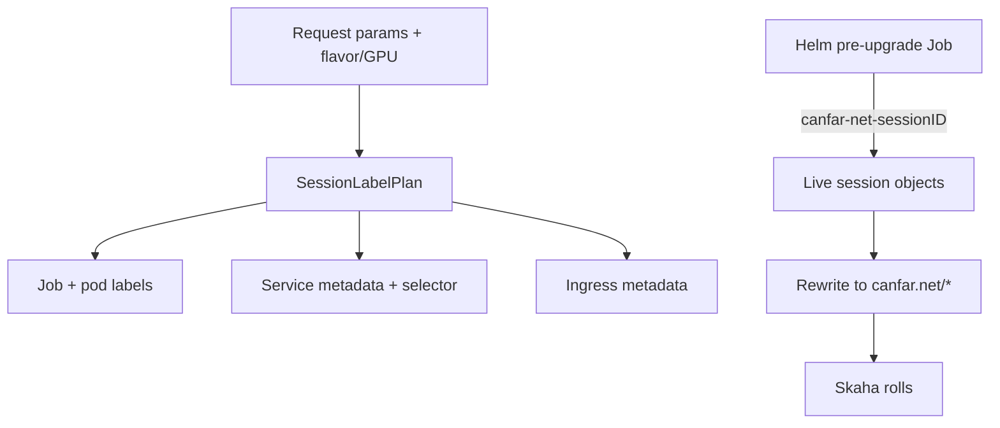

# Session label plan + deploy-time migration

Full task checklist: `docs/superpowers/plans/2026-07-15-session-label-plan-and-migration.md`  
Spec: `docs/superpowers/specs/2026-07-15-session-label-plan-and-migration-design.md`

<Callout type="decision">
No in-app dual-read. Migration runs once as a gated Helm `pre-upgrade` hook before new Skaha pods start. Selector key: `canfar-net-sessionID` (existence).
</Callout>

<FileTree>
- modify CONTRIBUTING.md -- Java 21 for this repo
- add skaha/src/main/java/org/opencadc/skaha/session/SessionLabelPlan.java -- immutable projections
- modify skaha/src/main/java/org/opencadc/skaha/session/SessionJobBuilder.java -- build plan once; labelService/labelIngress
- delete skaha/src/main/java/org/opencadc/skaha/session/SessionLaunchManifest.java -- false centralization removed
- modify skaha/src/main/java/org/opencadc/skaha/session/SessionLabels.java -- drop SessionMetadata + LabelSelectorRequirement
- modify skaha/src/main/java/org/opencadc/skaha/session/SessionBuilder.java -- map helpers
- modify skaha/src/main/java/org/opencadc/skaha/session/PostAction.java -- LaunchArtifacts
- add skaha/src/test/java/org/opencadc/skaha/session/SessionLabelPlanTest.java
- modify helm/values.yaml -- labelMigration.enabled
- add helm/templates/label-migration-rbac.yaml
- add helm/templates/label-migration-job.yaml
</FileTree>

<Phase title="Docs: Java 21" status="planned">
Update `CONTRIBUTING.md` Tools to match Skaha `VERSION_21`.
</Phase>

<Phase title="SessionLabelPlan + wire launch path" status="planned">
TDD plan projections → build in `SessionJobBuilder` → delete `SessionLaunchManifest` → shrink `SessionLabels` helpers → `PostAction` uses `buildLaunch()`.
</Phase>

<Phase title="Helm pre-upgrade migration" status="planned">
Gated Job+RBAC: Pods → Jobs → Services → Ingresses; map five legacy keys; strip old keys; fail blocks upgrade.
</Phase>

<Phase title="Verify" status="planned">
`./gradlew test` in `skaha`; `helm lint` in `helm`; walk spec success criteria.
</Phase>

| Legacy | Canonical |
|--------|-----------|
| canfar-net-sessionID | canfar.net/id |
| canfar-net-userid | canfar.net/username |
| canfar-net-sessionName | canfar.net/name |
| canfar-net-sessionType | canfar.net/kind |
| canfar-net-appID | canfar.net/app-id |

<Callout type="risk">
Service `spec.selector` must flip only after Pods carry `canfar.net/id` + `canfar.net/kind`, or session traffic drops during the hook.
</Callout>

<Questions>
- Which execution mode should we use after you approve this plan?
  - Subagent-driven development (fresh agent per task, review between) (Recommended)
  - Inline execution in this session
</Questions>
