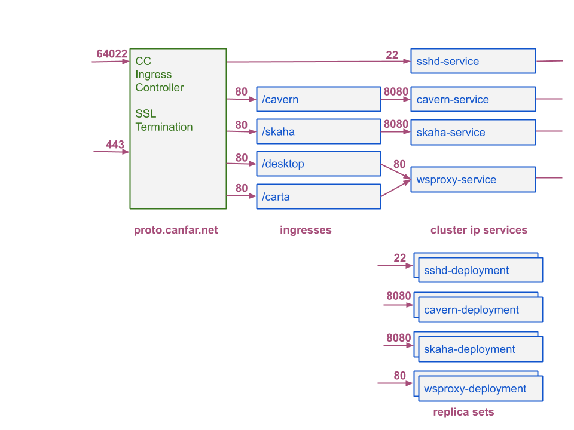

# skaha-k8s-config
Kubernetes deployment of skaha and cavern

## Overview
This module contains the prototype deployment configuration of skaha and cavern in kubernetes.

## kubernetes installation

Notes under an installation step indicate that configuration values must be changed to match the specifics of the kubernetes install.

### namespaces

The following namespaces are in use for cavern and skaha installation
   * skaha-system - for system services (deployments)
   * skaha-workload - for user sessions and applications (jobs)
   * cadc-harbor - for harbor
   * cadc-sssd - for the sssd daemonsets

### installation steps

Installation of cavern, skaha, and sssh is done with kustomize.

1. gather the values for all the secrets and place them in the associated kustomize dir.

```
.
./sssd
./sssd/config
./sssd/config/certs
./sssd/config/certs/ca.crt
./sssd/config/certs/cadc_CA_2029.crt
./sssd/config/sssd.conf
./servops-clientcert
./servops-clientcert/cadcproxy.pem
./skaha
./skaha/config
./skaha/config/k8s-config
./cavern
./cavern/sshd-certs
./cavern/sshd-certs/ssh_host_ed25519_key
./cavern/sshd-certs/ssh_host_ecdsa_key
./cavern/sshd-certs/ssh_host_rsa_key
```

The file `/skaha/config/k8s-config` must be handled specially.  See skaha/README.md for details

2. from k8s-config/kustomize, run: `kubectl apply -k .`

### site-specific configuration

When overlays on kustomize are complete this section won't be needed.

- cavern tomcat:
  - catalina.properties refers to hostname
  - Cavern.properties refers to hostname
  - cavern volume is installation specific
  - cephfs path set to /cavern-dev
- cavern ingress:
  - ingress refers to hostname
- skaha tomcat:
  - catalina.properties refers to hostname
  - cavern volume is installation specific
- skaha wsproxy
  - ingress refers to hostname
  - python redirect scripts in images reference namespaces

## Network

### Current network


The HA Proxy VM is there to support client proxy certificates.  The 'future' diagram below is what we'd like the network architecture to look like.  nginx in the ingress controller uses a newer version of openssl which requires apps (nginx in this case) to expose the configuration required to enable proxy certificates.  nginx does not allow that at this time.

This setup is not ideal because of the single point of failure in HA Proxy.

### Future network



In this setup SSL termination is done right in the ingress.  Because the ingress is load balanced it does not have a single point of failure.
