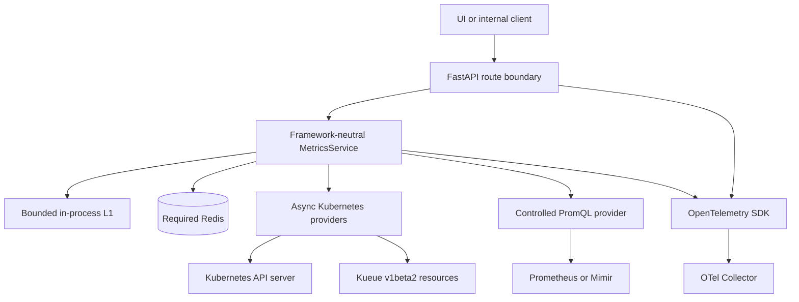
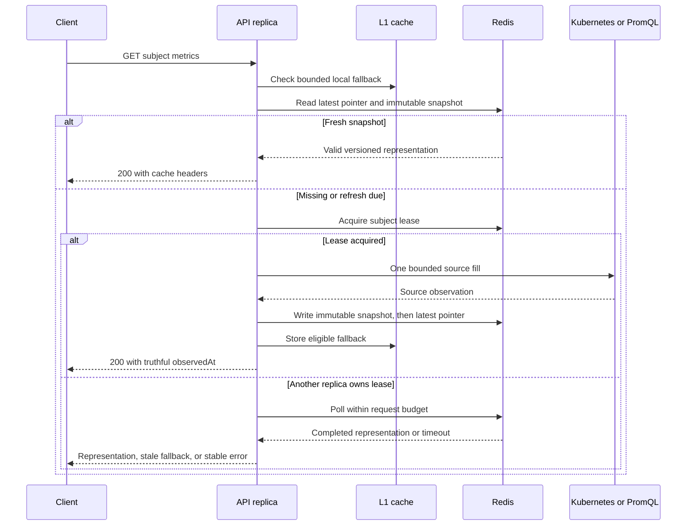
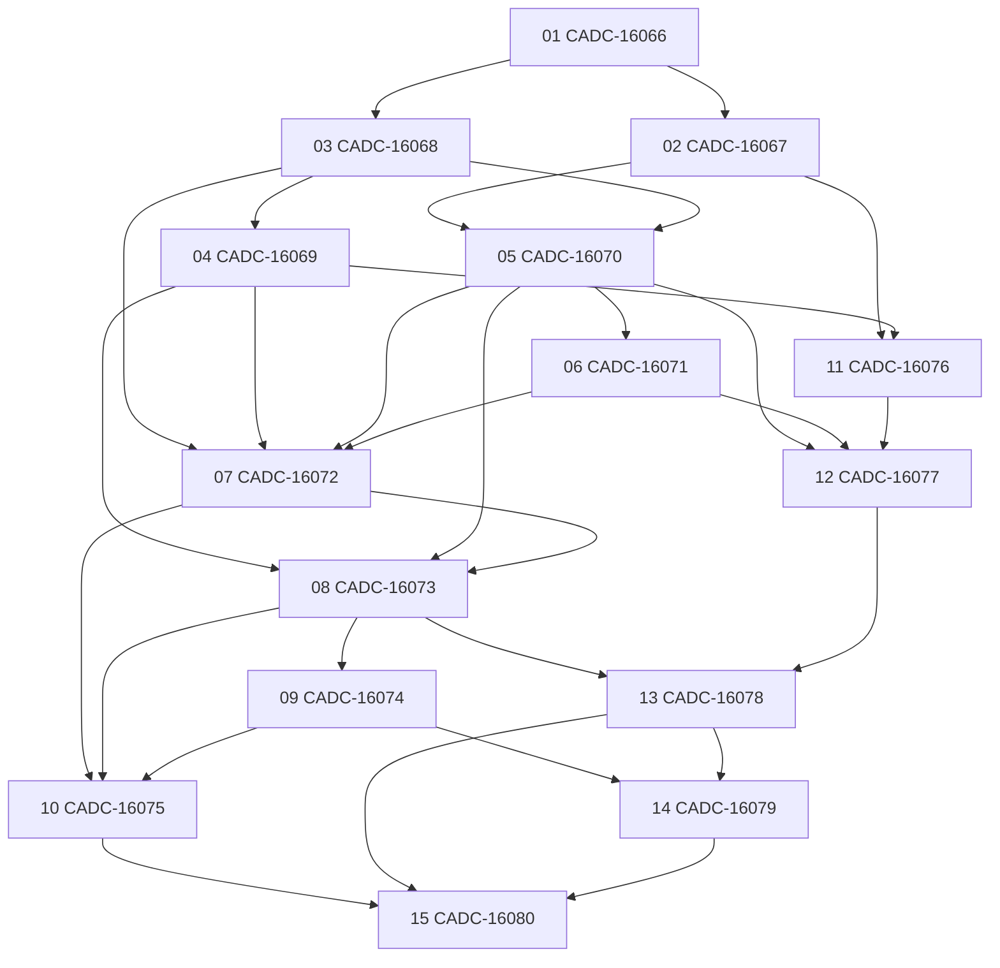

# CANFAR Metrics Backend — Implementation Handoff

<Callout type="warn" title="Execution guide, not a new design authority">
  This handoff tells the next coding agent how to deliver the accepted design. The canonical API contract, technical design, implementation specification, ADRs, and Jira subtasks remain authoritative. If this file disagrees with an approved source, stop and reconcile the conflict before coding.
</Callout>

<Stat>

- Existing work packages: 15
- Release closures: 2
- Initial GET surfaces: 3
- Canonical Confluence pages: 4

</Stat>

This document hands off the complete implementation of the CANFAR Metrics Backend: an async, Kubernetes-aware, Redis-coordinated FastAPI service; its `canfar.net/v1alpha1` contract; OpenTelemetry instrumentation; Helm packaging; and a reproducible kind/Kueue development and delivery environment.

## Mission

Evolve the existing code under `metrics/` in place. Deliver a standalone container and Helm release that expose these cluster-internal endpoints:

```text
GET /apis/canfar.net/v1alpha1/metrics/platform/canfar
GET /apis/canfar.net/v1alpha1/metrics/user/{user}
GET /apis/canfar.net/v1alpha1/metrics/community/{community}
```

Every successful representation uses:

```yaml
apiVersion: canfar.net/v1alpha1
kind: Metrics
```

The first release reports scheduler-effective requested resources for currently `Running` Skaha workload Pods. A later release adds lifetime usage and efficiency obtained from server-controlled PromQL queries. Both releases must be demonstrably runnable on the local kind stack.

<Callout type="note" title="Primary design intent">
  Build a Kubernetes-shaped read API today without pretending that each computed report is a stored Kubernetes object. Preserve clean seams for a future APIService, controller, or operator, but do not add operator machinery to this service.
</Callout>

## Start Here

<Checklist>

- [ ] Confirm the checkout is on `feat/usage-metrics`; the handoff was authored at commit `0b25f873`.
- [ ] Read the root `AGENTS.md` and `metrics/AGENTS.md` before any command or edit.
- [ ] Read `metrics/CONTEXT-MAP.md`, then `metrics/CONTEXT.md`.
- [ ] Read `metrics/docs/adr/README.md` and every accepted Metrics ADR, especially ADRs 0004 through 0009.
- [ ] Read `skaha/docs/labels.md`; those exact canonical labels define workload provenance and subject selection.
- [ ] Use Atlassian MCP to fetch all four Confluence pages and Jira CADC-16032 plus its 15 subtasks.
- [ ] Inspect current Git status before changing files. Preserve user-owned staged and untracked work.
- [ ] Run the current fast baseline before package 01, then use the target validation gates as they become available.

</Checklist>

### Repository rules that matter

- Prefix shell commands with `rtk` as required by the repository instructions.
- Use `uv` for dependency management and installed developer commands.
- Use conventional commits, split by Jira-sized behavior change.
- Use `apply_patch` for deliberate source edits.
- Reuse the existing kind cluster named `metrics`; inspect the active context before mutations.
- Never use destructive Git operations to discard existing changes.
- Update implementation-backed domain docs as behavior lands; do not rewrite them ahead of the implementation.
- Do not stage or delete unrelated research files just to make the worktree clean.

## Authority and Traceability

The Atlassian cloud ID is:

```text
a74fc2bd-a01d-46bb-a1ea-9caa8dd43e7c
```

<Matrix>

| Source | Role | Authority |
|---|---|---|
| API Contract | Exact HTTP and wire contract | Normative |
| Technical Design | Architecture/operations | Normative |
| Implementation Specifications | Implementation/test rules | Normative |
| Technical Research | Rationale and landscape only | Informative |
| Jira CADC-16032 | Scope and tracking | Normative |
| Repository ADRs | Durable repository decisions | Normative |
| Current-state docs | Shipped behavior | Descriptive |

</Matrix>

### Confluence

- [Technical Design](https://herzberg.atlassian.net/wiki/spaces/C/pages/edit-v2/2690809867?draftShareId=d1f1332a-e730-4b9f-b137-84bb071907a8), page `2690809867`. Covers architecture, async lifecycle, subject selection, request semantics, Redis, HTTP caching, PromQL, OpenTelemetry, configuration, containerization, local development, testing, and future Kubernetes integration.
- [API Contract](https://herzberg.atlassian.net/wiki/spaces/C/pages/edit-v2/2690809875?draftShareId=c4b310a0-ee5d-4f88-9e14-af419593b1bb), page `2690809875`. This is the source of truth for route names, payload examples, field definitions, conditions, cache headers, errors, and controlled PromQL behavior.
- [Implementation Specifications](https://herzberg.atlassian.net/wiki/spaces/C/pages/edit-v2/2690449417?draftShareId=4283d577-4c6b-4393-a869-cf134b97acf3), page `2690449417`. This records accepted implementation and testing decisions. It was a draft when this handoff was written; fetch its live state before implementation.
- [CANFAR Metrics Technical Research](https://herzberg.atlassian.net/wiki/spaces/C/pages/edit-v2/2691760131?draftShareId=4b428748-0429-4d73-b532-4fcde8d7fd4d), page `2691760131`. This consolidates the generic metrics/API and Python backend research. It is not design authority; approved specifications win.

Do not recreate these documents in the repository. Link to them from local docs where useful and keep local documentation focused on code-backed behavior, developer operations, and durable ADRs.

### Jira

- Main scope ticket: [CADC-16032 — CANFAR Metrics Backend](https://herzberg.atlassian.net/browse/CADC-16032).
- It is a Story under the existing epic CADC-15560. It is the only parent for this delivery.
- There are exactly 15 existing Sub-Tasks, CADC-16066 through CADC-16080.
- Never create a new Epic. Do not create replacement tasks for these packages.
- Each subtask intentionally has only `Description`, `Implementation specifics`, and `Acceptance Criteria` sections. Fetch and obey the complete ticket before starting it.

<Callout type="risk" title="Known Jira dependency-link defect">
  The native Jira `Blocks` links were created in the reverse direction. The human-readable `Blocked by` text in each subtask and the dependency graph in this handoff are correct. Do not schedule from native Jira link direction. Do not delete or recreate links without explicit authorization.
</Callout>

## Current Checkout State

At handoff creation:

```text
branch: feat/usage-metrics
HEAD:   0b25f873
untracked:
  metrics/docs/generic-metrics-api-research.md
  metrics/docs/python-backend-technical-research.md
```

Those two research files have already been consolidated into the Confluence research page. They are user-owned, intentionally untracked material. Do not add, delete, or move them without explicit direction.

`metrics/README.md` still links to removed local design/spec/ticket documents. Those links are stale because Confluence and Jira are now canonical. Correct the README links in the first documentation-bearing work package; do not resurrect duplicate local specifications.

Before making any change, capture a fresh state:

```bash
rtk git status --short
rtk git branch --show-current
rtk git log -5 --oneline
```

## Existing System Versus Accepted Target

| Concern | Existing implementation | Accepted target |
|---|---|---|
| Public route | `GET /api/v1/metrics/platform` | Three `/apis/canfar.net/v1alpha1/metrics/...` GET routes |
| Resource shape | Legacy `PlatformMetrics` envelope | `apiVersion: canfar.net/v1alpha1`, `kind: Metrics` |
| Subjects | Platform only | Platform, user, and community |
| Kubernetes client | Existing Kueue provider | Async `kr8s.asyncio` providers and exact selectors |
| Cache | Shallow TTL cache and process-local single-flight | Required Redis, versioned values, lease coordination, stale serving, bounded L1 |
| Redis outage | Error treated as miss/no-op | No downstream-source bypass; serve eligible bounded L1 or fail clearly |
| Refresh | On request | On request, with cross-replica coordination; no refresh daemon |
| Telemetry | Initial OTel scaffolding | Traces, metrics, correlated JSON logs, OTLP, redaction proven |
| Container | `python:3.13-alpine`, pip installation | `python:3.13-slim`, pinned uv, locked install, non-root, one worker |
| Type checker | mypy | Exact pinned `ty` beta |
| Developer UX | Shell-driven helpers | Installed `uv run metrics-dev ...` command surface |
| Local validation | Existing kind smoke | Core and accounting profiles with real Redis/Kueue/OTel and built image |

### Existing code to deepen

Do not replace the project with a second architecture. Start with these modules:

<FileTree>

- modify `metrics/pyproject.toml` — current package, dependencies, tool configuration
- modify `metrics/uv.lock` — locked environment
- modify `metrics/Dockerfile` — current runtime image
- modify `metrics/src/metrics/api/v1/routes.py` — legacy platform route
- modify `metrics/src/metrics/core/factory.py` — application construction
- modify `metrics/src/metrics/core/runtime.py` — owned resources and lifecycle
- modify `metrics/src/metrics/core/settings.py` — configuration
- modify `metrics/src/metrics/providers/kueue.py` — existing Kueue/Kubernetes provider
- modify `metrics/src/metrics/schemas/metrics.py` — legacy wire models
- modify `metrics/src/metrics/services/platform.py` — current orchestration and process single-flight
- modify `metrics/src/metrics/cache.py` — shallow cache interface and implementations
- modify `metrics/src/metrics/http_cache.py` — response cache helpers
- modify `metrics/src/metrics/telemetry.py` — initial OTel support
- modify `metrics/src/metrics/errors.py` — error boundary
- modify `metrics/src/metrics/main.py` — ASGI entrypoint
- modify `metrics/tests/test_delivery_contract.py` — delivery expectations
- modify `metrics/tests/test_runtime.py` — lifecycle ownership
- modify `metrics/tests/test_app_smoke.py` — FastAPI surface
- modify `metrics/tests/test_config.py` — configuration
- modify `metrics/tests/test_kueue.py` — provider behavior
- modify `metrics/tests/test_telemetry.py` — instrumentation
- modify `metrics/tests/integration/test_k8s_smoke.py` — live cluster seam
- modify `metrics/helm/` — Deployment, Service, RBAC, ServiceAccount, Redis, values
- modify `metrics/scripts/` — current kind smoke, teardown, values, fixtures, prerequisites
- modify `metrics/docs/` — current-state operations and accepted ADRs

</FileTree>

Prefer cohesive additions beside these modules: shared subject/schema policy, async providers, Redis coordination, metrics orchestration, telemetry, and developer CLI. Avoid speculative `ports/`, `adapters/`, registry, DAO, service-locator, generic DI, or operator package hierarchies.

## Non-Negotiable Product Boundaries

<Checklist>

- [ ] Hard cut over from the legacy route and payload. Do not add a compatibility route, legacy parser, or dual response.
- [ ] Expose GET only. No list, watch, POST, PATCH, DELETE, or kubectl-specific surface.
- [ ] No authentication logic, identity headers, or public ingress. Authentication remains upstream and out of scope.
- [ ] The service is cluster-internal in this delivery.
- [ ] Do not expose provider/source lists, raw PromQL, downstream URLs, or caller-controlled headers.
- [ ] Use only `Ready` and `Cached` conditions in the representation. Cache freshness detail belongs in standard HTTP headers.
- [ ] Keep `observedAt` equal to the source collection time, including when a stale representation is served.
- [ ] Do not add metrics refresh workers, a metrics operator, controller, CRD, webhook, or API aggregation layer.
- [ ] Do not materialize one Kubernetes CR per user/community/platform report.

</Checklist>

## Contract Invariants

### Naming and paths

```yaml
apiVersion: canfar.net/v1alpha1
kind: Metrics
```

The Kubernetes-style resource name is singular `metrics` and plural `metrics`. The initial subject selectors are encoded in the path:

```text
platform/canfar
user/{user}
community/{community}
```

Use the exact payloads and error examples from the API Contract page. Do not infer field names from the removed local design files or from the legacy `PlatformMetrics` model.

The `spec` remains intentionally simple. Its subject fields are:

```yaml
spec:
  user: alice
  community: cadc
  platform: canfar
```

Only the field relevant to the selected surface should carry the subject value in a concrete response. Apply the exact omission/nullability rule in the API Contract.

### Current resource semantics

- Include only Pods whose Kubernetes phase is exactly `Running`.
- Scope discovery to configured workload namespaces such as `canfar-workloads`.
- Require the canonical Skaha provenance and identity/community labels from `skaha/docs/labels.md`.
- Use exact label equality; do not build user-controlled selector strings.
- Report scheduler-effective requested CPU, memory, and extended resources rather than instantaneous utilization.
- Do not include Pending demand in this release. Future pending demand comes from Kueue LocalQueues and is out of scope.
- Platform aggregation scans the configured workload scope once.
- User aggregation filters directly for one canonical username label.
- Community aggregation filters directly for one canonical community label; never enumerate members and make N user calls.
- Do not return per-user or per-Pod member breakdowns from the community endpoint.

### Scheduler-effective requests

Implement the Kubernetes scheduling semantics accepted in the technical design and ticket AC, including init containers, application containers, Pod overhead, restartable sidecars where supported, extended resources, and quantity normalization. Keep the quantity mathematics pure and directly tested.

### Response conditions and HTTP caching

- `Ready` describes whether the representation is usable.
- `Cached` describes whether the returned representation came from cache.
- Do not put internal cache states such as `freshUntil`, `serveStaleUntil`, `purgeAfter`, `state`, or `complete` in the JSON payload.
- Express freshness, validation, and age through the exact standard cache headers in the API Contract.
- Support conditional requests according to the contract, including stable representation validators.
- Preserve the original `observedAt` for stale data and make staleness clear through headers and `Cached` condition semantics.

## Target Architecture



### Async and lifecycle rules

- All external I/O is async: Kubernetes, Redis, PromQL HTTP, and telemetry export.
- Use `kr8s.asyncio` for Kubernetes access.
- Use `redis.asyncio` for Redis.
- Use one owned async HTTPX client for PromQL.
- Keep quantity parsing, aggregation, hashing, and schema construction synchronous and pure.
- Construct owned clients once in FastAPI lifespan and close them deterministically during shutdown.
- Keep the domain/orchestration core independent of FastAPI request objects.
- Use explicit small protocols only where tests or provider substitution require them.
- A single Uvicorn worker per container is the expected runtime. Scale with replicas.

### Provider boundaries

The core should consume narrow capabilities, not client-library objects:

- discover selected Running Pods and their scheduler request inputs;
- read Kueue resources needed by platform/fair-share reporting;
- execute a named server-owned PromQL instant-query template;
- load/store/co-ordinate cache representations;
- emit telemetry without leaking subject identity.

Provider exceptions must be translated at the orchestration/API boundary into the contract's stable error model. Do not leak Redis, Kubernetes, HTTPX, or Prometheus exception text to clients.

## Redis and Cache Design

Redis is required for correct production behavior, not an optional optimization.

### Freshness windows

| Surface | Fresh | Serve stale | Purge |
|---|---:|---:|---:|
| Platform | 5 minutes | 30 minutes | 60 minutes |
| User | 2 minutes | 10 minutes | 15 minutes |
| Community | 2 minutes | 10 minutes | 15 minutes |

Use the exact configuration names and boundary behavior from the Technical Design and API Contract.

### Coordination model



Required properties:

- HMAC subject-derived cache-key segments using a secret of at least 32 bytes; never put raw usernames or communities in Redis keys.
- Strict, versioned JSON serialization. Unknown/incompatible versions are misses, never partially trusted payloads.
- Immutable snapshots plus an atomically updated latest pointer.
- Per-subject Redis lease with unique owner token and safe compare-and-delete release.
- Same-process event/task coordination so local waiters do not poll Redis unnecessarily.
- Cross-replica bounded polling while another replica owns the lease.
- Bounded L1 only as an eligible stale/outage fallback; it is not an independent freshness authority.
- No request may bypass failed Redis coordination and independently hammer Kubernetes or Prometheus/Mimir.
- Cancellation-safe lease cleanup and no orphaned owned clients/tasks on shutdown.

### Default latency budgets

- Redis operation: 500 milliseconds.
- Kubernetes or PromQL call: 5 seconds.
- Complete Kubernetes fill: 10 seconds.
- Cold GET: 12 seconds.
- At most one transient retry, and only when it fits inside the overall request budget.

Use monotonic deadlines internally. Test boundary cases, cancellation, lease loss, corrupted values, Redis outage, stale expiry, and multi-replica contention with a real Redis instance.

## OpenTelemetry and Logging

Ship first-class traces, application metrics, and correlated structured JSON logs through OTLP.

Instrument:

- inbound HTTP duration/status using templated route names;
- cache outcomes and age classes;
- lease acquisition, wait, contention, and timeout;
- source request duration, retry, timeout, and error class;
- fill duration and aggregate input counts;
- Redis connectivity and lifecycle health;
- application startup and graceful shutdown.

Never emit:

- raw usernames or community names;
- concrete subject paths;
- Kubernetes selectors;
- PromQL text;
- cache keys, HMAC digests, or secret material;
- Pod names, session IDs, or full response payloads.

Use low-cardinality attributes such as subject type, named provider operation, cache outcome class, and error category. Prove redaction with an OTel Collector file exporter in local smoke tests; do not rely only on unit assertions against logger calls.

## Phase 2: Active Workload Lifetime Accounting

The accepted basis name is `ActiveWorkloadLifetime`.

- The population is Pods that are currently `Running` at request time.
- Each selected Pod contributes over its own Running intervals, not over a shared wall-clock window.
- If Pods A, B, and C have run for one, two, and three hours, each is integrated only over its own eligible lifetime.
- Aggregate usage and requested capacity first, then compute efficiency. Never average per-Pod ratios.
- Canonical integrated units are core-hours, GiB-hours, and GPU-hours where attribution is proven.
- Enforce completeness rules from the contract. Do not silently combine partial usage with complete requested capacity.
- If actual GPU attribution is not proven by the accepted producer/rules, omit GPU efficiency instead of manufacturing it.

The service is a consumer of purpose-built accounting series. It must not construct arbitrary queries from callers.

### Controlled PromQL boundary

- Use HTTPX asynchronously.
- Allow only named server-owned templates.
- Use Prometheus-compatible instant query form POST to `/api/v1/query`.
- Allow an optional typed Mimir tenant configuration owned by the server.
- Do not accept caller-supplied PromQL, range parameters, base URLs, tenants, or arbitrary headers.
- Validate returned series, timestamps, labels, units, and completeness before aggregation.
- Cache accepted accounting results through the same Redis coordination boundary.
- A proxied/query URL for tightly controlled UI use is future work unless the live accepted contract explicitly promotes it.

## Local Development and Delivery Environment

### Pinned baseline

| Component | Required target |
|---|---|
| Python | 3.13 |
| Runtime base | `python:3.13-slim` |
| Kubernetes | supported floor 1.33 |
| kind | 0.32.0 |
| kind node | `kindest/node:v1.33.12` |
| kind digest | `sha256:3f5c8443c620245e4d355cfe09e96a91ead32ceaa569d3f1ca9edf0cb2fe2ff4` |
| Kueue | 0.19.2 |
| Kueue API | v1beta2 |
| Cluster name | `metrics` |
| Kubernetes context | `kind-metrics` |
| Workload namespace | `canfar-workloads` |

### Developer command surface

Deliver an installed command from `metrics/pyproject.toml`:

```bash
uv run metrics-dev up
uv run metrics-dev run
uv run metrics-dev image
uv run metrics-dev fixtures
uv run metrics-dev smoke
uv run metrics-dev down
uv run metrics-dev reset
uv run metrics-dev destroy
```

Expected semantics:

- `up`: create or converge the pinned local dependencies and Helm deployment.
- `run`: run the service locally against the kind cluster through an explicit, narrow kubeconfig path.
- `image`: build and load the production image into the existing kind cluster.
- `fixtures`: apply deterministic Kueue queues, cohorts, jobs, labels, and accounting fixtures.
- `smoke`: exercise health, contract, cache, telemetry, and fixture outcomes through a real service socket.
- `down`: stop the application/dependencies that can be safely stopped without deleting the cluster.
- `reset`: retain the cluster and image cache while recreating deterministic fixtures.
- `destroy`: explicitly delete the local stack; treat this as destructive and require exact context/cluster checks.

Do not add a second undocumented script surface. Thin implementation helpers are acceptable behind the installed command.

### Context safety

Before any cluster mutation:

```bash
rtk kubectl config current-context
rtk kind get clusters
rtk kubectl --context kind-metrics cluster-info
```

Fail closed if the selected context is not `kind-metrics`. Reuse the existing `metrics` cluster. Never create extra clusters because a fixture step failed.

The Helm workload must use a ServiceAccount and scoped RBAC. Do not mount a host Docker socket or general host kubeconfig into the deployed application. Include probes, resource requests/limits, graceful shutdown, one worker, and an internal-only Service. Include a NetworkPolicy appropriate to Kubernetes, Redis, OTLP, DNS, and the controlled PromQL endpoint.

### Local profiles

<Phase number="A" title="Core profile">
  Pinned kind cluster, Kueue, ephemeral Redis, OTel Collector, the built Metrics image installed by Helm, LocalQueue/ClusterQueue/cohort fixtures, and finite busy Jobs carrying canonical Skaha labels.
</Phase>

<Phase number="B" title="Accounting profile">
  Everything in the core profile plus kube-state-metrics, Prometheus, purpose-built recording rules or an accounting producer, and deterministic accounting fixtures. Mimir parity is optional unless promoted by the accepted ticket scope.
</Phase>

The warm smoke path should finish in under two minutes. Report cold image/chart pulls separately so network latency is not confused with service regression.

### Required Kueue fixtures

- At least two equal LocalQueues in `canfar-workloads`.
- ClusterQueues in one cohort with borrowing enabled.
- A separate UsageBasedAdmissionFairSharing scenario with warmed usage history.
- A deterministic assertion that the lower-use queue wins the next admission opportunity.
- Finite, pinned busy Jobs rather than infinite sleep Pods.
- Jobs labelled for at least two users and two communities using exact keys from `skaha/docs/labels.md`.
- Condition-based waits, never fixed sleeps as correctness mechanisms.
- Teardown/reset that removes only resources owned by this dev stack.

## Validation Strategy

<Matrix>

| Layer | Primary seam | Proof |
|---|---|---|
| Contract smoke | FastAPI TestClient | HTTP contract |
| Core orchestration | `MetricsService.get` | Cache/source/timeouts |
| Pure invariants | Direct math/schema functions | Math, selectors, HMAC |
| Redis integration | Real Redis | Leases, atomics, outage, stale |
| Provider integration | kind and documented fixtures | Kubernetes and PromQL behavior |
| OTel validation | Collector file exporter | Export and identity redaction |
| Delivery smoke | Built image, Helm, real socket | Runtime packaging and health |
| Load coordination | Two replicas and concurrent GETs | One downstream fill per subject |

</Matrix>

FastAPI `TestClient` is the primary application contract seam. Use it with the real lifespan and injected async adapters. `MetricsService.get` is the secondary orchestration seam. Add isolated function tests only for dangerous pure invariants; do not decompose every implementation detail into brittle unit tests.

The authoritative delivery smoke must call the Helm-deployed built image over a real socket. In-process TestClient success is necessary but not proof that the image, RBAC, configuration, Redis, service, and shutdown path work together.

### Current baseline before package 01

Run the repository's current gates from `metrics/` and record any pre-existing failures:

```bash
rtk uv sync --group dev
rtk uv run ruff check src tests
rtk uv run pytest
```

If the uv cache is not writable, use:

```bash
UV_CACHE_DIR=/tmp/canfar-uv-cache rtk uv run pytest
```

Inspect `metrics/AGENTS.md` for the exact current test split and kind commands rather than copying stale commands from tickets.

### Target pre-commit gate

Package 01 must converge the local gate so pre-commit runs the locked development tools, including:

```text
ruff check --fix
ruff format
ty check
lock validation
fast TestClient smoke
```

Pin the accepted `ty` beta exactly and remove mypy once replacement is complete. Keep slower image, live Redis outage, OTel Collector, and kind delivery scenarios as explicit manual/CI stages rather than making every commit wait on cluster setup.

## Work-Package Dependency Graph



The accepted direct edges are:

```text
01 -> 02, 03
03 -> 04, 05
02 -> 05, 11
05 -> 06, 07, 08, 12
04 -> 07, 08, 11
06 -> 07, 12
07 -> 08, 10
08 -> 09, 10, 13
09 -> 10, 14
11 -> 12
12 -> 13
13 -> 14, 15
10 -> 15
14 -> 15
```

## The 15 Existing Work Packages

Fetch each ticket with Atlassian MCP before implementation. The descriptions below are navigation summaries, not replacements for ticket acceptance criteria.

| # | Jira | Package | Blocked by | Outcome |
|---:|---|---|---|---|
| 01 | [CADC-16066](https://herzberg.atlassian.net/browse/CADC-16066) | Lock toolchain and image | — | Python 3.13/uv/ty/Ruff/pre-commit and production image baseline |
| 02 | [CADC-16067](https://herzberg.atlassian.net/browse/CADC-16067) | Shared async seam | 01 | Framework-neutral async service/provider/lifecycle boundary |
| 03 | [CADC-16068](https://herzberg.atlassian.net/browse/CADC-16068) | Core kind/Helm loop | 01 | Repeatable local cluster, image, Helm, Redis, OTel, and command surface |
| 04 | [CADC-16069](https://herzberg.atlassian.net/browse/CADC-16069) | Kueue borrowing and fair-share Jobs | 03 | Deterministic queues/cohort/fair-sharing workloads and assertions |
| 05 | [CADC-16070](https://herzberg.atlassian.net/browse/CADC-16070) | Redis load boundary | 02, 03 | Versioned cache, HMAC keys, leases, stale/L1, outage behavior |
| 06 | [CADC-16071](https://herzberg.atlassian.net/browse/CADC-16071) | OTel Platform slice | 05 | End-to-end trace/metric/log export with proven redaction |
| 07 | [CADC-16072](https://herzberg.atlassian.net/browse/CADC-16072) | Platform v1alpha1 hard cut | 04, 05, 06 | New platform route/shape; legacy route removed |
| 08 | [CADC-16073](https://herzberg.atlassian.net/browse/CADC-16073) | User current requests | 04, 05, 07 | Direct user-labelled Running-Pod scheduler requests |
| 09 | [CADC-16074](https://herzberg.atlassian.net/browse/CADC-16074) | Community current requests | 08 | Direct community-labelled aggregate without N+1 |
| 10 | [CADC-16075](https://herzberg.atlassian.net/browse/CADC-16075) | Initial release closure | 07, 08, 09 | Built-image Helm smoke for all current-request surfaces |
| 11 | [CADC-16076](https://herzberg.atlassian.net/browse/CADC-16076) | Prove ActiveWorkloadLifetime | 02, 04 | Accounting basis and fixture proof over each active Pod lifetime |
| 12 | [CADC-16077](https://herzberg.atlassian.net/browse/CADC-16077) | Accounting producer and controlled PromQL | 05, 06, 11 | Named instant-query pipeline with complete typed results |
| 13 | [CADC-16078](https://herzberg.atlassian.net/browse/CADC-16078) | User lifetime usage and efficiency | 08, 12 | User integrated usage/requested/efficiency |
| 14 | [CADC-16079](https://herzberg.atlassian.net/browse/CADC-16079) | Community lifetime usage and efficiency | 09, 13 | Community aggregate accounting with direct selection |
| 15 | [CADC-16080](https://herzberg.atlassian.net/browse/CADC-16080) | Complete accounting release closure | 10, 13, 14 | Full local delivery, outage, load, telemetry, and docs evidence |

### Recommended dependency waves

<Phase number="1" title="Foundation">
  CADC-16066. Lock the developer/runtime toolchain and container assumptions before architecture work changes dependencies or CI.
</Phase>

<Phase number="2" title="Parallel base seams">
  CADC-16067 and CADC-16068 can proceed after package 01. Keep the service seam and local delivery loop compatible; merge and validate serially on the feature branch.
</Phase>

<Phase number="3" title="Fixtures and cache correctness">
  CADC-16069 and CADC-16070. Establish real workload fixtures and the Redis coordination boundary before exposing the new API.
</Phase>

<Phase number="4" title="Observable platform hard cut">
  CADC-16071 then CADC-16072. Prove telemetry/redaction and cut the platform endpoint to the accepted contract.
</Phase>

<Phase number="5" title="Current subject surfaces">
  CADC-16073 then CADC-16074, followed by CADC-16075 initial-release closure.
</Phase>

<Phase number="6" title="Accounting foundation">
  CADC-16076 may begin once its base blockers land. CADC-16077 follows after lifetime semantics, cache, and OTel are proven.
</Phase>

<Phase number="7" title="Accounting surfaces and closure">
  CADC-16078 then CADC-16079, followed by CADC-16080 full-release closure.
</Phase>

## Per-Ticket Execution Protocol

For every work package:

<Checklist>

- [ ] Fetch the live Jira issue and confirm its status, description, implementation specifics, and acceptance criteria.
- [ ] Re-read the exact Confluence sections and ADRs named by the ticket.
- [ ] Confirm all logical blockers in this handoff are complete; ignore reversed native Jira link direction.
- [ ] Inspect Git status and the files in scope. Preserve unrelated user work.
- [ ] Write or update the highest-value contract/integration test first when practical.
- [ ] Implement the smallest coherent slice that satisfies the ticket; deepen existing modules.
- [ ] Run fast lint/type/test gates, then the ticket-specific real dependency or kind proof.
- [ ] Update code-backed README, architecture, environment, development, and troubleshooting docs where behavior changed.
- [ ] Commit only the package's files with a conventional commit that references the behavior, not a generic progress message.
- [ ] Record exact evidence: commands, versions, cluster context, image identity, outcomes, and any unrun host/CI/live gates.
- [ ] Use existing Jira tasks only. Transition or comment on issues only when authorized by the delivery workflow.

</Checklist>

Do not mark a ticket complete because mocks pass when its acceptance criteria require Redis, kind, Helm, Kueue, OTel Collector, Prometheus, multiple replicas, or a built image.

## Package-Specific Implementation Guidance

### 01 — Toolchain and image

- Update `pyproject.toml` rather than adding ad hoc setup scripts.
- Provide installed `metrics-dev` entry points through the project metadata.
- Pin the exact accepted `ty` beta and replace mypy only after equivalent checks pass.
- Make pre-commit the canonical fast gate.
- Build from `python:3.13-slim`, install with a pinned uv binary and the lockfile, retain runtime metadata, run non-root, and use one Uvicorn worker.
- Add a container smoke that imports package metadata and starts the actual entrypoint.

### 02 — Shared async seam

- Define the framework-neutral request/subject and response orchestration boundary.
- Centralize lifespan ownership of Redis, kr8s, HTTPX, and OTel resources.
- Keep FastAPI responsible for routing, validation, conditional headers, and error mapping only.
- Ensure cancellation and shutdown are testable.

### 03 — Core kind and Helm loop

- Implement `metrics-dev` lifecycle commands and exact context guards.
- Pin kind/Kubernetes/Kueue inputs and verify them in smoke output.
- Deploy Redis, OTel Collector, ServiceAccount/RBAC, and the built image.
- Use Kubernetes-native access in-cluster; local `run` may use a deliberately scoped kubeconfig.
- Make reset fast and destroy explicit.

### 04 — Kueue fixtures

- Install Kueue 0.19.2 and use v1beta2 resources.
- Create cohorts, ClusterQueues, LocalQueues, ResourceFlavors if required, and finite Jobs.
- Cover borrowing and UsageBasedAdmissionFairSharing independently.
- Assert conditions and scheduling outcome, not sleep duration.
- Apply exact Skaha username/community/provenance labels.

### 05 — Redis load boundary

- Treat Redis as required and unhealthy when unavailable.
- Implement HMAC key derivation, versioned snapshots/latest pointers, atomic writes, lease ownership, safe release, same-process events, cross-replica polling, and bounded L1.
- Enforce per-surface freshness windows and overall deadlines.
- Prove 100 concurrent requests across two replicas produce one downstream fill for one subject.
- Prove Redis outage never causes a source-request storm.

### 06 — OTel platform slice

- Configure OTLP traces, metrics, and correlated JSON logs.
- Add low-cardinality cache/lease/source/fill signals.
- Send local telemetry to the Collector file exporter.
- Assert absence of fixture usernames, communities, Pod/session names, selectors, queries, paths, keys, and digests from exported output.

### 07 — Platform hard cut

- Remove the old route and `PlatformMetrics` public wire envelope.
- Implement the exact platform payload and standard cache headers.
- Aggregate Running, labelled workloads across configured namespaces once.
- Implement scheduler-effective request semantics and stable error mapping.
- Make tests assert that the legacy route is absent.

### 08 — User current requests

- Select directly with canonical username plus provenance labels.
- Return only current scheduler-effective requests for Running Pods.
- Use the user cache policy and subject HMAC boundary.
- Test URL encoding/validation, empty result semantics, label safety, and no cross-user leakage.

### 09 — Community current requests

- Select directly with canonical community plus provenance labels.
- Aggregate in one provider scan; do not call the user service repeatedly.
- Do not include member identities or per-user breakdowns.
- Test mixed-user community fixtures and cross-community isolation.

### 10 — Initial release closure

- Install the built image through Helm into the core profile.
- Exercise all three GET routes over a real socket.
- Prove cold fill, fresh hit, conditional hit, stale serve, not-found/empty semantics, stable error model, graceful shutdown, and no legacy route.
- Capture warm smoke duration under the accepted two-minute target.
- Update code-backed local docs and remove stale README links.

### 11 — ActiveWorkloadLifetime proof

- Model each currently Running Pod's own Running intervals.
- Build deterministic fixtures with different Pod ages/intervals.
- Prove integrated requested capacity and usage units.
- Document and test restart, missing-series, recently-started, and incomplete-data behavior.
- Do not proceed to public efficiency fields until the basis is demonstrably correct.

### 12 — Accounting producer and PromQL

- Add the accounting profile with kube-state-metrics, Prometheus, and purpose-built rules/producer.
- Expose only named server-owned instant-query templates to the service.
- Validate typed results and completeness before caching.
- Instrument by template name/operation, never query contents.
- Prove timeout, upstream error, invalid series, stale cache, and optional Mimir tenant behavior.

### 13 — User lifetime usage and efficiency

- Apply ActiveWorkloadLifetime to the current Running set for one user.
- Aggregate requested and used core-hours/GiB-hours/GPU-hours before dividing.
- Follow exact absent/partial/zero-denominator contract semantics.
- Preserve current-request data if and only if the API contract permits a partial accounting response; otherwise fail as specified.

### 14 — Community lifetime usage and efficiency

- Query/account directly by community label.
- Aggregate raw numerators and denominators across the community before ratios.
- Never expose users, Pods, or sessions in the response or telemetry.
- Prove parity with the sum of controlled fixture inputs without implementing an N+1 production path.

### 15 — Complete release closure

- Run the accounting profile from a clean/converged setup and the fast reset path.
- Exercise all surfaces and accounting fields from the built Helm image.
- Run real Redis outage/stale tests, Prometheus failure tests, OTel redaction checks, and multi-replica one-fill load.
- Verify NetworkPolicy, RBAC, probes, graceful shutdown, non-root identity, and image metadata.
- Capture exact version and evidence records; distinguish local success from any unrun hosted-CI, staging, production, or human-approval gate.

## Release Evidence

### Initial release closure — CADC-16075

<Checklist>

- [ ] All packages 01 through 10 meet their live Jira acceptance criteria.
- [ ] Legacy route is removed and all three v1alpha1 routes work.
- [ ] Current requests use scheduler-effective semantics for labelled Running workloads.
- [ ] Redis coordination, stale headers, and conditional GET behavior are proven.
- [ ] OTel signals arrive and fixture identities are absent.
- [ ] Built `python:3.13-slim` image runs non-root through Helm with scoped RBAC.
- [ ] Warm local delivery smoke completes within the accepted target.
- [ ] Developer setup, reset, smoke, teardown, and troubleshooting docs match reality.

</Checklist>

### Complete accounting closure — CADC-16080

<Checklist>

- [ ] All 15 packages meet their live Jira acceptance criteria.
- [ ] ActiveWorkloadLifetime is proven for Pods with distinct Running intervals.
- [ ] Controlled PromQL exposes no caller query surface.
- [ ] User and community integrated usage/requested/efficiency obey unit and completeness rules.
- [ ] Redis and Prometheus outage behavior is bounded and does not fan out.
- [ ] Two-replica concurrent load produces one fill per subject/version window.
- [ ] OTel redaction is proven against exported Collector output.
- [ ] Core and accounting profiles can be created, reset, smoked, and destroyed safely.
- [ ] Evidence identifies exact Git revision, image digest, tool versions, cluster/context, and commands.

</Checklist>

## Documentation Ownership

Update local documents only when their described behavior has landed:

- `metrics/README.md`: supported API links, developer quick start, canonical Confluence/Jira links.
- `metrics/docs/architecture.md`: actual implemented module/lifecycle/cache/provider design.
- `metrics/docs/environment-contracts.md`: real configuration keys, defaults, and secret requirements.
- `metrics/docs/dev-setup.md`: actual `metrics-dev` workflows and pinned prerequisites.
- `metrics/docs/adr/`: add or amend only when an accepted architectural decision changes.
- troubleshooting/runbook documentation: failure signatures and exact recovery for Redis, kind, Kueue, OTel, and Prometheus.

Do not duplicate the full API Contract, Technical Design, Implementation Specifications, ticket bodies, or consolidated research in Git.

## Explicitly Out of Scope

- Authentication or authorization inside the service.
- AuthForward/Traefik configuration.
- Public ingress.
- Kubernetes CRDs, APIService registration, controller/operator reconciliation, or mutating webhooks.
- kubectl verbs or synthetic paths such as `kubectl get metrics.canfar.net user/alice`.
- List/watch/mutation APIs.
- Background cache refresh workers.
- Pending Kueue demand metrics.
- Arbitrary or caller-provided PromQL proxying.
- Historical ranges beyond ActiveWorkloadLifetime.
- Sessions, online time, I/O, IOPS, storage, network, or cost metrics unless promoted by a future accepted contract.
- Per-user detail in community responses.
- A new Epic or replacement Jira backlog.

## Stop and Reconcile Instead of Guessing

Stop implementation and ask for a decision when:

- the live Confluence payload differs from a ticket acceptance criterion;
- an ADR conflicts with the live API Contract or Technical Design;
- exact label keys cannot be reconciled with `skaha/docs/labels.md`;
- Kubernetes 1.33/Kueue 0.19.2 behavior differs from the accepted scheduling semantics;
- GPU usage attribution is incomplete but a response would imply complete efficiency;
- satisfying a ticket would require public ingress, authentication, an operator, a new API verb, or arbitrary PromQL;
- fixing Jira dependency links, deleting user files, or changing unrelated staged work becomes necessary;
- a test passes only by skipping the real dependency named in its acceptance criteria.

## Final Definition of Done

The feature is complete only when the repository contains a locked Python 3.13 service; the three accepted v1alpha1 GET routes; scheduler-effective current request metrics; Redis-coordinated caching and stale behavior; OTel traces/metrics/logs with proven redaction; controlled lifetime accounting for user and community efficiency; a production `python:3.13-slim` image; a scoped Helm deployment; and a pinned kind/Kueue/Redis/OTel/Prometheus local environment whose built-image smoke, reset, and teardown are repeatable and evidenced.

“Code complete” without the local delivery evidence is not complete. “Smoke passed” without real Redis/Kubernetes/OTel/Prometheus where required is not proof. Report every unrun gate explicitly.
