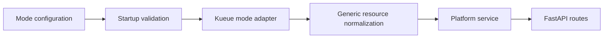

# Milestone M2: Kueue mode platform metrics release

This plan defines the second milestone for the CANFAR Metrics API rollout. It
turns platform metrics into a strict `Kueue` mode release with explicit startup
validation, live Kueue-backed fixtures, and an API contract that remains open
to future resource groups and resource names.

## Repository snapshot versus milestone target

This milestone describes the **target** runtime and testing model. The current
service still uses `METRICS_PROVIDER_MODE` values `live` and `static`, wires a
`FallbackCapacityProvider` in `live` mode, and does not run dependency checks
during FastAPI startup. The milestone closes when the implementation matches
this document, not when the document reads plausible in isolation.

## Summary

This milestone turns `GET /api/v1/metrics/platform` into a Kueue-backed
platform slice that is grounded in live cluster behavior rather than broad
provider fallbacks. You install Kueue `0.17.0+` in the test environment, seed
three `ClusterQueues` (`cq-proton`, `cq-neutron`, and `cq-electron`) in one
shared `Cohort` (`cohort-atom`), characterize the raw Kueue fields for quota
and allocation, and use that evidence to finalize a simple platform API
contract built around `capacity` and `allocated` resource maps.

The runtime model for this milestone is exactly one configured service mode per
process. In `Kueue` mode, startup validates Kueue connectivity, Kueue
installation, and the configured queue set. If validation fails, the service
shuts down rather than falling back to node-based or static behavior. Local
`dev` runs the app and Redis via `docker compose` against an already running
Kubernetes cluster such as Minikube. `integration`, `staging`, and
`production` run the service in Kubernetes.

Roadmap environment names use `integration` and `production`, while the current
settings model still accepts `int` and `prod` for `METRICS_ENVIRONMENT`. Until
that is reconciled in code, treat those pairs as aliases and keep operator
documentation explicit about which token is accepted at runtime.

## In scope

This section lists milestone deliverables you execute.

- Support `Kueue 0.17.0+` only for this milestone.
- Replace the generic `live` provider story with an explicit `Kueue` mode.
- Enforce a single configured mode per process.
- Validate `Kueue` mode requirements during startup and stop the service if
  validation fails.
- Install Kueue in local and CI-backed test environments used for live
  integration validation.
- Seed three `ClusterQueues` and one shared `Cohort` to exercise queue-subset
  aggregation and cohort deduplication.
- Query raw Kueue `ClusterQueue` and `Cohort` resources and document which
  fields map to configured quota, shared quota, and live allocation.
- Finalize platform contract semantics for aggregating over a runtime-configured
  list of `ClusterQueues`.
- Finalize a minimal response shape with `capacity.<resource-name>` and
  `allocated.<resource-name>` keys rather than fixed resource fields.
- Ensure the platform contract can represent all current and future
  `resourceGroups`, including resource names such as `ephemeral-storage`,
  `nvidia.com/gpu`, and provider-specific resources.
- Set the milestone default cache TTL to five minutes before the service
  re-queries Kueue state.
- Preserve cache metadata in the platform response.
- Keep all Kueue setup assets under `tests/fixtures/kueue`.
- Use `FastAPI TestClient` for API-level verification of valid and invalid
  Kueue-mode startup and routing behavior once startup validation exists in the
  application factory or lifespan.

## Out of scope

This section lists deferred work.

- User and session attribution endpoint logic.
- Kube-metrics mode implementation.
- Staging ArgoCD integration.
- Advanced analytics and dashboard-oriented metrics slices.
- Prometheus ownership model redesign.
- Long-lived watch or informer-based Kueue synchronization.
- Mixed-mode routing or runtime fallback behavior.
- Runtime utilization or consumption reporting beyond allocated resource totals.

## Dependencies

This milestone depends on the M1 foundation, the current platform endpoint, and
the live cluster test path.

- M1 quality and delivery scaffolding.
- `metrics/src/metrics/providers/kueue.py`.
- `metrics/src/metrics/config.py`.
- `metrics/src/metrics/app.py`.
- `metrics/src/metrics/service.py`.
- `metrics/src/metrics/models.py`.
- `metrics/src/metrics/api/routes.py`.
- `metrics/tests/test_app.py`.
- `metrics/tests/test_app_factory.py`.
- `metrics/tests/test_providers.py`.
- `metrics/tests/integration/test_k8s_smoke.py`.
- `metrics/scripts/run-minikube-integration.sh`.
- `metrics/scripts/minikube-values.yaml`.
- `metrics/helm/metrics-api/`.
- Raw Kueue API resources:
  `/apis/kueue.x-k8s.io/v1beta1/clusterqueues` and
  `/apis/kueue.x-k8s.io/v1beta1/cohorts`.
- Local prerequisites for bring-up and smoke validation: `docker`, `helm`, and
  `minikube`.

## Configuration naming draft

This milestone references uppercase Kueue env vars in operator-facing
documentation. The service today uses `METRICS_`-prefixed settings fields for
Kubernetes access. Until fields are renamed, treat this table as the
compatibility contract you must keep stable across charts, docs, and tests.

- `KUEUE_METRICS_URL` maps to `METRICS_KUBE_API_URL`
- `KUEUE_METRICS_CLUSTER_QUEUES` requires a new list-typed settings field and env
  binding, because queue selection is not represented in `Settings` today
- `KUEUE_METRICS_COHORT` requires a new settings field and env binding for cohort
  membership validation
- `PLATFORM_METRICS_CACHE_TTL` maps to `METRICS_CACHE_TTL_SECONDS`, noting that
  the current default in `Settings` is not yet aligned to the milestone default

## Constraints

This milestone must preserve operational safety and keep the contract grounded
in raw Kueue semantics.

- Maintain low impact on production infrastructure and bound request behavior to
  the configured timeout.
- Preserve a 12-factor runtime configuration model for the selected queue list,
  `KUEUE_METRICS_COHORT`, `KUEUE_METRICS_URL`, and cache TTL.
- Keep contract payload keys stable for platform scope while the internals move
  from broad provider fallback to explicit queue-subset aggregation.
- Parse Kubernetes quantity strings correctly for both quota and status fields.
- Deduplicate cohort-shared quota across the configured queue set rather than
  double-counting it once per member queue.
- Treat raw Kueue status as authoritative for allocated resources and do not
  add allocated totals to configured capacity.
- Support Kueue `0.17.0+` only, while staying on the
  `kueue.x-k8s.io/v1beta1` API surface for this milestone.
- Align the default platform cache TTL with the milestone default. Today
  `METRICS_CACHE_TTL_SECONDS` defaults to 30 seconds in `Settings`, while this
  milestone targets 300 seconds for platform reads backed by Kueue.
- Keep the resource schema open-ended so future keys such as
  `ephemeral-storage`, `nvidia.com/gpu`, `io`, `iops`, `network`, or
  vendor-specific resources do not require a contract redesign.
- Use `FastAPI TestClient` for startup and API contract tests in this
  milestone.
- Fail early when `docker`, `helm`, or `minikube` are unavailable for local or
  CI bring-up.

## Core decisions

This section records the design choices that keep the service clean and
auditable as mode-specific work begins.

- **Single-mode runtime:** Each process runs in one configured mode only.
- **Fail-fast startup:** `Kueue` mode validates its dependencies during startup
  and shuts down if Kueue is unreachable, not installed, or misconfigured.
- **No fallback behavior:** This milestone does not preserve node fallback,
  static fallback, or silent downgrade logic.
- **Mode boundary:** Mode selection and startup checks stay separate from
  request-time metrics collection.
- **Shared contract boundary:** Shared services own caching, response shaping,
  and generic resource normalization. Kueue-specific code owns Kueue
  connectivity and raw field mapping.
- **Fixture ownership:** Kueue manifests, chart values, and helper assets for
  this milestone live under `tests/fixtures/kueue`.
- **Test strategy:** Use `FastAPI TestClient` for API-level tests and keep the
  cluster-backed smoke loop as a separate validation layer.

## Research baseline

This section records the raw Kueue fields under evaluation so the milestone can
tie contract decisions to live evidence.

- `ClusterQueue.spec.resourceGroups[*].flavors[*].resources[*].nominalQuota`
  defines queue-owned quota.
- `ClusterQueue.spec.cohort` identifies cohort membership for each selected
  queue.
- `Cohort.spec.resourceGroups[*].flavors[*].resources[*].nominalQuota` defines
  a shared pool on top of member queue quota.
- `ClusterQueue.status.flavorsReservation[*].resources[*].total|borrowed`
  exposes reserved quota currently held by assigned workloads.
- `ClusterQueue.status.flavorsUsage[*].resources[*].total|borrowed` exposes
  quota used by admitted workloads.

M2 must compare `flavorsReservation` and `flavorsUsage` against live test data
before the platform contract locks one of them as the default meaning of
`allocated`. Until then, the milestone treats that choice as an explicit
research outcome rather than an assumption.

## Implementation phases

This section sequences the Kueue-mode release work.

1. **Kueue environment bring-up**
   - Install Kueue `0.17.0+` in Minikube-backed local and CI test
     environments.
   - Add prerequisite checks so local and CI loops stop immediately when
     `docker`, `helm`, or `minikube` are unavailable.
   - Seed `cq-proton`, `cq-neutron`, and `cq-electron` in `cohort-atom`.
   - Use intentionally asymmetric CPU and memory quota values across the seeded
     queues so tests stay deterministic. If you still want randomness, pin a
     documented seed and keep assertions invariant-based rather than
     snapshot-based.
2. **Raw API characterization**
   - Query `ClusterQueue` and `Cohort` resources through the raw Kueue API.
   - Record exactly which fields represent queue quota, cohort-shared quota,
     reservation, admitted usage, and borrowed quota.
   - Confirm how the configured queue subset maps onto cohort membership.
3. **Mode runtime design**
   - Replace the generic `live` provider narrative with an explicit `Kueue`
     mode configuration contract.
   - Define how the service receives `KUEUE_METRICS_CLUSTER_QUEUES` and
     `KUEUE_METRICS_COHORT` at runtime.
   - Define how `KUEUE_METRICS_URL` maps onto the existing service settings.
   - Define startup validation behavior for invalid queue names, missing Kueue,
     and cluster connectivity failures.
4. **Platform contract design**
   - Define aggregate capacity semantics for a runtime-configured list of
     `ClusterQueues`.
   - Deduplicate cohort-shared quota once across the configured queue set.
   - Finalize a minimal response shape built around `capacity` and `allocated`
     generic resource maps.
   - Ensure the response can carry all current and future resource kinds
     without fixed field names.
   - Use live observations to choose between `flavorsReservation` and
     `flavorsUsage` for `allocated`.
5. **Testing and rollout readiness**
   - Add `FastAPI TestClient` coverage for valid Kueue-mode startup.
   - Add `FastAPI TestClient` coverage for invalid Kueue-mode startup and for
     requests that target invalid configured `ClusterQueues`.
   - Keep Kueue setup assets in `tests/fixtures/kueue`.
   - Run live integration validation against the Kueue-backed test setup.
   - Add a review checkpoint after this phase to confirm the Kueue-mode runtime
     contract and `0.17.0+` support scope before broader implementation starts.

## Validation plan

This section defines milestone verification.

- Run gate `harness-contracts`.
- Run gate `repository-coverage`.
- Run gate `harness-cli`.
- Validate that local and CI bring-up fail immediately, with actionable
  feedback, if `docker`, `helm`, or `minikube` are unavailable.
- Validate that Minikube and CI install Kueue `0.17.0+` successfully before
  integration tests run.
- Validate that the seeded environment contains `cq-proton`, `cq-neutron`,
  `cq-electron`, and `cohort-atom`.
- Validate that the platform endpoint reflects only the configured queue
  subset.
- Validate that startup fails when the service is configured for invalid
  `ClusterQueues`.
- Validate that startup fails when Kueue cannot be reached or is not installed.
- Validate that the response shape uses only `capacity` and `allocated` generic
  resource maps.
- Validate that custom and future resource keys can be represented without
  schema changes.
- Compare `flavorsReservation` and `flavorsUsage` against live queue state and
  record the `allocated` contract decision with evidence.
- Validate five-minute cache TTL behavior and cache metadata on the platform
  endpoint.
- Validate that `FastAPI TestClient` covers both valid and invalid Kueue-mode
  cases.

## Risks

This section lists milestone risks and mitigations.

- **Cohort double-counting:** A naive sum over selected queues can overstate
  capacity when queues share cohort quota. Mitigate this by seeding a shared
  cohort in tests and requiring dedupe evidence.
- **Allocation semantic ambiguity:** `flavorsReservation` and `flavorsUsage`
  can describe different live states. Mitigate this by comparing both against
  live behavior before locking the meaning of `allocated`.
- **Kueue version drift:** Kueue behavior can change across controller
  versions. Mitigate this by explicitly supporting `0.17.0+` only and
  recording the validated version range in milestone evidence.
- **Startup validation regressions:** Request-time checks can creep back in and
  weaken fail-fast behavior. Mitigate this by requiring startup-failure tests
  and review checkpoints.
- **Fixture sprawl:** Kueue manifests can become scattered across tests and
  scripts. Mitigate this by keeping all milestone assets under
  `tests/fixtures/kueue`.
- **Resource schema churn:** A fixed response model can block future resources
  such as `ephemeral-storage` or `nvidia.com/gpu`. Mitigate this by locking the
  contract around generic resource-name keys now.

## Operational controls

This section defines release controls for stable operation.

- Require live Kueue-backed smoke validation before promotion.
- Require an explicit configured queue list for production aggregation.
- Require evidence for any cache TTL change from the 300-second default.
- Require captured evidence for the chosen `allocated` semantic.
- Require recorded Kueue fixture manifests and values files under
  `tests/fixtures/kueue`.
- Require startup validation evidence for valid and invalid queue
  configurations.
- Require milestone-facing documentation to use explicit mode naming such as
  `Kueue` rather than generic `live` wording.
- Require the Kueue-mode review checkpoint before broader implementation
  proceeds.

## Implementer handoff checklist

Use this checklist to close M2 execution.

- [ ] Kueue `0.17.0+` installation is automated for local and CI-backed live
  tests.
- [ ] The seeded environment includes `cq-proton`, `cq-neutron`,
  `cq-electron`, and `cohort-atom`.
- [ ] Kueue setup assets live under `tests/fixtures/kueue`.
- [ ] Raw `ClusterQueue` and `Cohort` fields used by the contract are validated
  against live responses.
- [ ] The service runs in a single configured `Kueue` mode per process.
- [ ] Startup validation shuts the service down when Kueue is unreachable, not
  installed, or misconfigured.
- [ ] No node fallback, static fallback, or silent downgrade logic remains in
  the milestone design.
- [ ] Platform aggregation is defined for a runtime-configured queue subset.
- [ ] Cohort-shared quota is deduplicated once across selected queues.
- [ ] The response contract is limited to `capacity` and `allocated` generic
  resource maps.
- [ ] Future resource kinds and resource groups can be represented without
  schema changes.
- [ ] The contract decision for `flavorsReservation` versus `flavorsUsage` is
  documented as the public meaning of `allocated`, with live evidence.
- [ ] The platform metrics cache TTL defaults to 300 seconds and is verified.
- [ ] `FastAPI TestClient` covers both valid and invalid Kueue-mode cases.
- [ ] The Kueue-mode review checkpoint is completed and recorded.
- [ ] Required gates pass.
