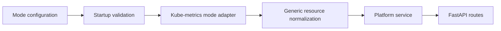

# Milestone M2b: kube-metrics mode platform release

This plan defines the follow-on platform milestone after the Kueue release. It
adds a strict `Kube-Metrics` mode that follows the same single-mode runtime
contract, startup validation model, and fixture layout introduced in M2.

## Repository snapshot versus milestone target

This milestone describes the **target** kube-metrics mode. The current service
still routes non-static modes through `FallbackCapacityProvider` and does not
perform startup dependency checks in FastAPI lifespan. The milestone closes
when the implementation matches this document.

## Summary

This milestone turns `GET /api/v1/metrics/platform` into a kube-metrics-backed
platform slice for environments where the platform service should read cluster
resource metrics instead of Kueue quota state. The milestone keeps the same
clean architecture as M2: one configured mode per process, startup validation
before the app serves traffic, open-ended generic resource maps, and no runtime
fallback behavior.

The local `dev` workflow remains `docker compose` for the app and Redis against
an already running Kubernetes cluster that is reachable through `kubectl`.
Helm is assumed to be installed and configured already. `staging`,
`integration`, and `production` run the service in Kubernetes. Kube-metrics
dependencies must be present and reachable before the service starts.

Use the canonical service mode names `dev`, `staging`, `integration`, and
`production` consistently in milestone docs, charts, and operator guidance.

## In scope

This section lists milestone deliverables you execute.

- Add an explicit `Kube-Metrics` mode as a follow-on to the Kueue release.
- Enforce a single configured mode per process.
- Validate kube-metrics dependencies during startup and stop the service if
  validation fails.
- Define the kube-metrics source contract for platform capacity and allocation.
- Finalize platform contract semantics for aggregating over kube-metrics-backed
  resource data.
- Preserve the minimal response shape with `capacity.<resource-name>` and
  `allocated.<resource-name>` keys rather than fixed resource fields.
- Ensure the platform contract can represent all current and future resource
  groups, including resource names such as `ephemeral-storage`,
  `nvidia.com/gpu`, and provider-specific resources.
- Preserve cache metadata in the platform response.
- Keep all kube-metrics setup assets under `tests/fixtures/kube-metrics`.
- Use `FastAPI TestClient` for API-level verification of valid and invalid
  kube-metrics startup and routing behavior once startup validation exists in the
  application factory or lifespan.

## Out of scope

This section lists deferred work.

- User and session attribution endpoint logic.
- Mixed-mode routing or runtime fallback behavior.
- Kueue-mode redesign beyond its documented contract.
- Advanced analytics and dashboard-oriented metrics slices.
- Prometheus ownership model redesign outside the kube-metrics milestone scope.
- Long-lived watch or informer-based synchronization.

## Dependencies

This milestone depends on the M1 foundation, the M2 architectural boundaries,
and the cluster-backed test path.

- M1 quality and delivery scaffolding.
- M2 single-mode runtime and startup validation contract.
- `metrics/src/metrics/config.py`.
- `metrics/src/metrics/app.py`.
- `metrics/src/metrics/service.py`.
- `metrics/src/metrics/models.py`.
- `metrics/src/metrics/api/routes.py`.
- `metrics/tests/test_app.py`.
- `metrics/tests/test_app_factory.py`.
- `metrics/tests/integration/test_k8s_smoke.py`.
- `metrics/scripts/run-minikube-integration.sh` (current script name retained as
  a historical artifact while the dev-cluster contract becomes cluster-agnostic).
- `metrics/scripts/minikube-values.yaml`.
- `metrics/helm/metrics-api/`.
- Local prerequisites for bring-up and smoke validation: `helm`, `kubectl`, and
  an already running cluster. `docker` remains part of the local compose
  workflow only when you choose to run the app and Redis that way.

## Kube-metrics dependency contract draft

This milestone must name the concrete signals it reads, not just the umbrella
term `kube-metrics`. At minimum, the plan assumes access to Kubernetes node
capacity signals and cluster-level resource accounting that operators already
expose through standard cluster components.

Local and CI baselines already enable the `metrics-server` addon in the Metrics
workflow, which is a strong default dependency for resource metrics APIs. If
the final mode also requires component metrics such as `kube-state-metrics`,
capture that explicitly in the dependency contract before implementation
starts.

## Constraints

This milestone must preserve operational safety and keep the contract grounded
in live cluster resource metrics.

- Maintain low impact on production infrastructure and bound request behavior to
  the configured timeout.
- Preserve a 12-factor runtime configuration model for kube-metrics connection
  settings and cache TTL.
- Keep contract payload keys stable for platform scope while the internals move
  from Kueue-backed data to kube-metrics-backed data.
- Support a single configured mode per process.
- Fail fast when required kube-metrics dependencies are missing, unreachable, or
  misconfigured.
- Keep the resource schema open-ended so future keys such as
  `ephemeral-storage`, `nvidia.com/gpu`, `io`, `iops`, `network`, or
  vendor-specific resources do not require a contract redesign.
- Use `FastAPI TestClient` for startup and API contract tests in this
  milestone.
- Require an active cluster context reachable through `kubectl`; do not depend
  on in-repo cluster provisioning code for local or CI bring-up.

## Core decisions

This section records the design choices that keep mode-specific work clean and
auditable.

- **Single-mode runtime:** Each process runs in one configured mode only.
- **Fail-fast startup:** `Kube-Metrics` mode validates its dependencies during
  startup and shuts down if the required metrics source is unavailable.
- **No fallback behavior:** This milestone does not add runtime fallback to
  Kueue, nodes, or static providers.
- **Mode boundary:** Mode selection and startup checks stay separate from
  request-time metrics collection.
- **Shared contract boundary:** Shared services own caching, response shaping,
  and generic resource normalization. Kube-metrics-specific code owns data
  source connectivity and raw field mapping.
- **Fixture ownership:** Kube-metrics manifests, values files, and helper
  assets for this milestone live under `tests/fixtures/kube-metrics`.
- **Test strategy:** Use `FastAPI TestClient` for API-level tests and keep the
  cluster-backed smoke loop as a separate validation layer.

## Implementation phases

This section sequences the kube-metrics release work.

1. **Kube-metrics environment bring-up**
   - Define the required kube-metrics dependency set for local and CI
     environments.
   - Assume Helm and `kubectl` already target the intended cluster.
   - Keep cluster provisioning out of milestone workflows.
   - Keep kube-metrics setup assets under `tests/fixtures/kube-metrics`.
2. **Source contract characterization**
   - Query the selected kube-metrics data source through the cluster-facing
     interfaces used by the service.
   - Record exactly which fields represent platform capacity and allocated
     usage.
   - Confirm how the selected source maps onto the platform response contract.
3. **Mode runtime design**
   - Define the `Kube-Metrics` mode configuration contract.
   - Define startup validation behavior for missing metrics dependencies,
     connectivity failures, and invalid configuration.
   - Keep the runtime model aligned with the M2 single-mode boundary.
4. **Platform contract design**
   - Define aggregate platform semantics for kube-metrics-backed resource data.
   - Preserve the `capacity` and `allocated` generic resource maps.
   - Ensure the response can carry all current and future resource kinds
     without fixed field names.
5. **Testing and rollout readiness**
   - Add `FastAPI TestClient` coverage for valid kube-metrics startup.
   - Add `FastAPI TestClient` coverage for invalid kube-metrics startup and
     invalid source configuration.
   - Run live integration validation against the kube-metrics-backed test
     setup.
   - Add a review checkpoint after this phase to confirm the shared
     architecture boundaries remain clean before broader implementation starts.

## Validation plan

This section defines milestone verification.

- Run gate `harness-contracts`.
- Run gate `repository-coverage`.
- Run gate `harness-cli`.
- Validate that the active dev or CI cluster context is reachable through
  `kubectl` before cluster-backed checks begin.
- Validate that the kube-metrics dependency set is installed and reachable
  before integration tests run.
- Validate that startup fails when kube-metrics dependencies are missing,
  unreachable, or misconfigured.
- Validate that the platform endpoint uses only `capacity` and `allocated`
  generic resource maps.
- Validate that custom and future resource keys can be represented without
  schema changes.
- Validate that `FastAPI TestClient` covers both valid and invalid
  kube-metrics cases.
- Validate that the shared architecture boundary remains clean across M2 and
  M2b.

## Risks

This section lists milestone risks and mitigations.

- **Dependency ambiguity:** Different clusters can expose different metrics
  components. Mitigate this by defining and documenting the exact dependency
  contract in the milestone.
- **Startup validation regressions:** Request-time checks can creep back in and
  weaken fail-fast behavior. Mitigate this by requiring startup-failure tests
  and review checkpoints.
- **Fixture sprawl:** Kube-metrics manifests can become scattered across tests
  and scripts. Mitigate this by keeping all milestone assets under
  `tests/fixtures/kube-metrics`.
- **Resource schema churn:** A fixed response model can block future resources
  such as `ephemeral-storage` or `nvidia.com/gpu`. Mitigate this by keeping the
  contract centered on generic resource-name keys.
- **Mode boundary drift:** Shared service layers can become entangled with
  source-specific logic. Mitigate this by preserving the M2 architecture
  boundary and reviewing it explicitly before implementation expands.

## Operational controls

This section defines release controls for stable operation.

- Require live kube-metrics-backed smoke validation before promotion.
- Require recorded kube-metrics fixture manifests and values files under
  `tests/fixtures/kube-metrics`.
- Require startup validation evidence for valid and invalid kube-metrics
  configurations.
- Require milestone-facing documentation to use explicit mode naming such as
  `Kube-Metrics`.
- Require the shared-architecture review checkpoint before broader
  implementation proceeds.

## Implementer handoff checklist

Use this checklist to close M2b execution.

- [ ] Kube-metrics dependencies are defined and validated for local and CI
  tests.
- [ ] Kube-metrics setup assets live under `tests/fixtures/kube-metrics`.
- [ ] The service runs in a single configured `Kube-Metrics` mode per process.
- [ ] Startup validation shuts the service down when kube-metrics dependencies
  are missing, unreachable, or misconfigured.
- [ ] No runtime fallback to Kueue, nodes, or static providers is added.
- [ ] Platform aggregation is defined for kube-metrics-backed resource data.
- [ ] The response contract is limited to `capacity` and `allocated` generic
  resource maps.
- [ ] Future resource kinds and resource groups can be represented without
  schema changes.
- [ ] `FastAPI TestClient` covers both valid and invalid kube-metrics cases.
- [ ] The shared-architecture review checkpoint is completed and recorded.
- [ ] Required gates pass.
