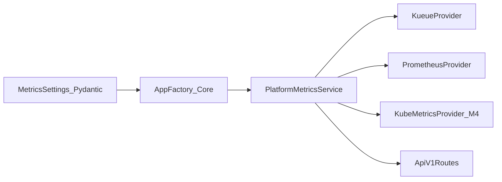

# Milestone M3: app structure and platform sources realignment

This plan defines the third milestone for the CANFAR Metrics API roadmap. It
reorganizes the service into a cleaner FastAPI layout, removes deprecated
provider paths, and locks a three-source platform model for follow-on
milestones.

## Repository snapshot versus milestone target

This milestone describes the target architecture after M2 closure. Current code
still uses a flat package layout under `src/metrics/`, keeps `static` as a
runtime mode, and keeps `node` provider artifacts in source and tests.

M3 closes when the source tree is physically reorganized and the runtime
contract supports only the configured platform sources captured in this plan.

## Summary

This milestone introduces a production-ready package structure aligned with
FastAPI layering while keeping implementation lean:

- `api/` for versioned route modules and API composition.
- `core/` for settings, app factory, startup checks, and shared runtime
  wiring.
- `schemas/` for Pydantic request, response, and internal transfer models.
- `services/` for orchestration and cache-aware computation.
- `providers/` for external-system adapters.

M3 also removes `static` and `node` provider paths and treats platform metrics
as a composed result from configured sources. The supported source set is:
`kueue`, `prometheus`, and `kube-metrics`. Full kube-metrics runtime depth is
delivered in M4.

## In scope

This section lists milestone deliverables you execute.

- Move modules into the layered FastAPI package structure listed above.
- Remove `static` provider runtime mode from settings, app wiring, tests, and
  docs.
- Remove `node` provider code and tests.
- Remove fallback/provider-composite logic that only existed to support
  deprecated providers.
- Define a nested, 12-factor configuration model for source composition using
  Pydantic models and `pydantic-settings`.
- Ensure all schema/config contracts use Pydantic models only; do not introduce
  dataclasses for runtime contracts.
- Document a clear extension path for future scopes such as user metrics source
  config.
- Keep route and response contracts stable unless a separate milestone
  explicitly changes wire format.

## Out of scope

This section lists deferred work.

- Full kube-metrics runtime implementation details (M4 milestone scope).
- User and session behavior redesign (M5 and M6 scopes).
- ArgoCD staging rollout implementation (M9 scope).
- Dashboard or analytics slice expansion.
- Multi-process federation redesign.

## Dependencies

This milestone depends on earlier roadmap outputs and current implementation
boundaries.

- M1 delivery and CI foundation.
- M2 platform release plus M2 post-review closure checklist.
- Existing Kueue startup validation and platform service behavior.
- Existing Prometheus usage provider path for scoped usage.
- Existing Kubernetes-first deployment path for all environments.

## Target configuration model

The target model keeps 12-factor runtime behavior while expressing source
configuration as nested Pydantic settings. Helm values may render these as
environment variables, and settings parsing remains environment-driven.

Example roadmap shape:

```yaml
metrics:
  platform:
    kueue:
      cluster_queues:
        - cq-proton
        - cq-neutron
      cohort: cohort-atom
    prometheus:
      url: http://prometheus.monitoring.svc:9090
    kube_metrics:
      enabled: true
  user:
    prometheus:
      label_key: canfar-userid
```

Implementation must keep one service process that combines configured sources
for the active scope, instead of a binary provider-mode switch.

## Constraints

This milestone must reduce complexity without adding unnecessary indirection.

- Do not keep compatibility shims that preserve removed static or node behavior.
- Do not re-export old package paths as a substitute for moving code.
- Keep the module graph explicit and testable with minimal boilerplate.
- Keep startup failure semantics fail-fast for invalid source configuration.
- Keep all runtime behavior configurable via environment variables.
- Keep payload contracts and error semantics deterministic.

## Core decisions

This section records architecture decisions that shape M3 implementation.



- **Layered ownership:** API, core, schemas, services, and providers each own a
  distinct boundary.
- **Pydantic-only contracts:** Runtime config and schema models remain Pydantic
  across all layers.
- **Three-source platform model:** Kueue, Prometheus, and kube-metrics are the
  only supported platform sources after cutover.
- **No legacy providers:** Static and node are removed, not hidden behind
  compatibility aliases.
- **M4 dependency:** Kube-metrics implementation depth is intentionally deferred
  to M4 while M3 establishes architecture and config contracts.

## Implementation phases

This section sequences M3 execution.

1. **Package reorganization**
   - Define the target module map and move files physically into layered
     packages.
   - Update imports and route composition to the new structure.
2. **Provider and runtime cleanup**
   - Remove static and node provider code paths.
   - Remove fallback logic tied to deprecated providers.
3. **Configuration remodel**
   - Replace flat provider-mode switching with nested source configuration.
   - Keep environment-driven parsing through `pydantic-settings`.
4. **Service composition hardening**
   - Wire platform service composition to configured source set.
   - Preserve deterministic startup validation and request error mapping.
5. **Tests and docs alignment**
   - Replace legacy-provider tests with new architecture coverage.
   - Align architecture, design, specs, and environment docs with the new model.
   - Run review arbitration before milestone closure.

## Validation plan

This section defines milestone verification.

- Run gate `harness-contracts`.
- Run gate `repository-coverage`.
- Run gate `harness-cli`.
- Validate no runtime path references static or node providers.
- Validate startup fails when required configured source dependencies are
  missing.
- Validate route contracts still return deterministic payload and error models.
- Validate settings parsing supports nested source configuration through
  environment-derived values.
- Validate import graph and package boundaries match the target module map.

## Risks

This section lists milestone risks and mitigations.

- **Scope creep risk:** M3 can absorb M4 behavior if boundaries are vague.
  Mitigate by keeping kube-metrics runtime depth explicitly out of scope.
- **Boilerplate risk:** A new package layout can introduce empty wrappers.
  Mitigate by requiring each moved module to own clear behavior.
- **Migration risk:** Bulk import rewrites can break startup paths. Mitigate with
  app-factory and route tests before merge.
- **Config ambiguity risk:** Nested model migration can drift from Helm/env
  reality. Mitigate with explicit environment contract tests.
- **Review drift risk:** Architecture intent can diverge between docs and code.
  Mitigate with multi-reviewer arbitration before closure.

## Operational controls

This section defines rollout controls for stable operation.

- Require architecture review checkpoint before merging M3 code.
- Require explicit evidence that static and node paths are fully removed.
- Require startup validation evidence for each supported source combination.
- Require docs and plans index updates in the same change as milestone renaming.
- Require follow-on M4 kickoff to confirm kube-metrics implementation scope.

## Implementer handoff checklist

Use this checklist to close M3 execution.

- [ ] Files are physically moved into layered FastAPI package boundaries.
- [ ] Static provider mode is removed from runtime settings and app wiring.
- [ ] Node provider code and tests are removed.
- [ ] Legacy fallback logic tied to removed providers is removed.
- [ ] Nested Pydantic settings model for source composition is implemented.
- [ ] No dataclasses are used for runtime config or API/schema models.
- [ ] Platform source support is limited to Kueue, Prometheus, and kube-metrics.
- [ ] M4 remains the implementation milestone for kube-metrics runtime depth.
- [ ] Required gates pass.
