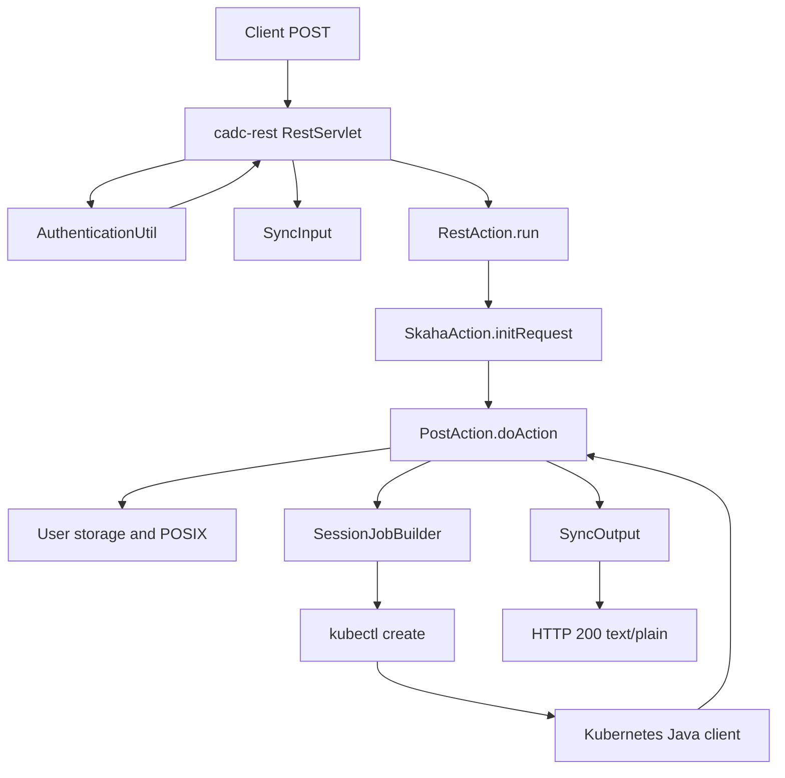
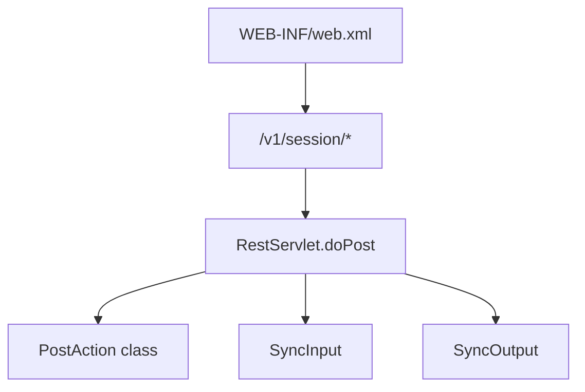
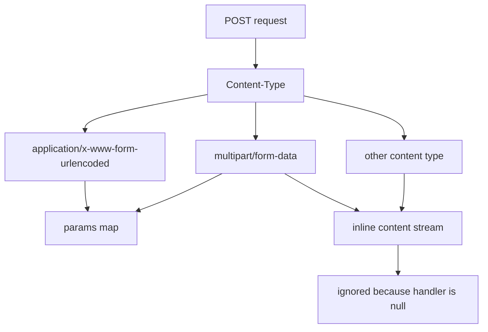
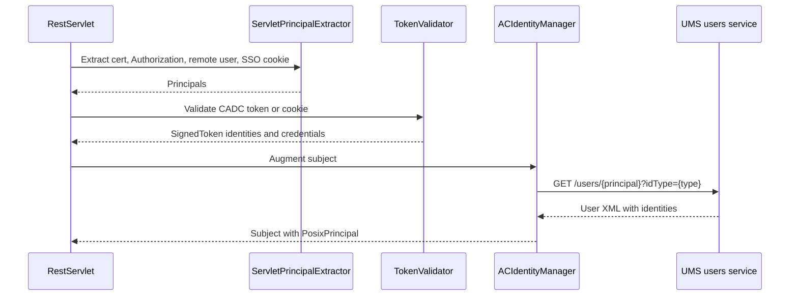
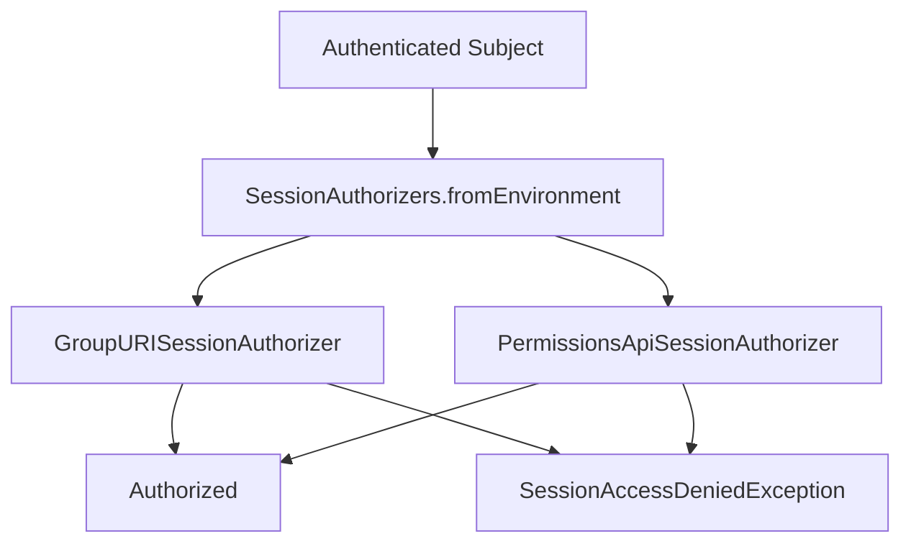
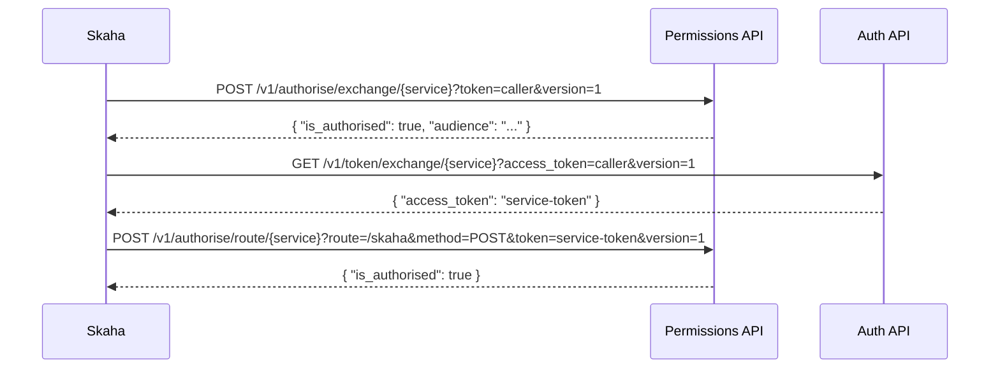
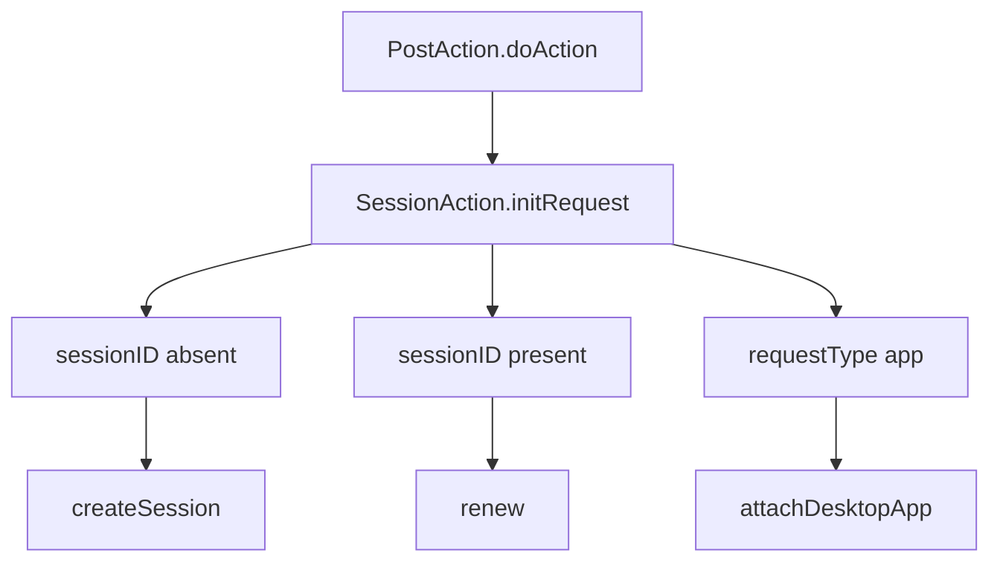
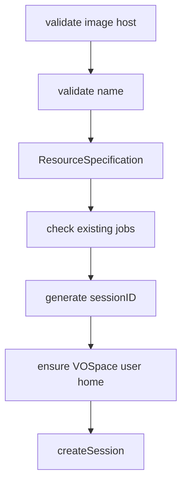
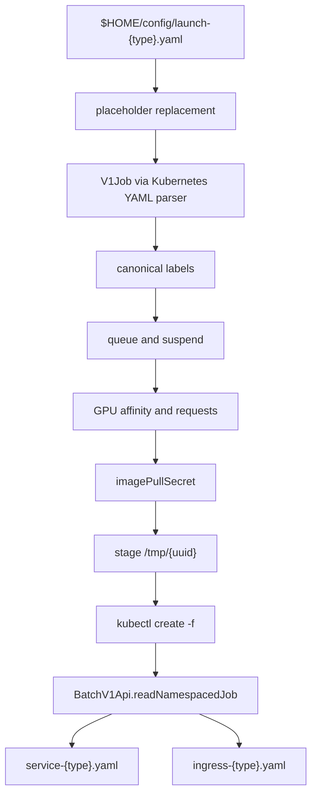
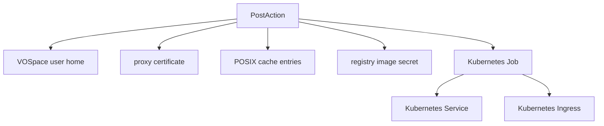

# Skaha POST Request Trace

This page traces the Skaha session POST path from client input through `cadc-rest`, CADC identity and authorization, Skaha request handling, user-storage side effects, Kubernetes object creation, and the final response.

<Callout type="decision">
The current Skaha POST API is parameter-driven. `POST /v1/session` declares query parameters and `cadc-rest` only promotes URL-encoded or multipart POST fields into `SyncInput`; a raw JSON request body is not consumed by this endpoint.
</Callout>

<Stat>
- Primary route: `POST /v1/session` (note) -- launch a new session
- Success body: `sessionID\n` (good) -- returned as `text/plain`
- Session ID: 8 chars (note) -- generated by `RandomStringGenerator`
- Runtime templates: `$HOME/config` (warn) -- not mostly stored under `src/main`
</Stat>



<Phase title="Client Payload" status="done">

New sessions are launched with query parameters or form fields. These are the values `PostAction` reads from `SyncInput`.

```http
POST /skaha/v1/session?name=my-session&image=images.canfar.net/skaha/notebook-scipy:0.2&type=notebook&cores=2&ram=8
Authorization: Bearer <cadc-token>
x-skaha-registry-auth: <base64 username:secret>  # only when private image auth is needed
Content-Type: application/x-www-form-urlencoded
```

```json
{
  "name": "my-session",
  "image": "images.canfar.net/skaha/notebook-scipy:0.2",
  "type": "notebook",
  "cores": "2",
  "ram": "8",
  "gpus": "0",
  "cmd": "optional headless command",
  "args": "optional headless args",
  "env": ["KEY=value"]
}
```

</Phase>

<Phase title="cadc-rest Entry" status="done">

`WEB-INF/web.xml` maps `/v1/session/*` to `ca.nrc.cadc.rest.RestServlet`; the `post` init parameter points to `org.opencadc.skaha.session.PostAction`.



`RestServlet` authenticates first, instantiates the configured action, wires `SyncInput` and `SyncOutput`, then runs `PostAction` under `Subject.doAs`.

</Phase>

<Phase title="Input Decoding" status="done">

For POST and PUT, `SyncInput.init()` branches on content type.



<Callout type="warn">
Skaha returns `null` from `getInlineContentHandler()`. That means a JSON request body reaches `processStream`, logs that no inline handler exists, and does not populate request parameters.
</Callout>

</Phase>

<Phase title="Authentication" status="done">

Headers, cookies, and certificates become a CADC `Subject`; CADC signed tokens and cookies are parsed locally, while identity augmentation can call the UMS users service.



</Phase>

<Phase title="Authorization" status="done">

Skaha then applies one configured session authorizer. Both modes run before session parameters are acted on.

<Compare>
## GMS group mode
- pro: Uses `IvoaGroupClient.getMemberships`
- pro: Compares cached groups to `SKAHA_USERS_GROUP`
- con: Needs delegated credentials and GMS registry config

## Permissions API mode
- pro: Authorizes route and method explicitly
- pro: Exchanges token before route authorization
- con: Sends route, method, token, and `{}` through external policy services
</Compare>



</Phase>

<Phase title="Permissions Payload" status="done">

When Permissions API mode is enabled, the route authorization path is a three-step exchange.



The exchange POST uses an empty JSON entity; the route POST uses `{}`.

</Phase>

<Phase title="PostAction Branching" status="done">

`PostAction.doAction()` parses the path into session and app context, then chooses one of three POST behaviors.

<Matrix>
| Route | Branch | Output |
|-------|--------|--------|
| `/v1/session` | create session | `sessionID\n` |
| `/v1/session/{id}` | renew session | empty success |
| `/v1/session/{id}/app` | attach app | `appID\n` |
</Matrix>



</Phase>

<Phase title="Create Session" status="done">

The new-session branch validates image, name, type, resources, GPU count, existing-session limits, and user storage before creating any Kubernetes object.



<Callout type="note">
Resource defaults come from context and optional flex-resource environment variables. Explicit `cores`, `ram`, and `gpus` must match available options from the context layer.
</Callout>

</Phase>

<Phase title="Kubernetes Mutation" status="done">

`createSession()` converts the runtime launch template into a Kubernetes Job, creates it with `kubectl`, reads the created Job back through the Kubernetes Java client, then optionally creates Service and Ingress resources.



```yaml
metadata:
  labels:
    canfar.net/id: sessionID
    canfar.net/username: owner
    canfar.net/name: lower-case-name
    canfar.net/kind: notebook
    canfar.net/job: skaha-notebook-owner-sessionid
    canfar.net/flavor: flexible
    canfar.net/accelerator: none
spec:
  suspend: true  # when queue configuration is present
```

</Phase>

<Phase title="Side Effects" status="done">

The POST can touch user storage, credentials, POSIX cache, registry secrets, Kubernetes Jobs, Services, and Ingresses.



</Phase>

<Phase title="Response And Errors" status="done">

`PostAction` writes a plain-text ID after successful create or attach. Error status mapping is mostly inherited from `cadc-rest RestAction`, with Skaha adding a custom 403 mapping for `SessionAccessDeniedException`.

| Condition | HTTP |
|-----------|------|
| Missing param | 400 |
| Not authenticated | 401 |
| Access denied | 403 |
| Not found | 404 |
| Conflict | 409 |
| Service busy | 503 |

```http
HTTP/1.1 200 OK
Content-Type: text/plain

abc123xy
```

</Phase>

<Checklist title="Trace Coverage">
- [x] Client request shape
- [x] `cadc-rest` servlet and action flow
- [x] Auth and identity augmentation
- [x] GMS and Permissions API authorization
- [x] New-session creation path
- [x] Kubernetes Job, Service, and Ingress mutation
- [x] Renew and desktop-app POST branches
- [x] Success and error response behavior
</Checklist>

<Callout type="note">
Primary repo anchors: `skaha/src/main/webapp/WEB-INF/web.xml`, `skaha/src/main/webapp/openapi.yaml`, `skaha/src/main/java/org/opencadc/skaha/SkahaAction.java`, `skaha/src/main/java/org/opencadc/skaha/session/PostAction.java`, `SessionAction.java`, `SessionJobBuilder.java`, `SessionDAO.java`, `UserStorageClient.java`, and `CommandExecutioner.java`.
</Callout>
